<h1>Production Science Q1 vs Q2</h1>

**Platform:** linux-x86_64

**Factorio Version:** 2.0.76

**Date:** 2026-04-07

<h2>Table Of Contents</h2>

- [The Question](#the-question)
- [Conclusion](#conclusion)
- [Scenario](#scenario)
  - [Q2 Setup](#q2-setup)
  - [Q1 Setup](#q1-setup)
- [Results](#results)
  - [Overview](#overview)
  - [Mining Productivity](#mining-productivity)
  - [Worker Robot Speed](#worker-robot-speed)
  - [Q1 Science](#q1-science)
  - [Q2 Science](#q2-science)
  - [Timeseries Charts](#timeseries-charts)

## The Question

Is Q1 (normal quality) or Q2 (uncommon quality) better in terms of UPS for purple science?

## Conclusion

Q1 is better than Q2. With the given designs that were tested, Q2 performs ~10% worse than Q1.

The down side of Q2 is you cannot avoid belting steel and stone given patch size limitations. Given that these are the highest volume ingredients, not being able to directly insert them is a major penality for Q2. The Q2 design used in this benchmark could be improved to leverage more direct insertion of steel, but the down sides of not being able to direct insert stone into furnaces from mining drills will most likely prove to still favor Q1 in the end.

## Scenario
* Each save was tested for 72000 tick(s) and 1 run(s)
* Save files can be downloaded here [google drive](https://drive.google.com/drive/folders/1c3pjG5V4kfJN833jOprMbiTSWkHNWnoA?usp=sharing)

A full megabase is tested producing 3840 SPS of all sciences running mining productivity and worker robot speed.

> NOTE: For comparison purposes, the save files for Q1 and Q2 are also benchmarked fully idle with no research running to establish a baseline of the base update time without any science being produced.

### Q2 Setup
For Q2, the production rate is 1920 SPS since Q2 has 200% science capacity.

Q2 production is using the most UPS efficient ore voiding strategies known at the time of this benchmark.

Stone is voided by producing landfill from normal quality stone and voiding landfill.
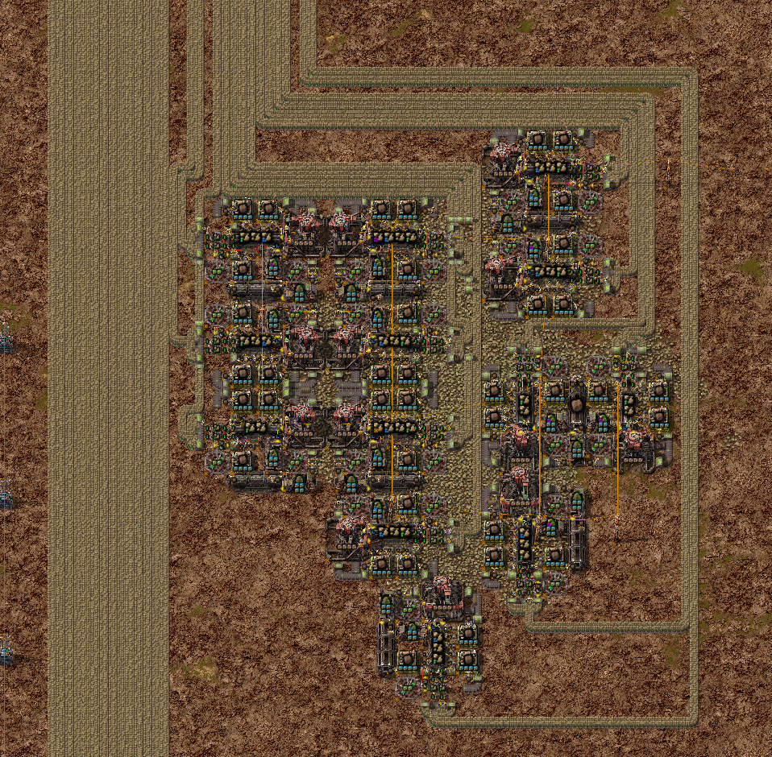

Iron, copper, and coal ore is directly voided

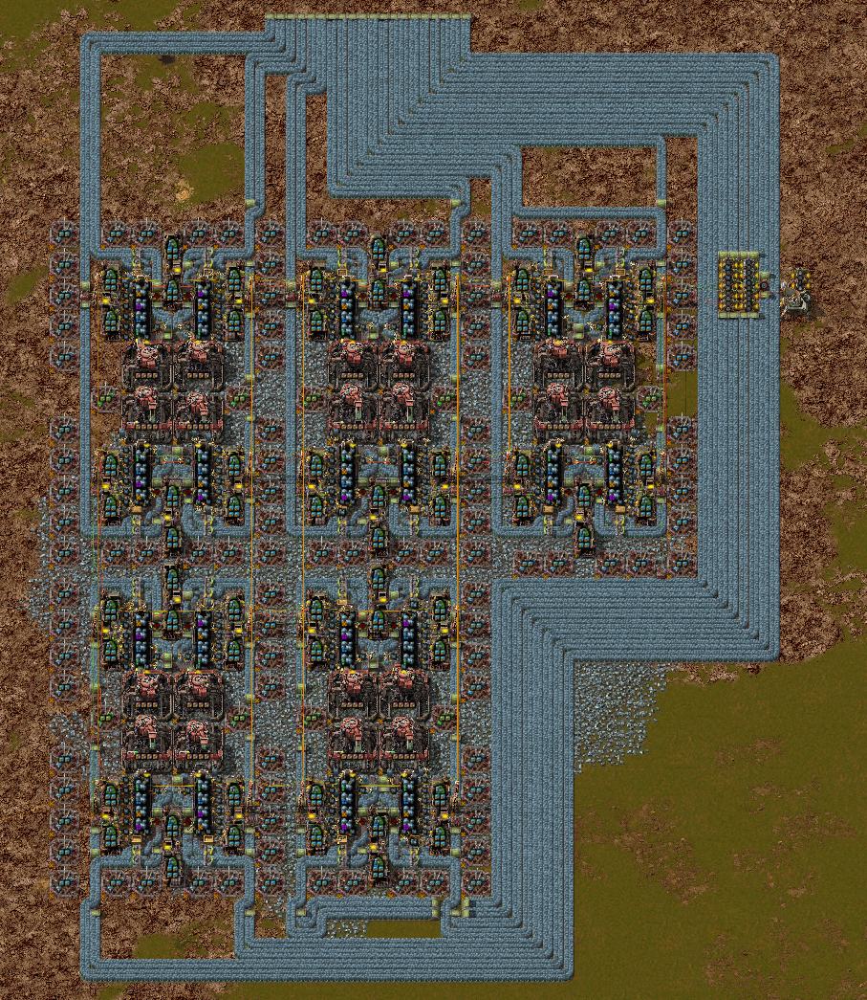

The final science "blade" can be seen in the screenshot below. Note the very large steel stack that is required to produce the steel required for 240/s of Q2 purple science.

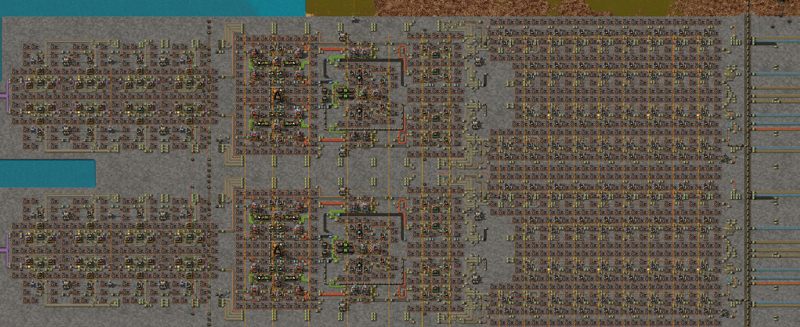

### Q1 Setup
For Q1, the production of materials is a mix of on patch setups and belted stone.

- Furnaces
  - stone is directly inserted into furnaces from electric mining drills to produce bricks
  - bricks are directly inserted into assemblers to craft furnaces
  - advanced circuits are belted in

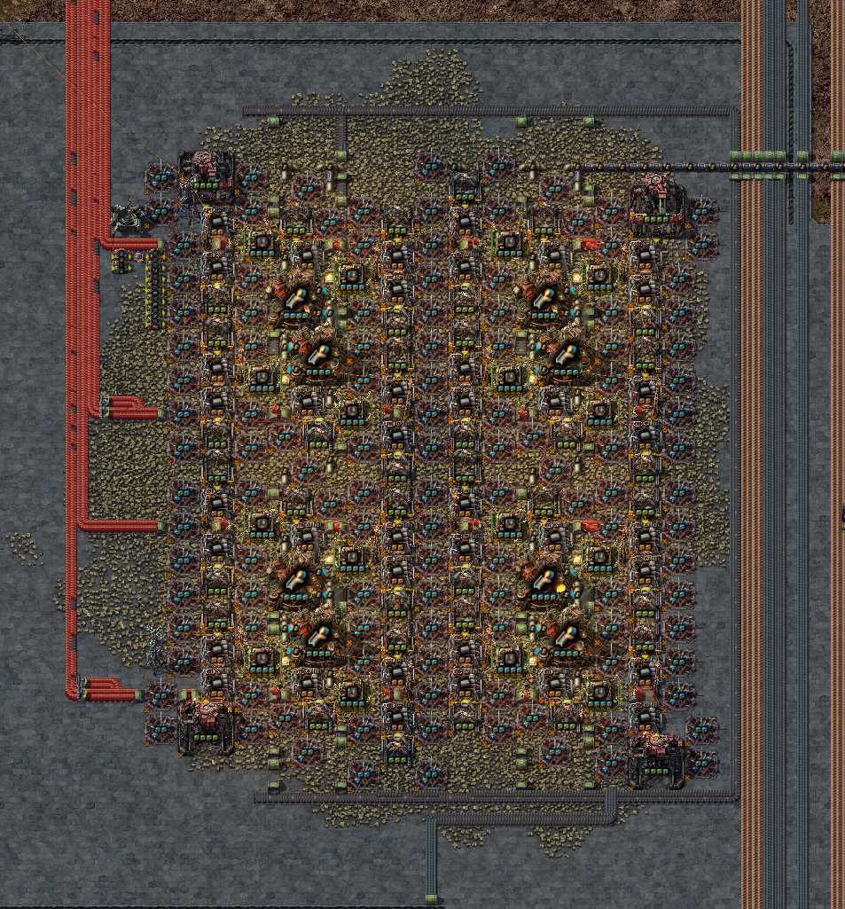

- Productivity Modules / Advanced Circuits
  - fully direct inserted
  - fluid bus

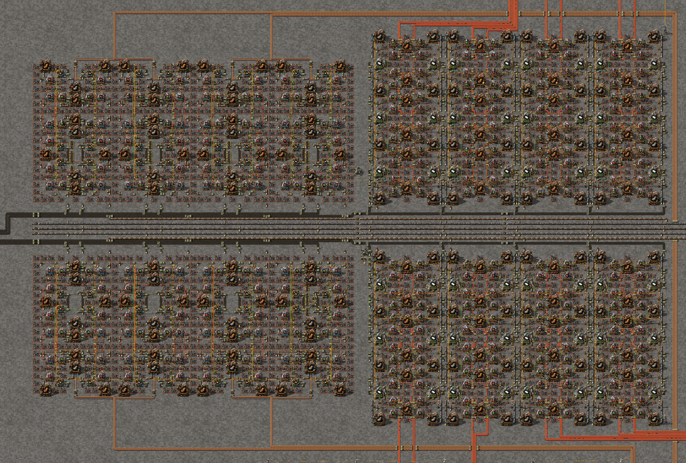

- Science Assemblers
  - belted in furnaces and productivity modules
  - direct inserted rails
  - stone is belted in for rails

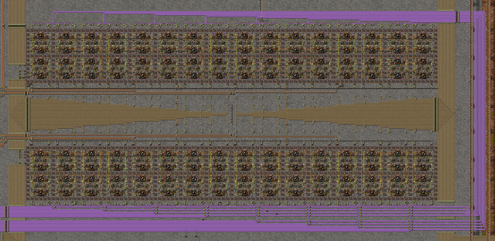

## Results

### Overview
| Metric            | Description                           |
| ----------------- | ------------------------------------- |
| **Mean UPS**      | Updates per second - higher is better |
| **Mean Avg (ms)** | Average frame time - lower is better  |
| **Mean Min (ms)** | Minimum frame time - lower is better  |
| **Mean Max (ms)** | Maximum frame time - lower is better  |

| Save                  | Avg (ms) | Min (ms) | Max (ms) | UPS | Execution Time (ms) |
| --------------------- | -------- | -------- | -------- | --- | ------------------- |
| q2_worker_robot_speed | 5.080    | 3.795    | 25.594   | 196 | 365729              |
| q1_worker_robot_speed | 4.601    | 3.389    | 24.895   | 217 | 331253              |
| q2_mining_prod        | 3.464    | 2.490    | 24.531   | 288 | 249434              |
| q1_mining_prod        | 3.139    | 2.264    | 23.488   | 318 | 226022              |
| q2_idle               | 2.187    | 1.525    | 21.836   | 457 | 157436              |
| q1_idle               | 2.080    | 1.457    | 22.116   | 480 | 149785              |

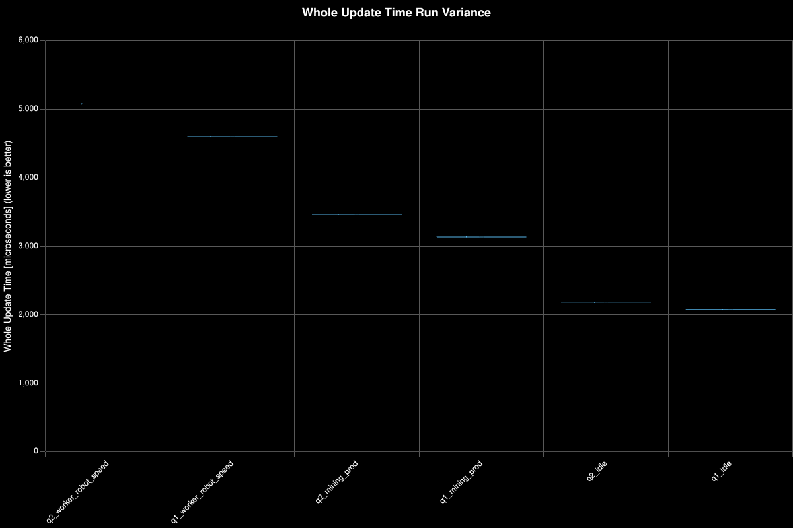

### Mining Productivity

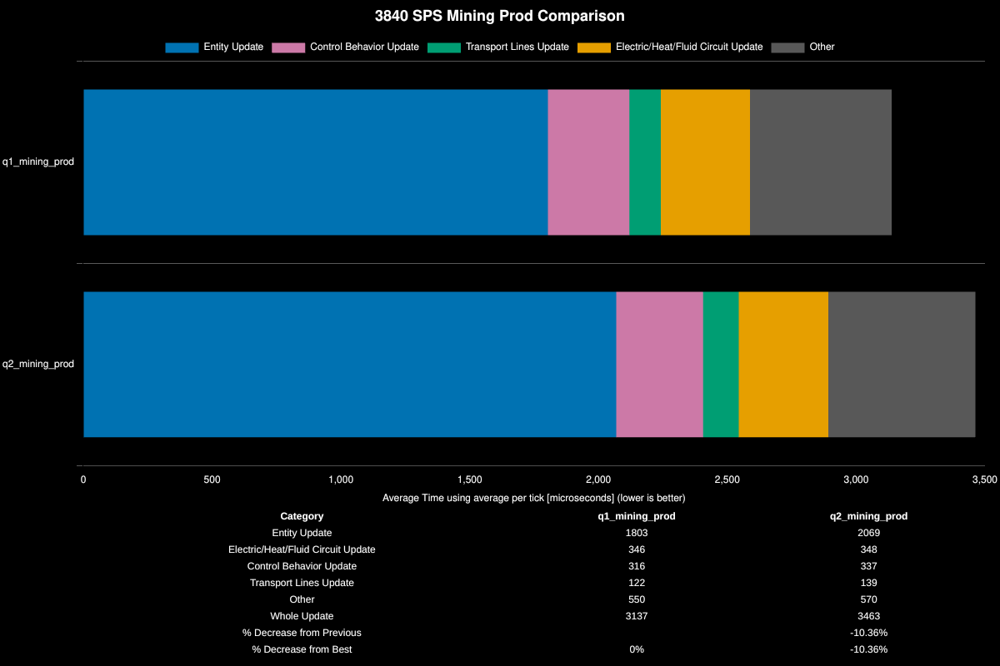

| Save File      | Entity Update | Electric/Heat/Fluid Circuit Update | Control Behavior Update | Transport Lines Update | Other | Whole Update | % Decrease from Previous |
| -------------- | ------------- | ---------------------------------- | ----------------------- | ---------------------- | ----- | ------------ | ------------------------ |
| q1_mining_prod | 1803          | 346                                | 316                     | 122                    | 550   | 3137         |                          |
| q2_mining_prod | 2069          | 348                                | 337                     | 139                    | 570   | 3463         | -10.36%                  |

### Worker Robot Speed

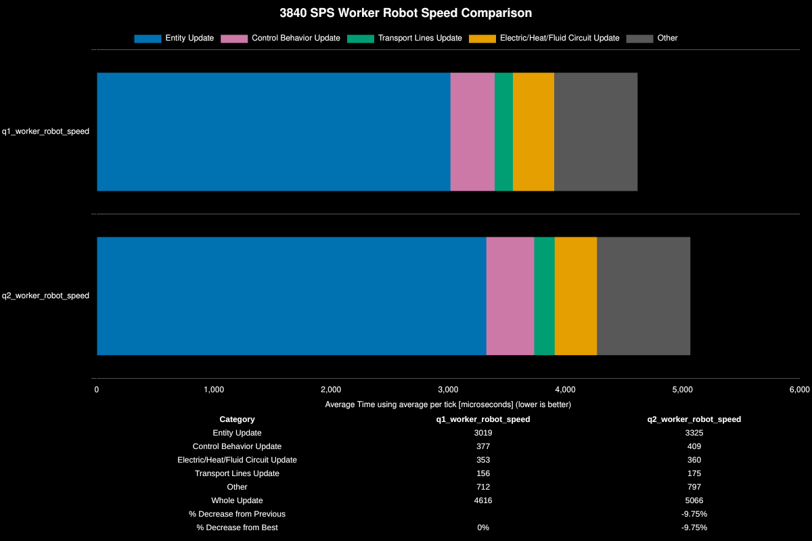

| Save File             | Entity Update | Control Behavior Update | Electric/Heat/Fluid Circuit Update | Transport Lines Update | Other | Whole Update | % Decrease from Previous |
| --------------------- | ------------- | ----------------------- | ---------------------------------- | ---------------------- | ----- | ------------ | ------------------------ |
| q1_worker_robot_speed | 3030          | 374                     | 353                                | 152                    | 690   | 4599         |                          |
| q2_worker_robot_speed | 3366          | 401                     | 360                                | 175                    | 775   | 5078         | -10.41%                  |

### Q1 Science

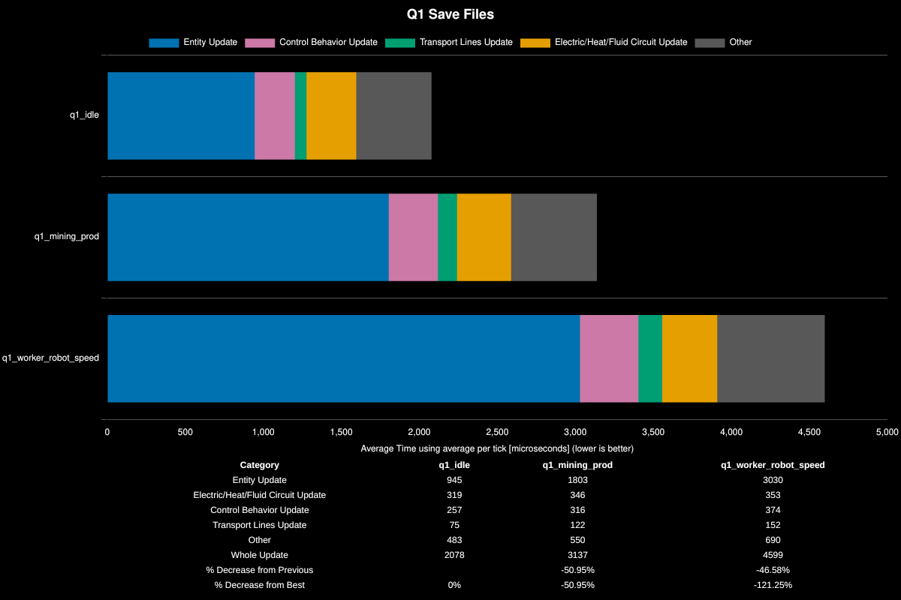

| Save File             | Entity Update | Electric/Heat/Fluid Circuit Update | Control Behavior Update | Transport Lines Update | Other | Whole Update |
| --------------------- | ------------- | ---------------------------------- | ----------------------- | ---------------------- | ----- | ------------ |
| q1_idle               | 945           | 319                                | 257                     | 75                     | 483   | 2078         |
| q1_mining_prod        | 1803          | 346                                | 316                     | 122                    | 550   | 3137         |
| q1_worker_robot_speed | 3030          | 353                                | 374                     | 152                    | 690   | 4599         |

### Q2 Science

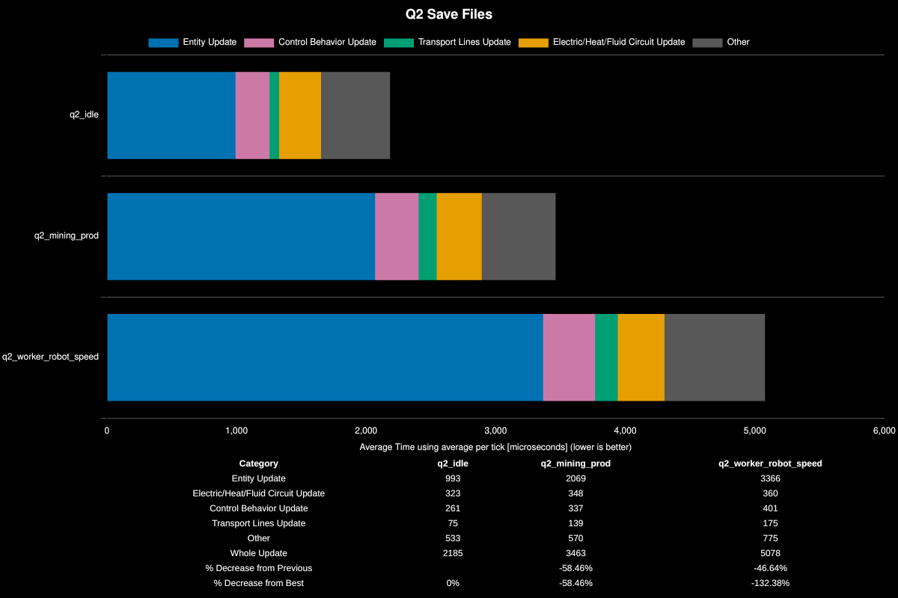

| Save File             | Entity Update | Electric/Heat/Fluid Circuit Update | Control Behavior Update | Transport Lines Update | Other | Whole Update |
| --------------------- | ------------- | ---------------------------------- | ----------------------- | ---------------------- | ----- | ------------ |
| q2_idle               | 993           | 323                                | 261                     | 75                     | 533   | 2185         |
| q2_mining_prod        | 2069          | 348                                | 337                     | 139                    | 570   | 3463         |
| q2_worker_robot_speed | 3366          | 360                                | 401                     | 175                    | 775   | 5078         |

### Timeseries Charts

because graphs are fun!

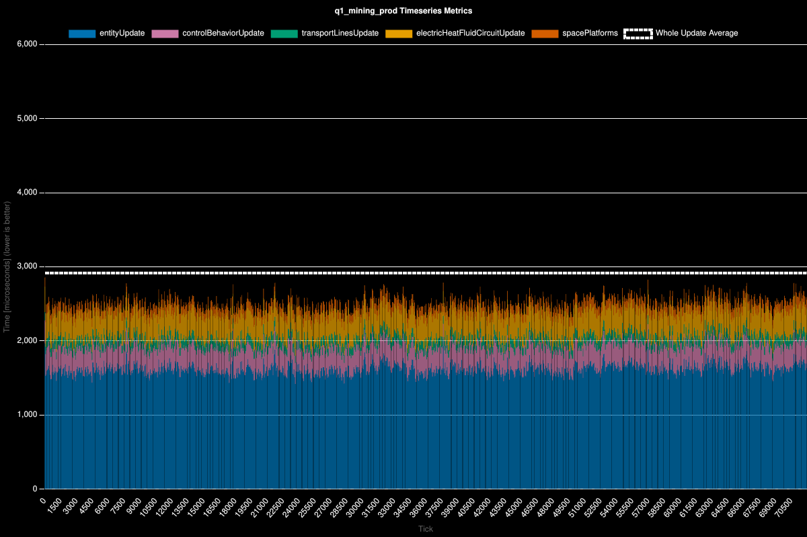 

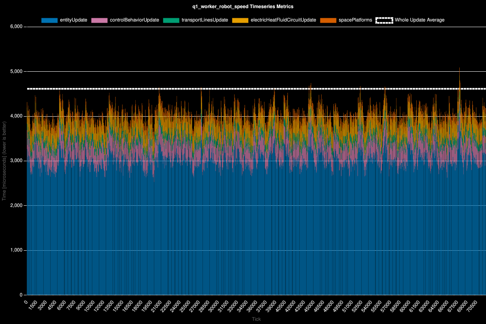

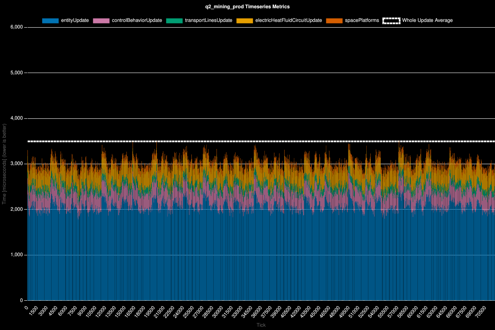

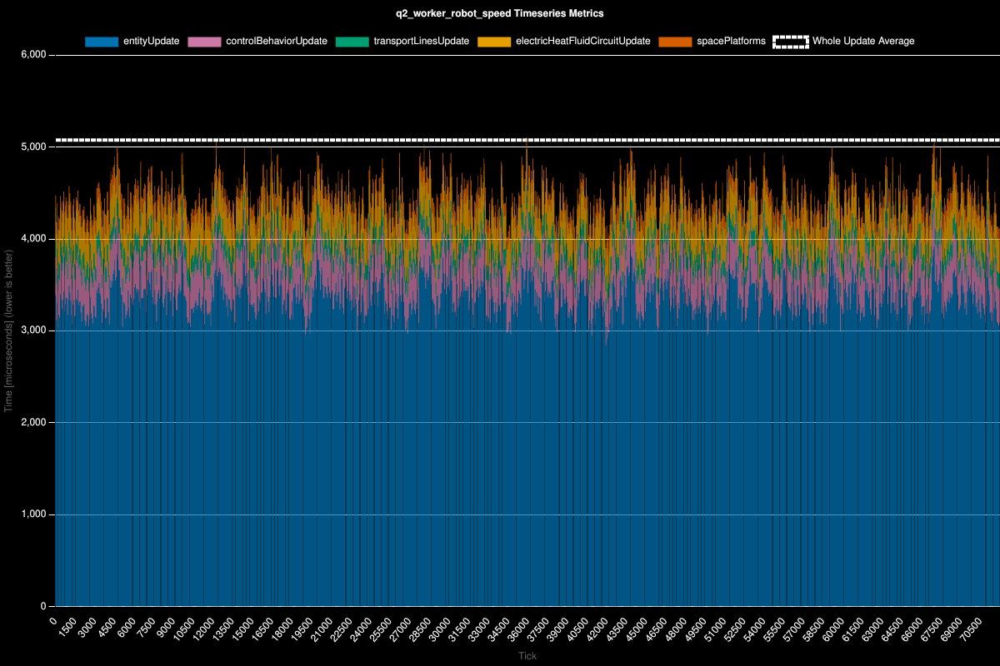

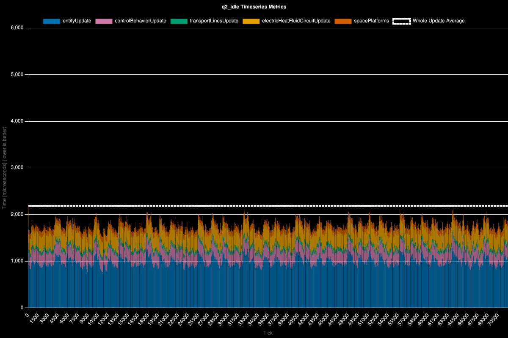

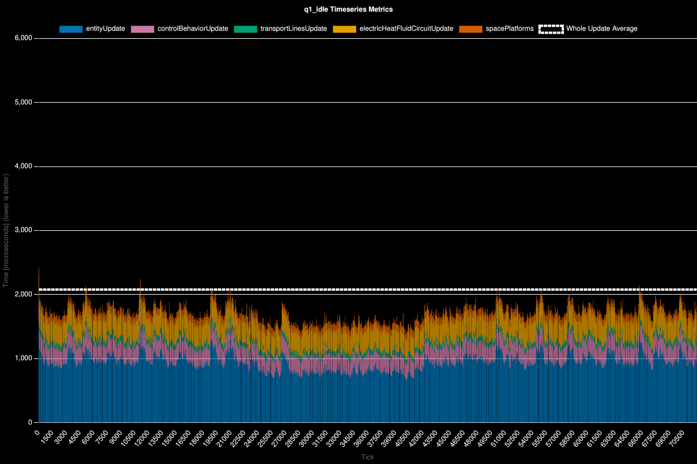