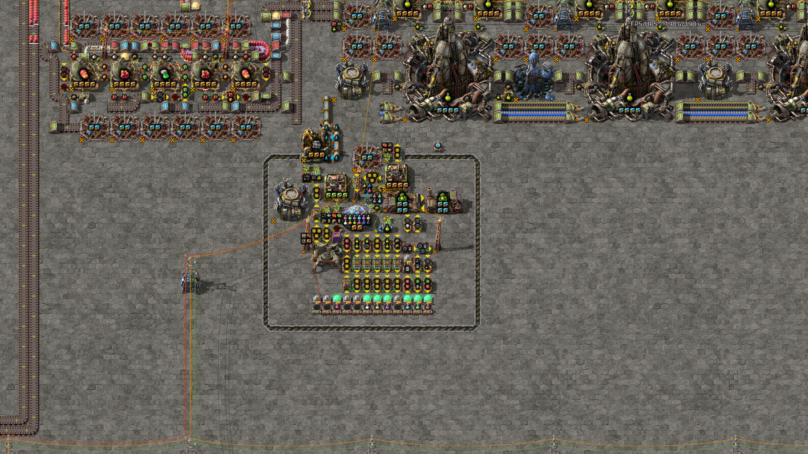
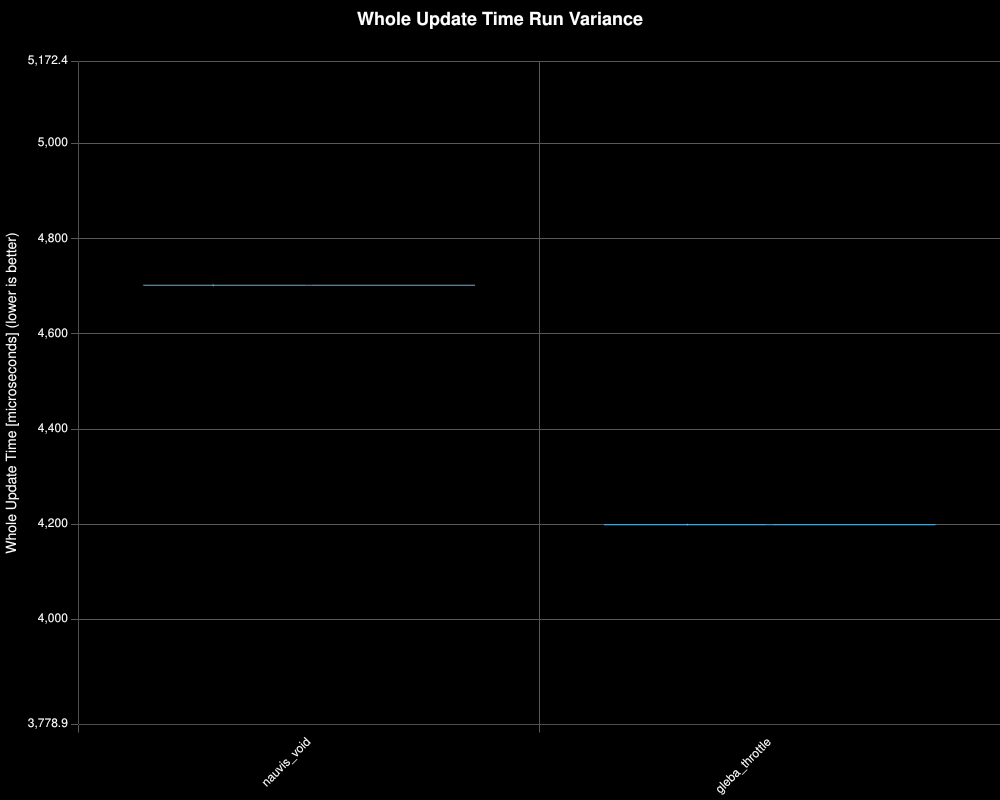
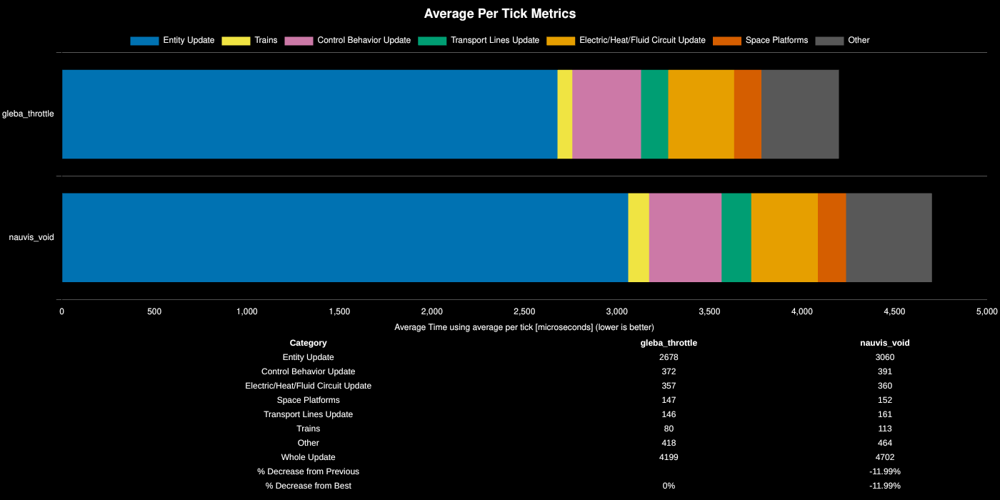
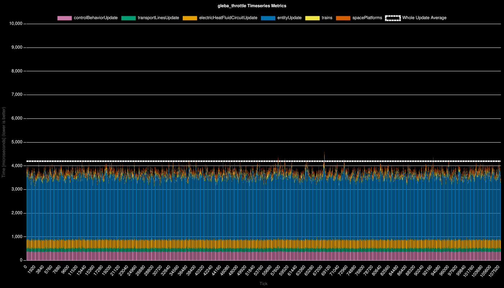
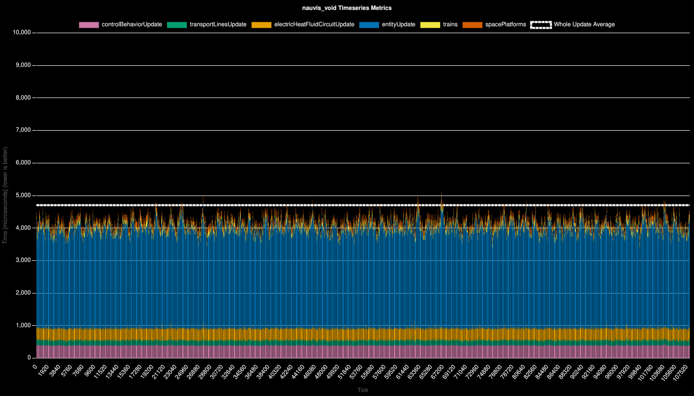

# Throttling Science Production on Gleba vs Voiding on Nauvis

**Platform:** linux-x86_64

**Factorio Version:** 2.0.76

**Date:** 2026-04-17

## Scenario
* Each save was tested for 108000 tick(s) and 1 run(s)

A new research control combinator was created to use a lab to monitor which sciences are actively being researched with on Gleba. This is used to throttle the production rate on gleba when not using agriculture science.

When throttled, science is produced on Gleba at 5000 science per minute. It has the capacity to produce 230_400 science per minute on gleba at full speed.

In this scenario, Worker Robot Speed is researched to measure the impact of running at this throttled rate compared to voiding the science back on Nauvis at a rate of 50k science per minute.

## Results
| Metric | Description |
| ----------------- | ------------------------------------- |
| **Mean UPS** | Updates per second - higher is better |
| **Mean Avg (ms)** | Average frame time - lower is better |
| **Mean Min (ms)** | Minimum frame time - lower is better |
| **Mean Max (ms)** | Maximum frame time - lower is better |

| Save | Avg (ms) | Min (ms) | Max (ms) | UPS | Execution Time (ms) | % Difference from Worst |
|------|----------|----------|----------|-----|---------------------| --- |
| dmb_main_nauvis_void | 4.704 | 3.488 | 24.457 | 212 | 508030 | 0.00% |
| dmb_main_gleba_throttle | 4.201 | 3.182 | 24.565 | **238** | 453707 | 11.97% |

### Timeseries

## Conclusion

The throttled production rate had a noticeable improvement to the entire save file, increasing the UPS from 212 to 238 a 12.3% increase in performance.