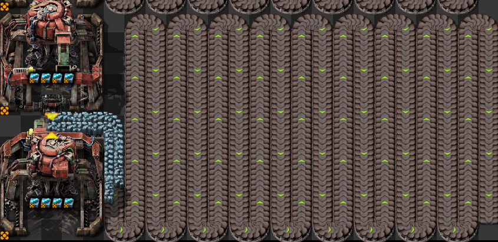
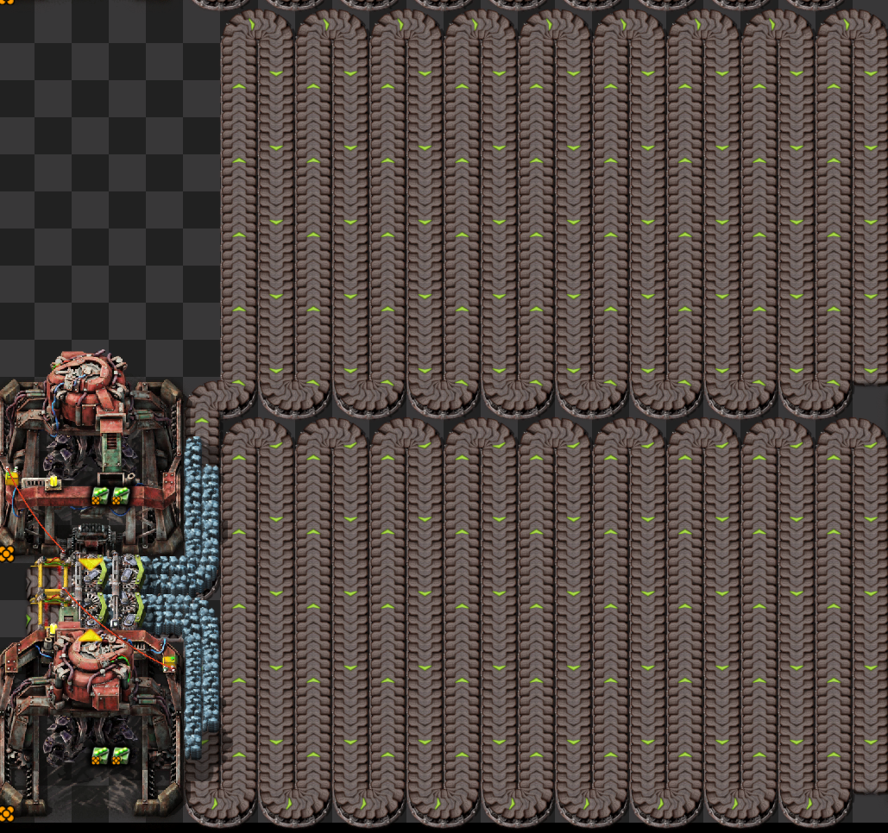
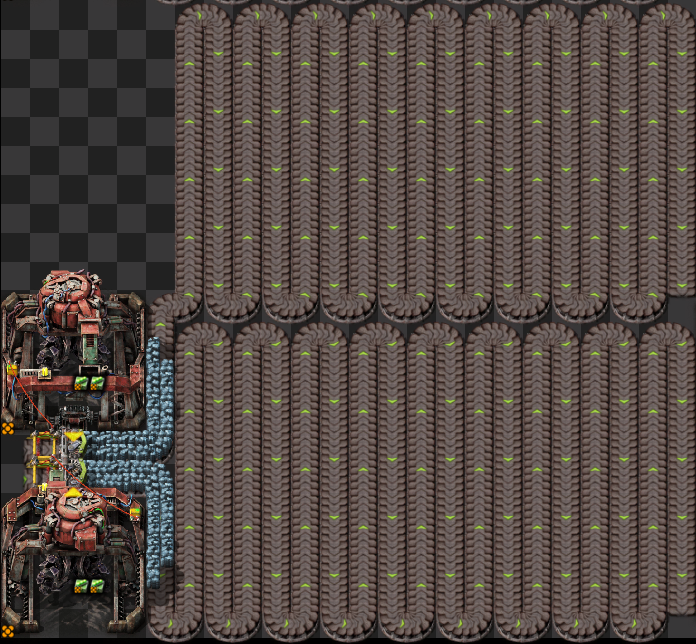
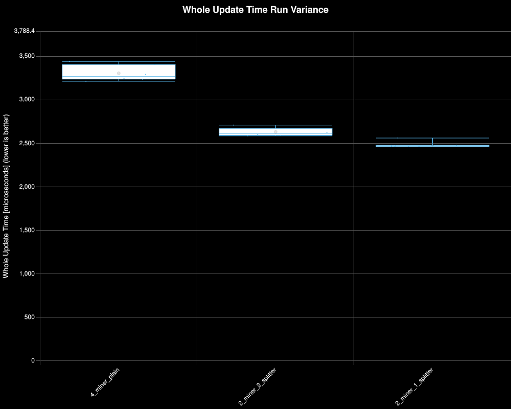
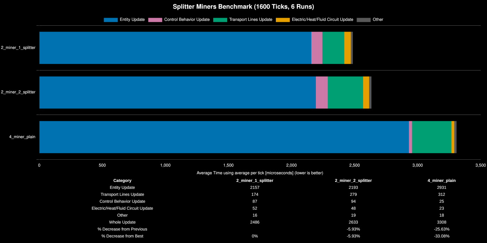

# Factorio Benchmark Results

**Platform:** linux-x86_64

**Factorio Version:** 2.0.77

**Date:** 2026-06-10

## The Question

Two big mining drills facing a single splitter can be used to output to two fully stacked turbo belts. Traditionally this is done with four big mining drills. Which is better for UPS?

Below are the variants that will be tested:

**4_miner_plain**

**2_miner_2_splitter**

**2_miner_1_splitter**

## The Answer

Having less big mining drills facing a splitter is better than the traditional method.

## Scenario
* Each save was tested for 1600 tick(s) and 6 run(s)

Credit to tappi for creating the save files and doing the investigations.

## Results
| Metric            | Description                           |
| ----------------- | ------------------------------------- |
| **Mean UPS**      | Updates per second - higher is better |
| **Mean Avg (ms)** | Average frame time - lower is better  |
| **Mean Min (ms)** | Minimum frame time - lower is better  |
| **Mean Max (ms)** | Maximum frame time - lower is better  |

| Save                  | Avg (ms) | Min (ms) | Max (ms) | UPS     | Execution Time (ms) | % Difference from Worst |
| --------------------- | -------- | -------- | -------- | ------- | ------------------- | ----------------------- |
| DI_4_miner_plain      | 3.308    | 0.041    | 247.700  | 302     | 31760               | 0.00%                   |
| DI_2_miner_2_splitter | 2.634    | 0.103    | 28.883   | 379     | 25284               | 25.57%                  |
| DI_2_miner_1_splitter | 2.486    | 0.104    | 27.715   | **402** | 23862               | 33.03%                  |

|Save File|Entity Update|Transport Lines Update|Control Behavior Update|Electric/Heat/Fluid Circuit Update|Other|Whole Update|% Decrease from Previous|% Decrease from Best|
|---|---|---|---|---|---|---|---|---|
|2_miner_1_splitter|2157|174|87|52|16|2486||0%|
|2_miner_2_splitter|2193|279|94|48|19|2633|-5.93%|-5.93%|
|4_miner_plain|2931|312|25|23|18|3308|-25.63%|-33.08%|