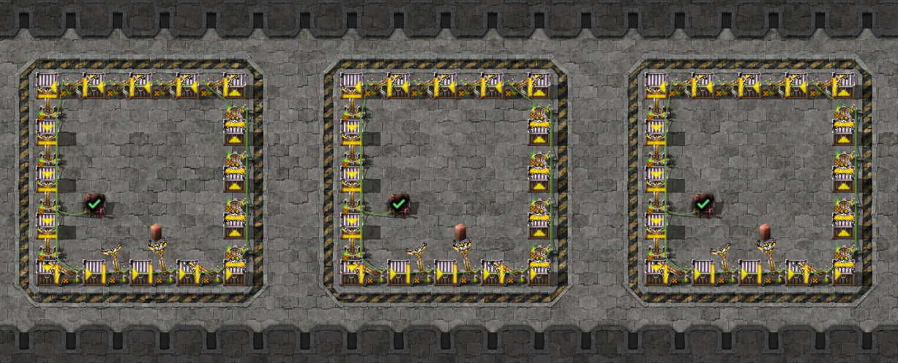
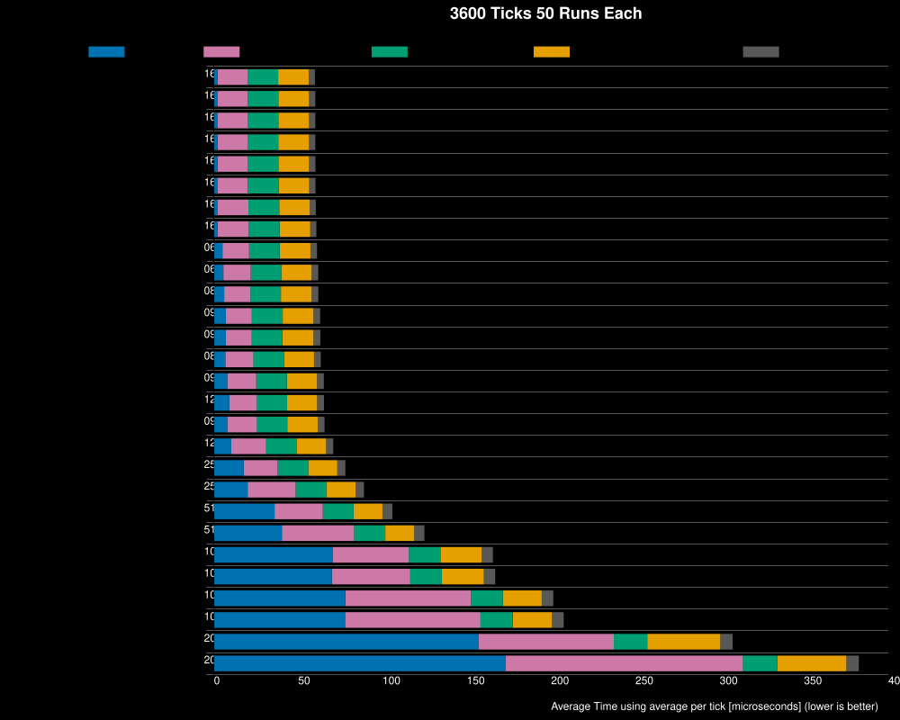
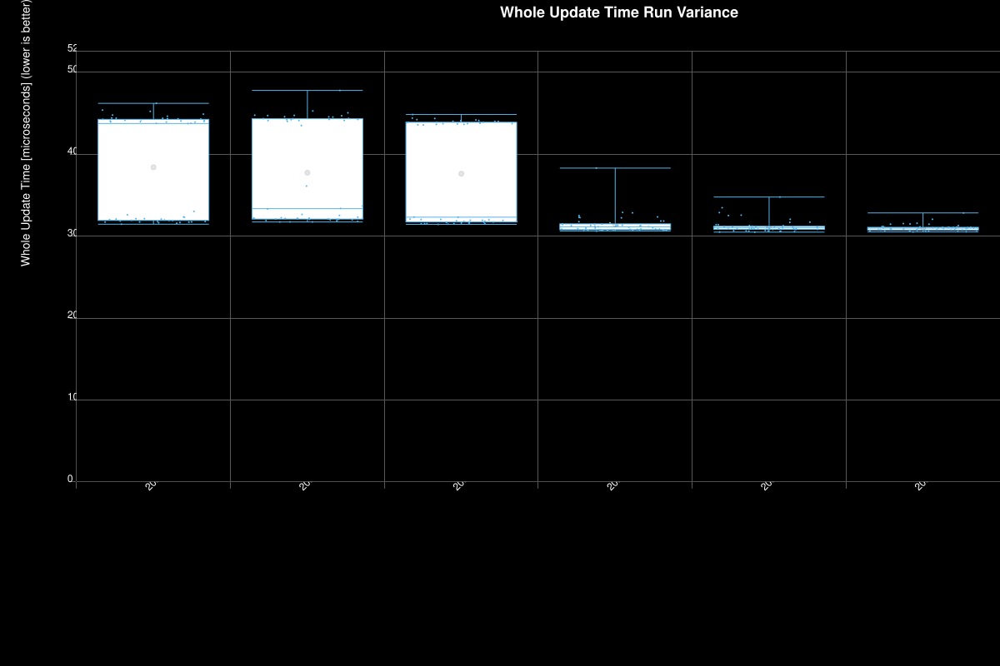
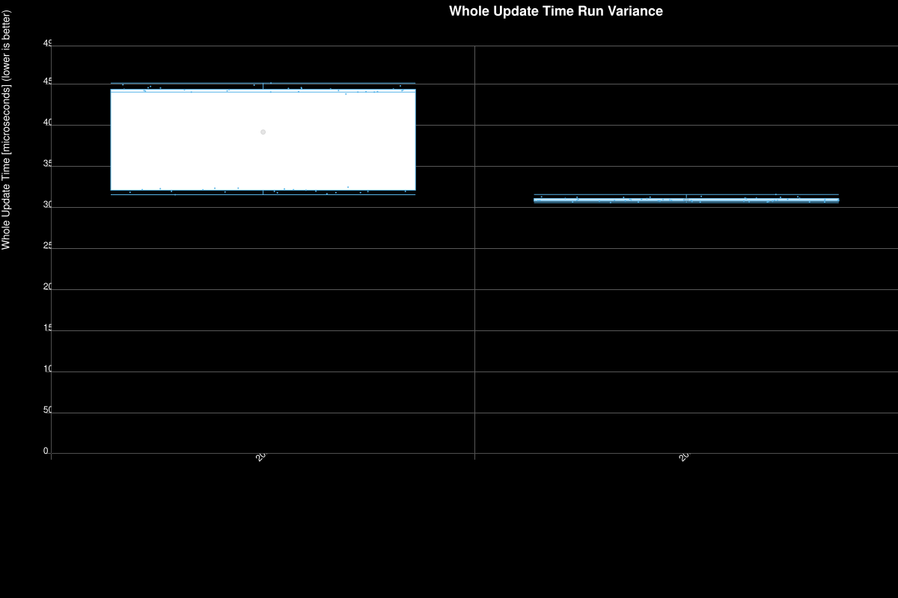
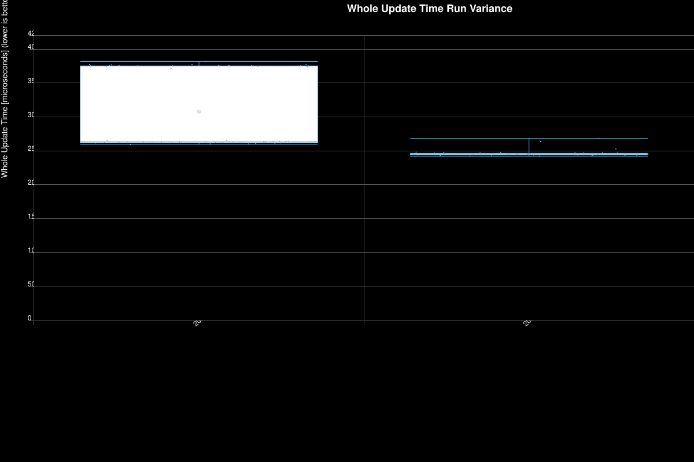
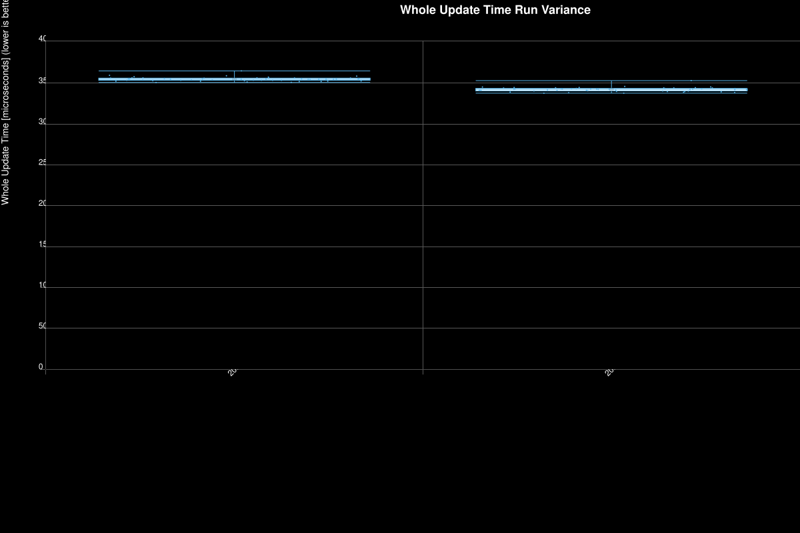
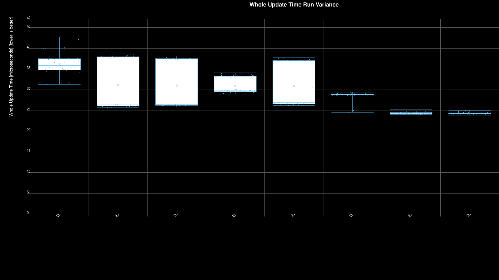

# Bimodal `controlBehaviorUpdate` Investigation — Summary Report

Investigation into a bimodal performance distribution observed in Factorio 2.1.6's `ControlBehaviorManager::update` on the `loop_*_circuit_no_condition` saves. The full data, methodology, and per-experiment retractions live in [BIMODAL_ANALYSIS.md](BIMODAL_ANALYSIS.md); this document is a high-level index of the experiments and what each one showed on `controlBehaviorUpdate`.

All experiments compare Factorio **2.0.77** vs **2.1.6** on an AMD Ryzen 7 9800X3D (8 physical × 2 SMT). Sample size is 50 runs per save unless noted.

## TL;DR

- 2.1.6 exhibits a strictly bimodal `controlBehaviorUpdate` distribution: ~50% of process launches run at parity with 2.0.77, ~50% run at ~2.5× the cost.
- The mode is locked at process startup and is independent of CPU pinning, SMT topology, ASLR, allocator implementation, and huge-page reservation.
- Setting `update-runner-threads-count=1` eliminates the bimodal split on both versions. 2.0.77 also bifurcates at N=2 and N=4 — it was previously assumed unimodal only because every default-N test used N=16, where it happens to be clean.
- The source-level mechanism is not identified by these black-box experiments; the responsible code path is somewhere active when `update-runner-threads-count ≥ 2`.

## Save files

All save files are stored under [maps/](maps/) and follow the naming pattern:

```
loop_<N>_<wiring>_<condition>_<version>.zip
```

Each save consists of `N` identical "loop units" which are cloned while power is off. One loop unit is a small square containing 16 inserters arranged around a central chest. Some are connected to the circuit network and some have different conditions set to mock varying active control behavior states. The definitions are below.



| Field | Values | Meaning |
|---|---|---|
| `N` | `16`, `64`, `80`, `96`, `128`, `256`, `512`, `1024`, `2056` | Number of loop units in the save. Total inserter count is `N × 16`. |
| wiring | `circuit` | Inserters are wired into a circuit network. |
| wiring | `no_circuit` | Inserters are not wired. |
| wiring | `one_network` | All `N` loops share a single circuit network (vs the default of one network per loop). |
| condition | `no_condition` | Inserters are wired but no enabled-if condition is set. They tick the control behavior every update but never gate state. |
| condition | `enabled_if_one` | Enabled-if check mark is equal to 1. |
| condition | `enabled_zero` | Enabled-if check mark is equal to 0. |
| `version` | `2_0_77`, `2_1_6` | The Factorio version the save was created in. Both versions of the same save are kept so cross-version comparisons aren't confounded by save-format changes. |

Almost every experiment below targets `loop_2056_circuit_no_condition` (32,896 inserters, wired but with no condition set) because it's the largest workload that consistently triggers the bimodal pattern.

## Experiment index

### 1. Baseline — workload sweep across loop sizes

50 runs × 11 `loop_N_circuit_no_condition` saves × 2 versions, default config (N=16 workers).




**Result:** 2.0.77 is unimodal at every workload size; max/min variance stays under 1.30×. 2.1.6 is bimodal from `loop_128` upward; the slow/fast ratio grows monotonically with workload, asymptoting at ~2.6× by `loop_2056`. When 2.1.6 lands in its fast mode it matches 2.0.77 to within 2%.

### 2. CPU pinning — physical / SMT / full

50 runs × 3 pinning strategies × 2 versions on `loop_2056_circuit_no_condition`, default N. Strategies: `physical_8` (`taskset -c 0-7`, one HW thread per physical core), `smt_8` (forced SMT sibling contention), `full_16` (default).



**Result:** The bimodal split is unaffected by CPU mask. `physical_8` (where SMT contention is mechanically impossible) still produces the same ~50/50 split with the same fast and slow cluster means. **Falsifies the SMT-sibling-placement hypothesis.**

### 3. ASLR off

50 runs × 2 versions, `setarch -R` + physical pinning, on `loop_2056_circuit_no_condition`.



**Result:** With process layout deterministic across launches, 2.1.6 still produces a 21/29 fast/slow split with cluster means within 1% of the pinning experiment. 2.0.77 collapses to its cleanest baseline yet (stdev 603 µs, n=50, zero slow). **Falsifies the address-layout / cache-aliasing hypothesis.**

### 4. mimalloc + 4 GiB huge pages (stacked on ASLR-off + pinning)

50 runs × 2 versions, `LD_PRELOAD=libmimalloc.so` + `MIMALLOC_RESERVE_HUGE_OS_PAGES=4` on top of the ASLR-off + pinning stack.



**Result:** 2.1.6 stays bimodal (30/20 split). Both versions get faster across the board (cb_update −18% on 2.0.77 baseline); the slow/fast ratio actually *widens* slightly (2.71×), which is the signature of a per-batch cache effect rather than a fixed-cost regression. **Falsifies the glibc-arena / allocator-implementation hypothesis.** Side observation: 2.1.6 `entityUpdate` is steadily +18% vs 2.0.77 in every run regardless of mode — a separate, unimodal finding worth flagging independently.

### 5. Single worker thread (true, via `update-runner-threads-count=1`)

50 runs × 2 versions, isolated `config.ini` with `update-runner-threads-count=1`, stacked on top of the mimalloc + huge pages + ASLR-off + pinning stack.



**Result:** Both versions collapse to tight unimodal distributions (2.1.6 cv 0.51%, 2.0.77 cv 0.84%). No bimodal, no flips, no intermediates. 2.1.6 median is 2% *below* 2.0.77 in this config. This is the first experiment to actually remove the effect — placing the cause inside the parallel code path active when `update-runner-threads-count ≥ 2`.

### 6. N-thread sweep — N ∈ {1, 2, 4, 8, 16}

50 runs × 2 versions × 5 N values on `loop_2056_circuit_no_condition`, same stack as experiment 5.



**Result:** 2.1.6 is bimodal at every N ∈ {2, 4, 8, 16}, with a stable ~58/42 split and a slow/fast ratio that grows with N (1.27× → 2.71×). **2.0.77 also bifurcates** at N=2 (4/50 slow) and starkly at N=4 (47/50 slow, only 1.50× speedup over N=1) — but is unimodal at N=8 and N=16. The earlier "2.0.77 never enters slow mode" framing in this document was a property of the chosen N, not of the version. At every N, 2.1.6's fast cluster matches 2.0.77 to within 1%; the slow cluster's absolute cb_update is approximately N-invariant for 2.1.6 at N ≥ 4 (~178–198k µs vs N=1's 195k µs — the pool barely parallelizes in slow mode regardless of worker count).

## What remains open

The data narrows the responsible code path to "somewhere active with ≥2 update-runner threads" and rules out the conventional environmental suspects (placement, topology, ASLR, allocator, TLB). The source-level mechanism is not identified by these experiments; discriminating it further requires either hardware-counter capture (`perf stat`, `perf c2c`) on paired fast/slow processes, or instrumentation of the worker pool itself. See [BIMODAL_ANALYSIS.md](BIMODAL_ANALYSIS.md) for the full hypothesis surface that survives.
