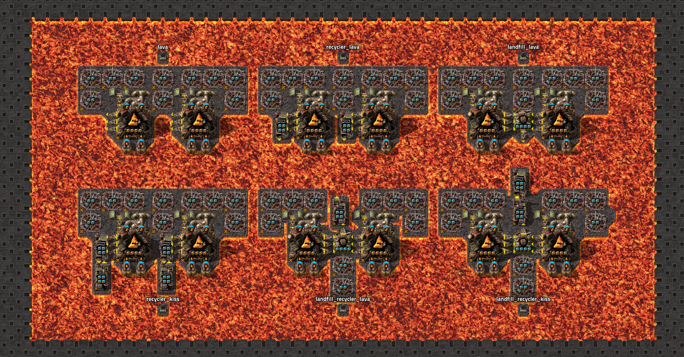
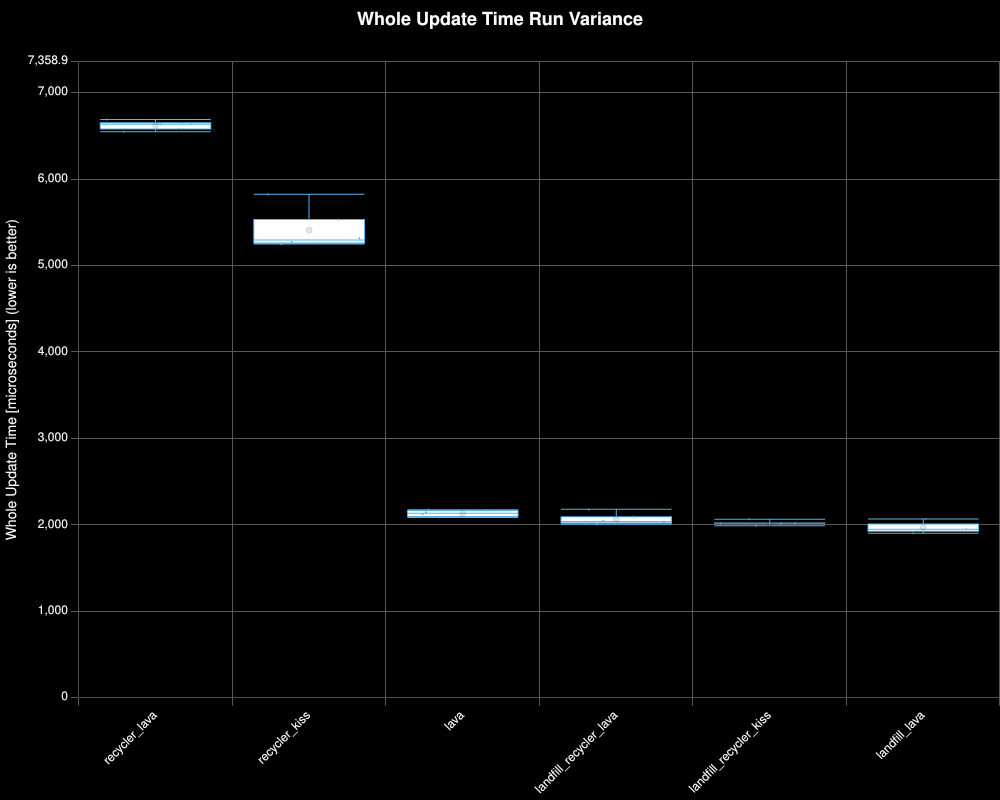
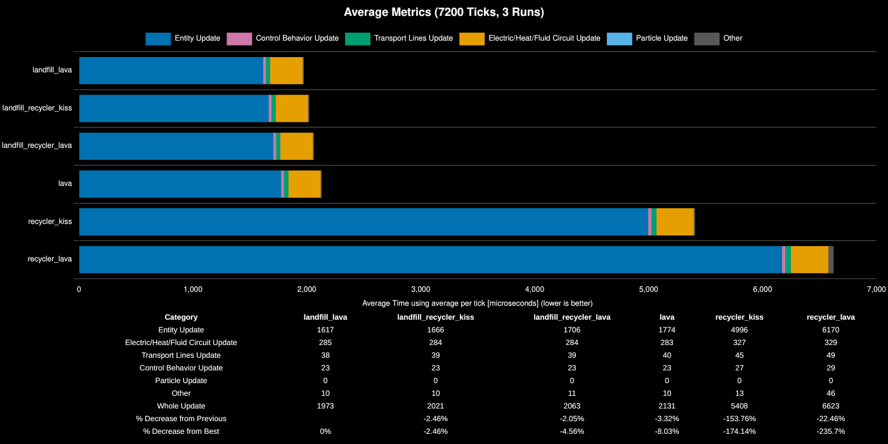
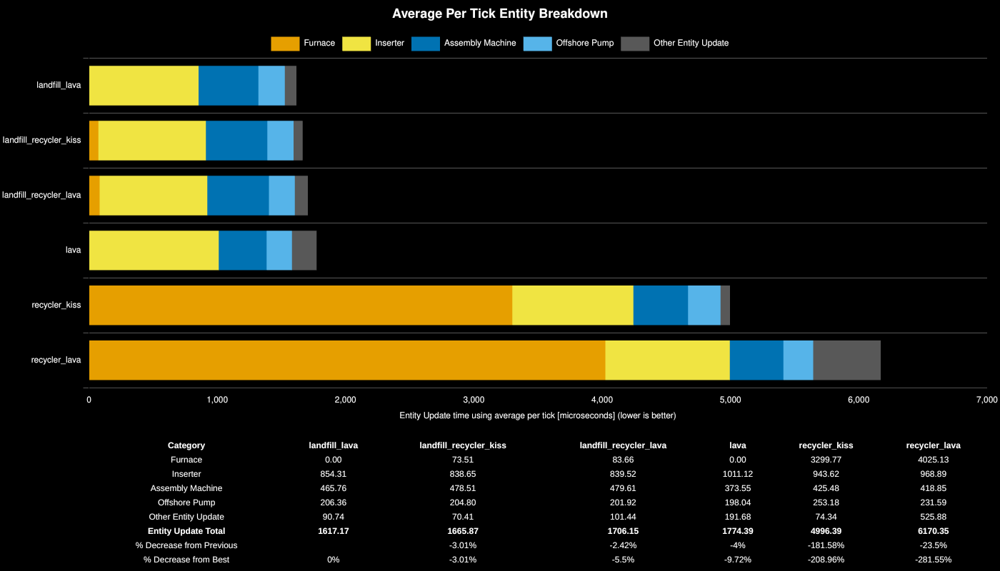
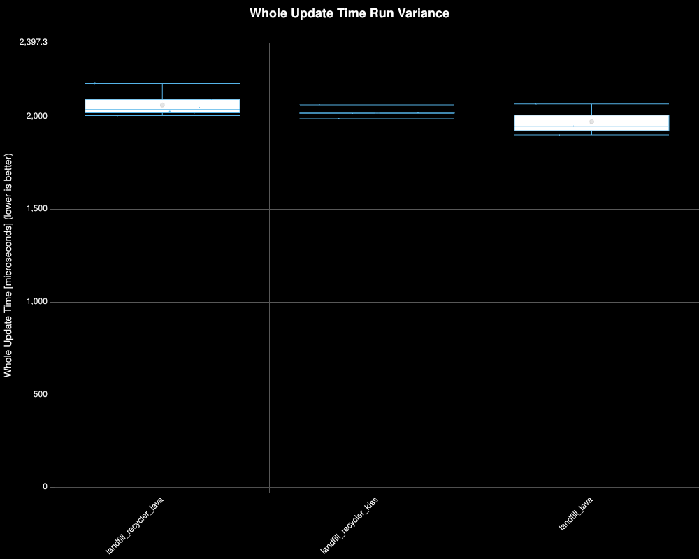
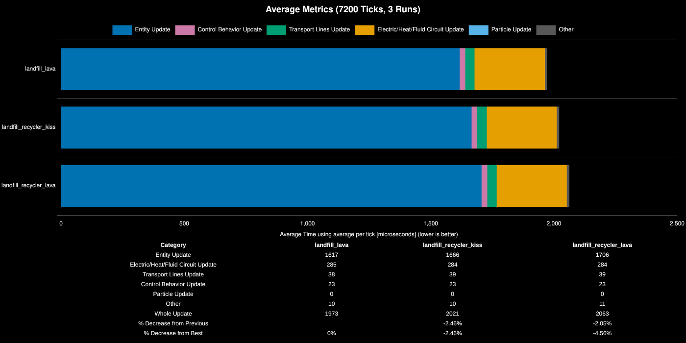
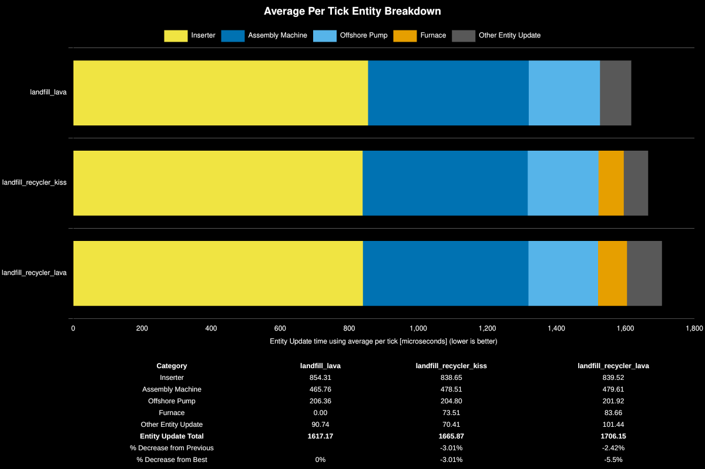

# Stone Voiding on Vulcanus

**Platform:** linux-x86_64

**Factorio Version:** 2.1.9

**Date:** 2026-07-01

## The Question

When producing molten fluids on Vulcanus, which method of stone voiding is the best in terms of UPS?

With 2.1.9, inserters now instantly drop the full stack into lava in 1 tick making this much more viable than in previous versions.

## The Answer

Crafting stone into landfill and voiding it in lava (`landfill_lava`) is the best method, followed closely by the other landfill variants. The top three configurations are all landfill-based and within ~5% of each other. Directly voiding stone in lava (`lava`) is ~8% worse, while recycler-based methods are dramatically worse — roughly 3× the whole update time — due to the high cost of recyclers (marked as furnace prototype) performing a craft for each stone discarded rather than a batch of 50 items crafting at once for landfill.

**Recommendation:** Craft stone into landfill with an assembly machine and discard it in lava. Avoid recyclers for stone voiding on Vulcanus.

## Scenario

The configurations and names of each save file are shown in the following graphic. The first step is always removing stone from the foundry with three legendary stack inserters.

- Each save was tested for 7200 tick(s) and 3 run(s)
- 6 copies of each design are fed from a belt of calcite and output to one fluid network with an infinity pipe connected
- 512 copies of this are created for a total of 3072 copies of each blueprint
- each design has slight back pressure and produces 368 stone per foundry

Save file preparation steps:
- the game is paused and all entities are added into the array of 6 and then cloned 511 times
- all inserters, foundries, and pumps are deleted except for the calcite provider inserters
- the game is run until the belts are filled
- the game is paused
- the removal operation performed earlier is undone
- the game is saved

Note: at the time of this benchmark, the mod region cloner does not support factorio 2.1 so a temporary local version was created and marked as version 9.9.9 which is an unofficial version.

## Results

### All Save Files

|Save File|Entity Update|Electric/Heat/Fluid Circuit Update|Transport Lines Update|Control Behavior Update|Particle Update|Other|Whole Update|% Decrease from Previous|% Decrease from Best|
|---|---|---|---|---|---|---|---|---|---|
|landfill_lava|1617|285|38|23|0|10|1973||0%|
|landfill_recycler_kiss|1666|284|39|23|0|10|2021|-2.46%|-2.46%|
|landfill_recycler_lava|1706|284|39|23|0|11|2063|-2.05%|-4.56%|
|lava|1774|283|40|23|0|10|2131|-3.32%|-8.03%|
|recycler_kiss|4996|327|45|27|0|13|5408|-153.76%|-174.14%|
|recycler_lava|6170|329|49|29|0|46|6623|-22.46%|-235.7%|

| Save File              | Furnace | Inserter | Assembly Machine | Offshore Pump | Other Entity Update | Entity Update Total | % Decrease from Previous | % Decrease from Best |
| ---------------------- | ------- | -------- | ---------------- | ------------- | ------------------- | ------------------- | ------------------------ | -------------------- |
| landfill_lava          | 0       | 855.84   | 465.41           | 206.36        | 90.49               | 1618.11             |                          | 0%                   |
| landfill_recycler_kiss | 72.91   | 840.44   | 478.28           | 204.86        | 70.5                | 1666.99             | -3.02%                   | -3.02%               |
| landfill_recycler_lava | 82.97   | 841.02   | 479.24           | 201.91        | 101.11              | 1706.25             | -2.36%                   | -5.45%               |
| lava                   | 0       | 1012.01  | 373.28           | 198.01        | 190.82              | 1774.13             | -3.98%                   | -9.64%               |
| recycler_kiss          | 3292.85 | 945.01   | 425.17           | 253.04        | 74.25               | 4990.33             | -181.28%                 | -208.4%              |
| recycler_lava          | 4016.1  | 968.21   | 418.45           | 231.44        | 522.33              | 6156.52             | -23.37%                  | -280.48%             |

### Landfill Crafting

| Save File              | Entity Update | Electric/Heat/Fluid Circuit Update | Transport Lines Update | Control Behavior Update | Particle Update | Other | Whole Update | % Decrease from Previous | % Decrease from Best |
| ---------------------- | ------------- | ---------------------------------- | ---------------------- | ----------------------- | --------------- | ----- | ------------ | ------------------------ | -------------------- |
| landfill_lava          | 1617          | 285                                | 38                     | 23                      | 0               | 10    | 1973         |                          | 0%                   |
| landfill_recycler_kiss | 1666          | 284                                | 39                     | 23                      | 0               | 10    | 2021         | -2.46%                   | -2.46%               |
| landfill_recycler_lava | 1706          | 284                                | 39                     | 23                      | 0               | 11    | 2063         | -2.05%                   | -4.56%               |

| Save File              | Inserter | Assembly Machine | Offshore Pump | Furnace | Other Entity Update | Entity Update Total | % Decrease from Previous | % Decrease from Best |
| ---------------------- | -------- | ---------------- | ------------- | ------- | ------------------- | ------------------- | ------------------------ | -------------------- |
| landfill_lava          | 854.31   | 465.76           | 206.36        | 0       | 90.74               | 1617.17             |                          | 0%                   |
| landfill_recycler_kiss | 838.65   | 478.51           | 204.8         | 73.51   | 70.41               | 1665.87             | -3.01%                   | -3.01%               |
| landfill_recycler_lava | 839.52   | 479.61           | 201.92        | 83.66   | 101.44              | 1706.15             | -2.42%                   | -5.5%                |