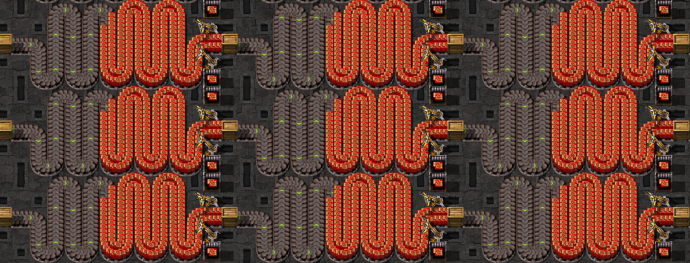
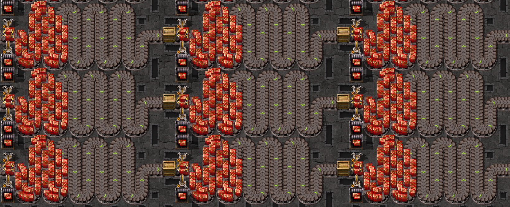
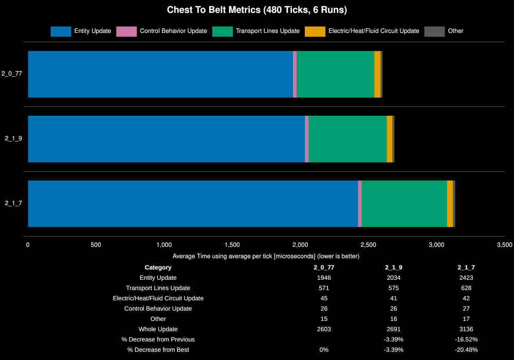
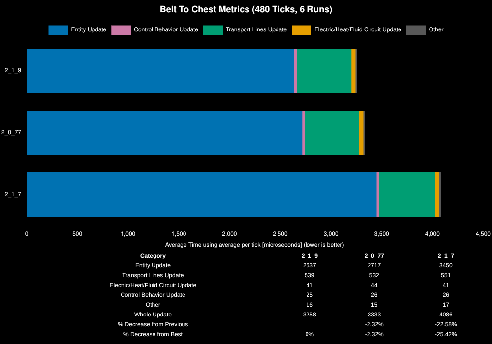

# Inserter Performance Between Factorio Versions

**Platform:** linux-x86_64

**Factorio Version:** 2.1.9

**CPU:** Ryzen 9800X3D

**Date:** 2026-07-01

## The Question

What is the difference in performance of inserters picking up from a belt or dropping to a belt between different factorio versions?

Specific versions that are tested:

1. 2.0.77 is the latest stable version of 2.0
2. 2.1.7 experimental version to represent 2.1
3. 2.1.8 is omitted due to a bug causing Q5 inserters to not drop at 80 items per second
4. 2.1.9 experimental version which switched to fixed point math for inserter rotation and fixed the bug in 2.1.8

## The Answer
Moving from 2.0.77 to 2.1.7 was a significant regression for inserters, costing roughly 20% in chest-to-belt and 23% in belt-to-chest whole update time. The switch to fixed point math for inserter rotation in 2.1.9 recovered essentially all of that loss: chest-to-belt is now within ~3% of 2.0.77, and belt-to-chest is actually ~2% faster than 2.0.77. In short, 2.1.9 restores 2.0-era inserter performance and, in the belt-to-chest direction, slightly improves on it.

## Scenario

Below are screenshots of the maps for both belt to chest and chest to belt.

In the belt to chest scenario, the chests are prefilled with an infinity chest and then swapped with a steel chest before cloning to prevent the overhead incurred by infinity chests.

- Each save was tested for 480 tick(s) and 6 run(s)
- All saves have 16x1028 clones of the original template seen in the screenshots for a total of 32896 inserters
- 480 ticks is chosen as that is the time it takes to unload and load onto this belt
- the first 60 ticks are removed from each benchmark metrics due to the large overhead incurred during initial save load

> Note: due to the size of the save files, only the 2.0.77 version is committed, subsequent versions are created by opening the save file in the respective version with the game paused and saving it with the respective version postfix.

## Results

### Chest to Belt

| Save File | Entity Update | Transport Lines Update | Electric/Heat/Fluid Circuit Update | Control Behavior Update | Other | Whole Update | % Decrease from Previous | % Decrease from Best |
| --------- | ------------- | ---------------------- | ---------------------------------- | ----------------------- | ----- | ------------ | ------------------------ | -------------------- |
| 2_0_77    | 1946          | 571                    | 45                                 | 26                      | 15    | 2603         |                          | 0%                   |
| 2_1_9     | 2034          | 575                    | 41                                 | 26                      | 16    | 2691         | -3.39%                   | -3.39%               |
| 2_1_7     | 2423          | 628                    | 42                                 | 27                      | 17    | 3136         | -16.52%                  | -20.48%              |

### Belt to Chest

| Save File | Entity Update | Transport Lines Update | Electric/Heat/Fluid Circuit Update | Control Behavior Update | Other | Whole Update | % Decrease from Previous | % Decrease from Best |
| --------- | ------------- | ---------------------- | ---------------------------------- | ----------------------- | ----- | ------------ | ------------------------ | -------------------- |
| 2_1_9     | 2637          | 539                    | 41                                 | 25                      | 16    | 3258         |                          | 0%                   |
| 2_0_77    | 2717          | 532                    | 44                                 | 26                      | 15    | 3333         | -2.32%                   | -2.32%               |
| 2_1_7     | 3450          | 551                    | 41                                 | 26                      | 17    | 4086         | -22.58%                  | -25.42%              |