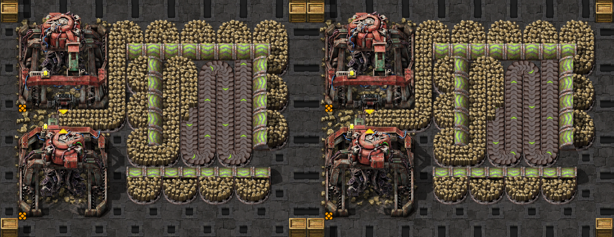
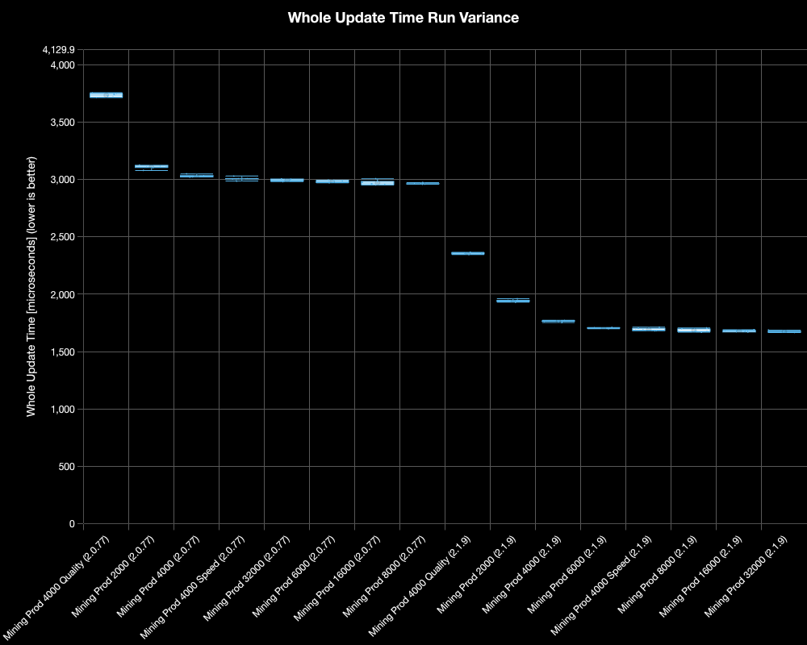
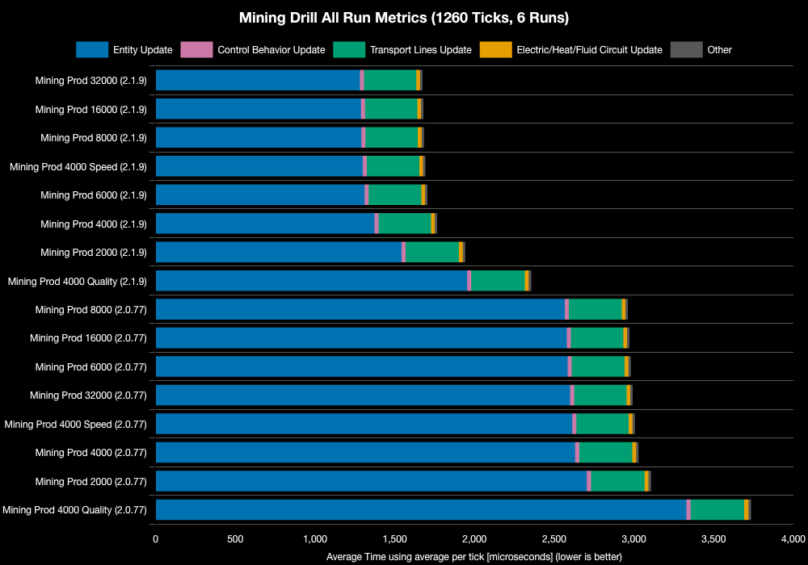
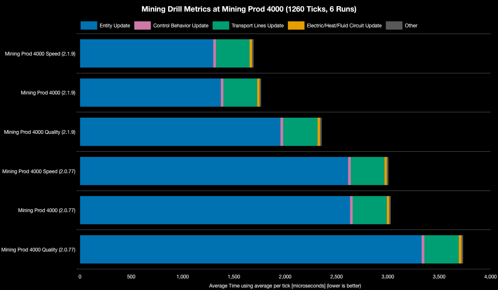
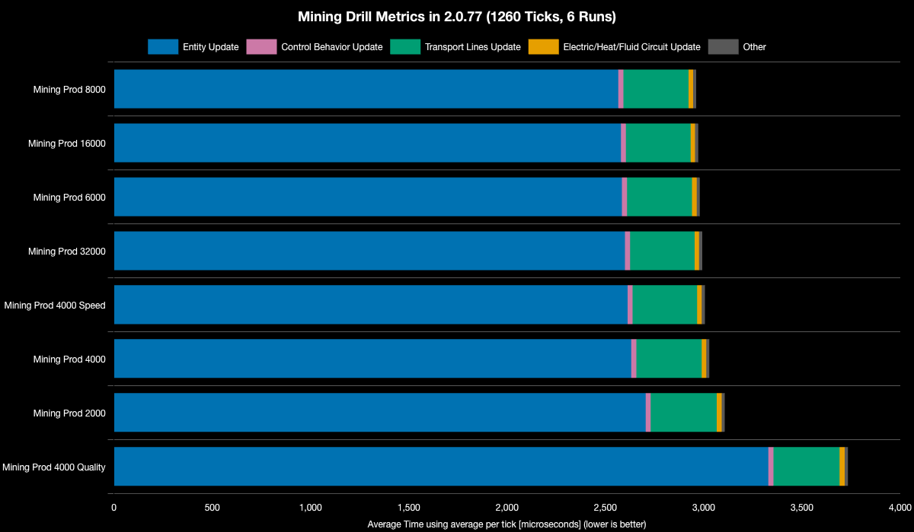
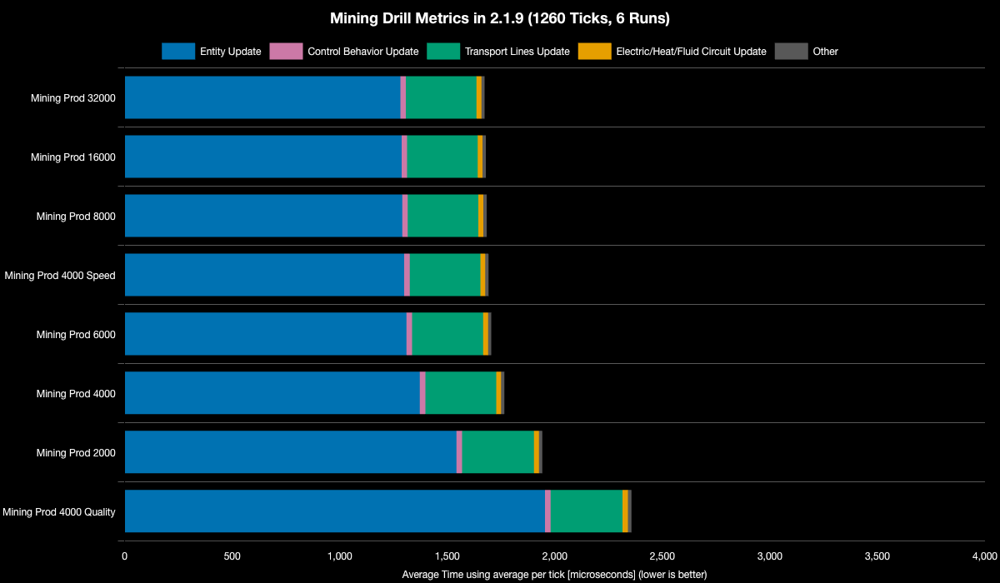

# Mining Drill Performance Improvements in 2.1

**Platform:** linux-x86_64

**Factorio Version:** 2.1.9

**CPU:** Ryzen 9800X3D

**Date:** 2026-07-03

## The Question

Has 2.1 improved mining drill performance over 2.0?


## The Answer
2.1.9 is dramatically faster than 2.0.77 for mining drills — roughly 43-44% faster on entity update time for comparable configs (e.g., Mining Prod 4000: 1372ms vs 2631ms entity update; Prod 8000: 1291ms vs 2566ms).


After speaking with the developers they said they did make an improvement specifically. Rseding did a batch mining where a drill goes slightly different code path when drill is about to produce at least 2 sets of bonus products in a single tick.


## Scenario


The above blueprint is used in each save file. It takes 1260 ticks for the belt to be filled. It is copied 64 times to the east and the full row of 64 is copied 256 times to the north. A total of 32_768 miing drills are used in each save file.

Benchmark Runs:
- Each save was tested for 1260 ticks and 6 runs each
- The launchers are available on github in the `launchers` folder for launching 2.0.77 and 2.1.9

> Note: the 2.1.9 save files are omitted for space saving reasons. To reproduce this benchmark, save each save file and rename the prefix to `bm_2_1_9`

Mining productivity is setup by invoking the following command in game:

```
/c game.player.force.technologies['mining-productivity-3'].level = 4001
```

## Results

### All Runs


| Save File                         | Entity Update | Transport Lines Update | Control Behavior Update | Electric/Heat/Fluid Circuit Update | Other | Whole Update | % Decrease from Previous | % Decrease from Best |
| --------------------------------- | ------------- | ---------------------- | ----------------------- | ---------------------------------- | ----- | ------------ | ------------------------ | -------------------- |
| Mining Prod 32000 (2.1.9)         | 1282          | 328                    | 25                      | 23                                 | 15    | 1674         |                          | 0%                   |
| Mining Prod 16000 (2.1.9)         | 1288          | 328                    | 25                      | 23                                 | 15    | 1679         | -0.32%                   | -0.32%               |
| Mining Prod 8000 (2.1.9)          | 1291          | 328                    | 25                      | 23                                 | 15    | 1683         | -0.23%                   | -0.55%               |
| Mining Prod 4000 Speed (2.1.9)    | 1300          | 328                    | 25                      | 23                                 | 15    | 1692         | -0.53%                   | -1.08%               |
| Mining Prod 6000 (2.1.9)          | 1311          | 330                    | 26                      | 23                                 | 15    | 1705         | -0.77%                   | -1.85%               |
| Mining Prod 4000 (2.1.9)          | 1372          | 329                    | 26                      | 23                                 | 15    | 1766         | -3.57%                   | -5.49%               |
| Mining Prod 2000 (2.1.9)          | 1543          | 334                    | 26                      | 24                                 | 15    | 1942         | -9.97%                   | -16%                 |
| Mining Prod 4000 Quality (2.1.9)  | 1954          | 335                    | 26                      | 25                                 | 16    | 2356         | -21.35%                  | -40.77%              |
| Mining Prod 8000 (2.0.77)         | 2566          | 331                    | 26                      | 23                                 | 16    | 2962         | -25.71%                  | -76.96%              |
| Mining Prod 16000 (2.0.77)        | 2579          | 329                    | 26                      | 23                                 | 16    | 2972         | -0.33%                   | -77.55%              |
| Mining Prod 6000 (2.0.77)         | 2584          | 331                    | 26                      | 24                                 | 16    | 2980         | -0.28%                   | -78.05%              |
| Mining Prod 32000 (2.0.77)        | 2600          | 328                    | 26                      | 23                                 | 16    | 2992         | -0.4%                    | -78.77%              |
| Mining Prod 4000 Speed (2.0.77)   | 2613          | 328                    | 26                      | 23                                 | 16    | 3006         | -0.46%                   | -79.59%              |
| Mining Prod 4000 (2.0.77)         | 2631          | 332                    | 26                      | 24                                 | 16    | 3029         | -0.77%                   | -80.96%              |
| Mining Prod 2000 (2.0.77)         | 2705          | 336                    | 26                      | 24                                 | 16    | 3107         | -2.57%                   | -85.62%              |
| Mining Prod 4000 Quality (2.0.77) | 3329          | 336                    | 27                      | 26                                 | 16    | 3733         | -20.17%                  | -123.05%             |


### 2.0 vs 2.1 at Fixed Mining Prod


| Save File                | Entity Update | Transport Lines Update | Control Behavior Update | Electric/Heat/Fluid Circuit Update | Other | Whole Update | % Decrease from Previous | % Decrease from Best |
| ------------------------ | ------------- | ---------------------- | ----------------------- | ---------------------------------- | ----- | ------------ | ------------------------ | -------------------- |
| Mining Prod 32000        | 1282          | 328                    | 25                      | 23                                 | 15    | 1674         |                          | 0%                   |
| Mining Prod 16000        | 1288          | 328                    | 25                      | 23                                 | 15    | 1679         | -0.32%                   | -0.32%               |
| Mining Prod 8000         | 1291          | 328                    | 25                      | 23                                 | 15    | 1683         | -0.23%                   | -0.55%               |
| Mining Prod 4000 Speed   | 1300          | 328                    | 25                      | 23                                 | 15    | 1692         | -0.53%                   | -1.08%               |
| Mining Prod 6000         | 1311          | 330                    | 26                      | 23                                 | 15    | 1705         | -0.77%                   | -1.85%               |
| Mining Prod 4000         | 1372          | 329                    | 26                      | 23                                 | 15    | 1766         | -3.57%                   | -5.49%               |
| Mining Prod 2000         | 1543          | 334                    | 26                      | 24                                 | 15    | 1942         | -9.97%                   | -16%                 |
| Mining Prod 4000 Quality | 1954          | 335                    | 26                      | 25                                 | 16    | 2356         | -21.35%                  | -40.77%              |

### 2.0

| Save File                | Entity Update | Transport Lines Update | Control Behavior Update | Electric/Heat/Fluid Circuit Update | Other | Whole Update | % Decrease from Previous | % Decrease from Best |
| ------------------------ | ------------- | ---------------------- | ----------------------- | ---------------------------------- | ----- | ------------ | ------------------------ | -------------------- |
| Mining Prod 8000         | 2566          | 331                    | 26                      | 23                                 | 16    | 2962         |                          | 0%                   |
| Mining Prod 16000        | 2579          | 329                    | 26                      | 23                                 | 16    | 2972         | -0.33%                   | -0.33%               |
| Mining Prod 6000         | 2584          | 331                    | 26                      | 24                                 | 16    | 2980         | -0.28%                   | -0.62%               |
| Mining Prod 32000        | 2600          | 328                    | 26                      | 23                                 | 16    | 2992         | -0.4%                    | -1.02%               |
| Mining Prod 4000 Speed   | 2613          | 328                    | 26                      | 23                                 | 16    | 3006         | -0.46%                   | -1.48%               |
| Mining Prod 4000         | 2631          | 332                    | 26                      | 24                                 | 16    | 3029         | -0.77%                   | -2.26%               |
| Mining Prod 2000         | 2705          | 336                    | 26                      | 24                                 | 16    | 3107         | -2.57%                   | -4.89%               |
| Mining Prod 4000 Quality | 3329          | 336                    | 27                      | 26                                 | 16    | 3733         | -20.17%                  | -26.05%              |

### 2.1

| Save File                | Entity Update | Transport Lines Update | Control Behavior Update | Electric/Heat/Fluid Circuit Update | Other | Whole Update | % Decrease from Previous | % Decrease from Best |
| ------------------------ | ------------- | ---------------------- | ----------------------- | ---------------------------------- | ----- | ------------ | ------------------------ | -------------------- |
| Mining Prod 32000        | 1282          | 328                    | 25                      | 23                                 | 15    | 1674         |                          | 0%                   |
| Mining Prod 16000        | 1288          | 328                    | 25                      | 23                                 | 15    | 1679         | -0.32%                   | -0.32%               |
| Mining Prod 8000         | 1291          | 328                    | 25                      | 23                                 | 15    | 1683         | -0.23%                   | -0.55%               |
| Mining Prod 4000 Speed   | 1300          | 328                    | 25                      | 23                                 | 15    | 1692         | -0.53%                   | -1.08%               |
| Mining Prod 6000         | 1311          | 330                    | 26                      | 23                                 | 15    | 1705         | -0.77%                   | -1.85%               |
| Mining Prod 4000         | 1372          | 329                    | 26                      | 23                                 | 15    | 1766         | -3.57%                   | -5.49%               |
| Mining Prod 2000         | 1543          | 334                    | 26                      | 24                                 | 15    | 1942         | -9.97%                   | -16%                 |
| Mining Prod 4000 Quality | 1954          | 335                    | 26                      | 25                                 | 16    | 2356         | -21.35%                  | -40.77%              |

