# Automation Science Q1 vs Q2 in 2.1.9 

**Platform:** linux-x86_64

**Factorio:** 2.1.9

**CPU:** Ryzen 9800X3D

**Date:** 2026-07-08

## The Question

Does the number of clones change which full automation-science design is fastest? A Q1 red-science build and a Q2 red-science build produce different winners depending on how many clones are present.

## The Answer

**Yes — the winner flips with scale.** Q1 (clocked) is faster at low clone counts (≤18), and Q2 LDS shuffle is faster at high clone counts (≥30). Q2 copper ore voiding is the slowest of the three real designs at every scale.

The unclocked Q1 control confirms inserter clocking is an optimization, not overhead: removing it makes Q1 slower at every scale (28% worse at clone_0 → 46% worse at clone_48). Clocking keeps inserters idle between pulses, cutting entity update time by **~40–43%** at large scale (equivalently, removing it raises entity update by ~68–75%: 4,970→8,677 µs at clone_48; 2,434→4,082 µs at clone_30). That saving far outweighs the circuit/control cost it adds.

The Q1→Q2 crossover is *not* about circuit overhead and *not* about entity update. Clocking lets Q1 hold **competitive entity-update cost right through clone_48** despite 2× the belt/inserter infrastructure — at large scale, Q1 and Q2 LDS shuffle are within 1% on entity update. Q1 loses at scale because its **fluid network, control behavior, and transport overhead grow faster** than Q2 LDS shuffle's and eventually overtake it. Q2 LDS shuffle always beats Q2 copper ore voiding because its copper-recycling loop uses fewer entities for the same throughput.

## Designs

All four variants target the same effective science output. Uncommon (Q2) packs are worth 2×, so 24 stacked turbo belts of Q2 output = 48 belts of Q1 output.

**Q1 48-belt (clocked)** — Normal-quality science, 48 belts/clone. Iron and copper ore smelted in foundries to molten iron/copper; gears cast from molten iron, copper plates from molten copper; both feed science assemblers. Large dual-fluid network per clone. Inserters clocked via circuit networks.
**Q1 48-belt unclocked** — Identical production/fluid chain, all circuits removed. Inserters run every tick. Control to isolate entity-update cost from circuit overhead.

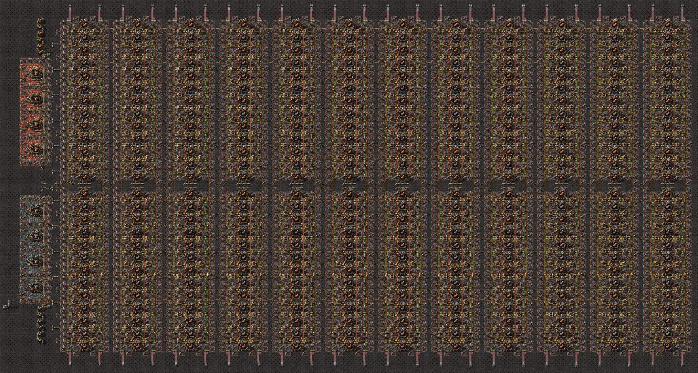

**Q2 LDS shuffle 24-belt** — Uncommon-quality, 24 belts/clone. Copper plates recovered from an LDS recycling loop (ore → molten iron/copper in foundries → LDS → recycled to copper plates; steel byproduct voided via infinity-recycled steel chests). Iron plates: normal-quality iron ore voided in recyclers, remainder smelted in standard furnaces → gear assembler. Foundries used only for the LDS subassembly, so a small dual-fluid network per clone. Inserters clocked via circuit networks.
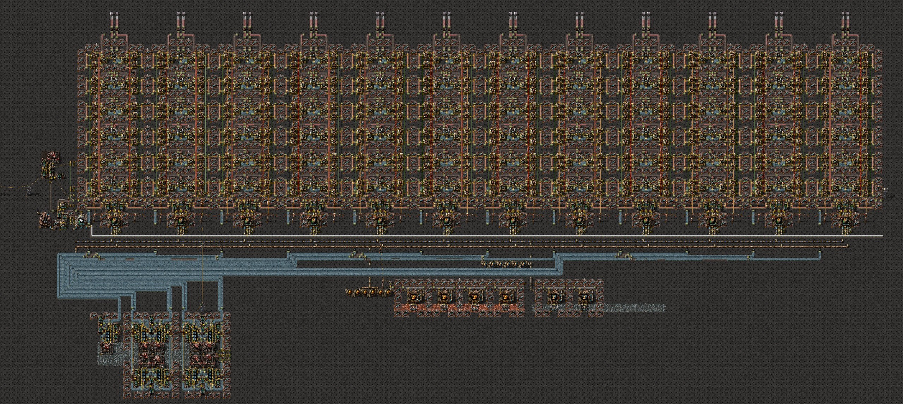

**Q2 copper ore voiding 24-belt** — Uncommon-quality, 24 belts/clone. Copper and iron ore smelted in standard furnaces. Normal-quality **copper ore is voided** in recyclers (to obtain uncommon copper), and normal-quality **iron ore is also voided** in recyclers before the remainder is smelted into iron plates for the gear assembler. No foundries, no fluids. Inserters clocked via circuit networks. (Voided ore appears as furnaces in entity stats.)

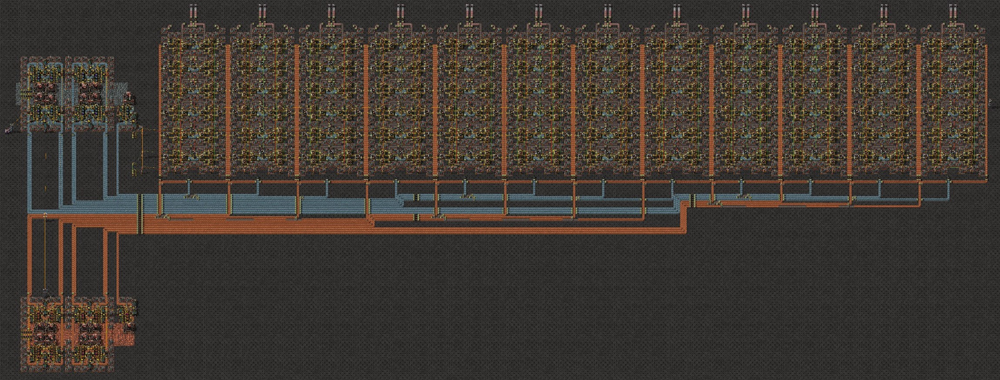

`clone_#` = number of full copies of the design in the map.

All save file blueprints are in the following book: [blueprints.txt](./blueprints.txt)

## Results

### Whole-update scaling (median µs)

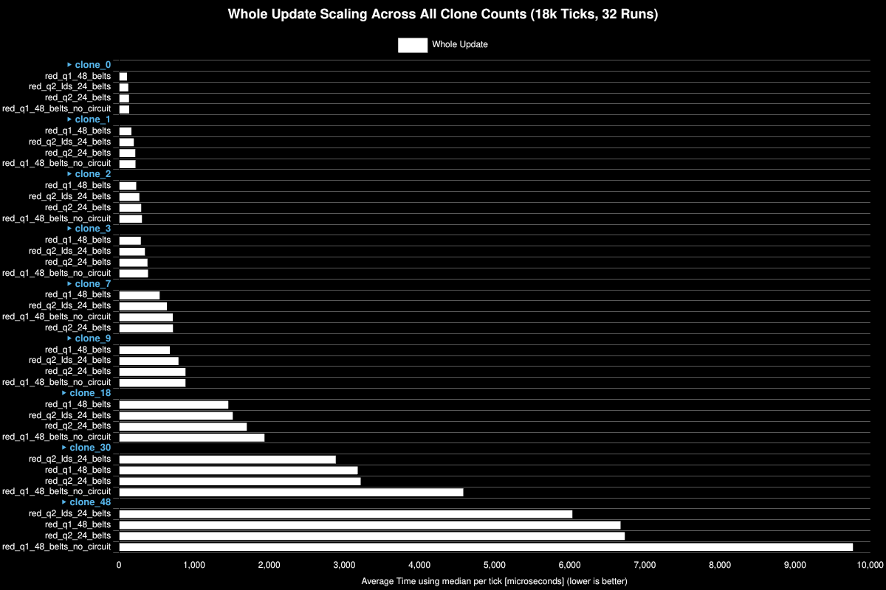

| Clones | Q1 clocked | Q1 unclocked | Q2 LDS shuffle | Q2 ore voiding | Leader     | Q1 vs Q2 LDS |
| ------ | ---------- | ------------ | -------------- | -------------- | ---------- | ------------ |
| 0      | 106        | 136          | 123            | 134            | Q1         | Q1 −14%      |
| 1      | 166        | 219          | 198            | 216            | Q1         | Q1 −16%      |
| 2      | 229        | 305          | 272            | 296            | Q1         | Q1 −16%      |
| 3      | 291        | 387          | 343            | 379            | Q1         | Q1 −15%      |
| 7      | 542        | 716          | 637            | 718            | Q1         | Q1 −15%      |
| 9      | 676        | 886          | 792            | 886            | Q1         | Q1 −15%      |
| 18     | 1455       | 1937         | 1513           | 1701           | Q1         | Q1 −4%       |
| 30     | 3179       | 4586         | 2885           | 3217           | **Q2 LDS** | Q2 LDS −9%   |
| 48     | 6678       | 9773         | 6035           | 6735           | **Q2 LDS** | Q2 LDS −10%  |

Unclocked Q1 is the slowest design at every scale beyond clone_9.

### What drives the crossover

Q1's overhead sub-metrics accumulate faster than Q2 LDS shuffle's as copies scale — fluid (`electricHeatFluidCircuitUpdate`) at ~3×, control behavior at ~2×, transport at ~1.3× — combining to roughly 2× overall.

| Clones | Q1 Circuit | Q2 LDS Circuit | Q1 Control | Q2 LDS Control | Q1 Transport | Q2 LDS Transport |
| ------ | ---------- | -------------- | ---------- | -------------- | ------------ | ---------------- |
| 0      | 18         | 19             | 18         | 17             | 16           | 15               |
| 9      | 68         | 41             | 72         | 58             | 52           | 48               |
| 18     | 126        | 71             | 135        | 100            | 97           | 84               |
| 30     | 250        | 113            | 280        | 177            | 196          | 159              |
| 48     | 531        | 187            | 711        | 418            | 438          | 344              |

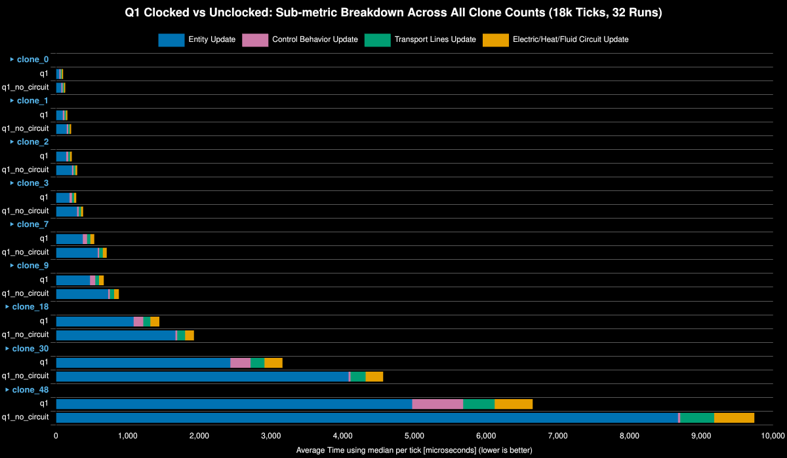

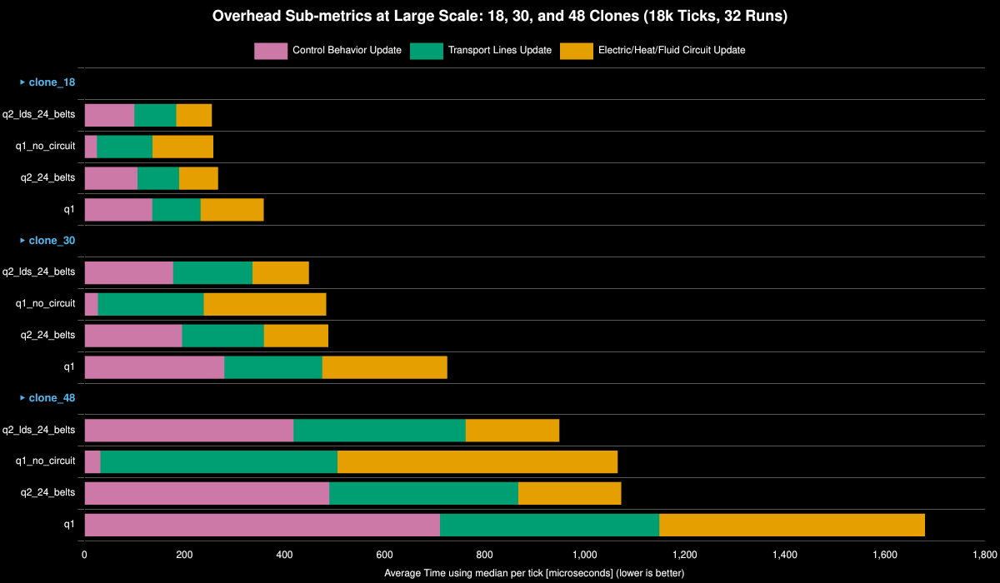

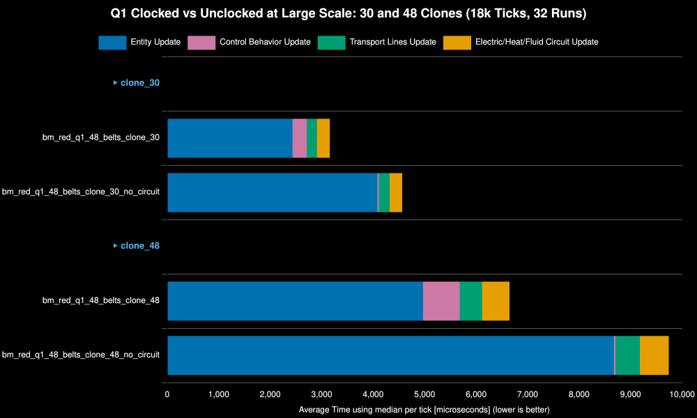

Removing Q1's circuits nearly eliminates its control-behavior cost (135→25 at clone_18; 711→32 at clone_48) but barely changes `electricHeatFluidCircuitUpdate` — because that phase is dominated by fluid flow, not circuits.

### Q1 entity breakdown: clocked vs unclocked

The entity-level breakdown isolates where unclocked Q1 pays the extra entity-update cost: **inserters**. Inserters check whether to insert each time a craft completes — if the insertion limit and overload multiplier conditions are met, an insertion occurs. Clocking gates these checks by keeping inserters idle between clock pulses, suppressing the per-craft evaluation for most of the cycle. Without clocking, every craft completion triggers the check, roughly doubling inserter cost at large scale, while assembly machines, loaders, and other entities remain nearly unchanged.

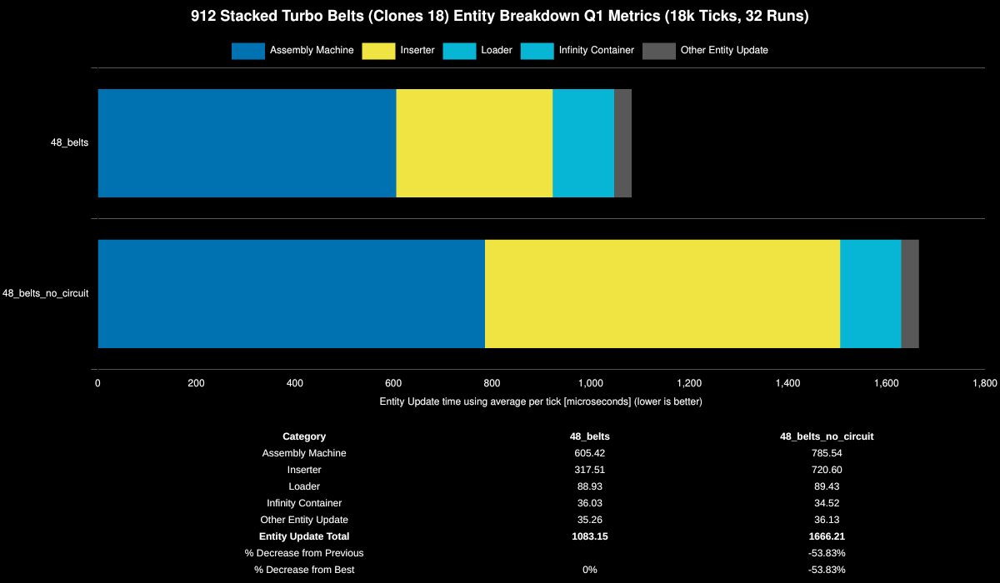

| Save File                    | Assembly Machine | Inserter | Loader | Infinity Container | Other | Entity Update Total | % vs clocked |
| ---------------------------- | ---------------- | -------- | ------ | ------------------ | ----- | ------------------- | ------------ |
| 48_belts_clone_18            | 605.42           | 317.51   | 88.93  | 36.03              | 35.26 | 1083.15             | —            |
| 48_belts_clone_18_no_circuit | 785.54           | 720.60   | 89.43  | 34.52              | 36.13 | 1666.21             | +54%         |

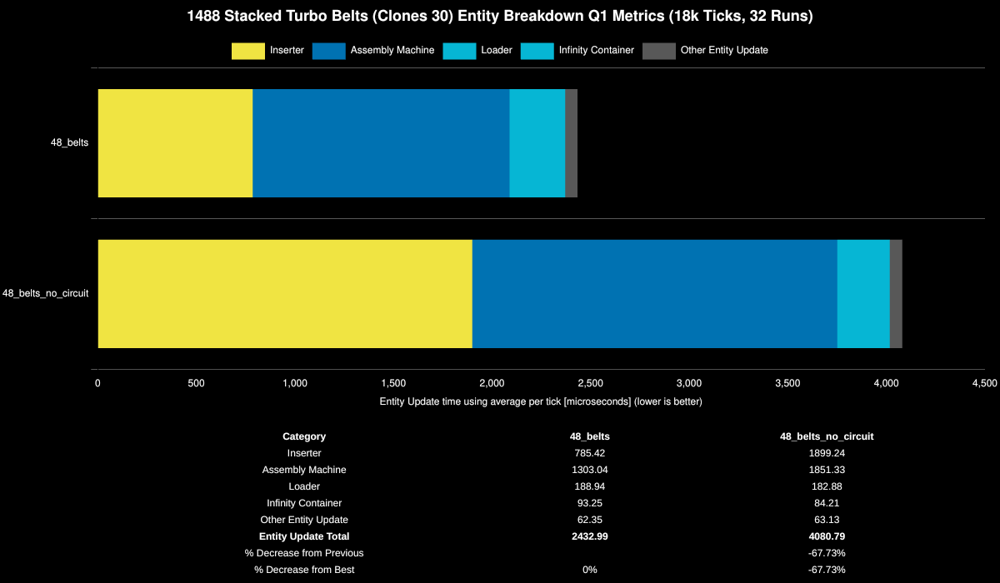

| Save File                    | Inserter | Assembly Machine | Loader | Infinity Container | Other | Entity Update Total | % vs clocked |
| ---------------------------- | -------- | ---------------- | ------ | ------------------ | ----- | ------------------- | ------------ |
| 48_belts_clone_30            | 785.42   | 1303.04          | 188.94 | 93.25              | 62.35 | 2432.99             | —            |
| 48_belts_clone_30_no_circuit | 1899.24  | 1851.33          | 182.88 | 84.21              | 63.13 | 4080.79             | +68%         |

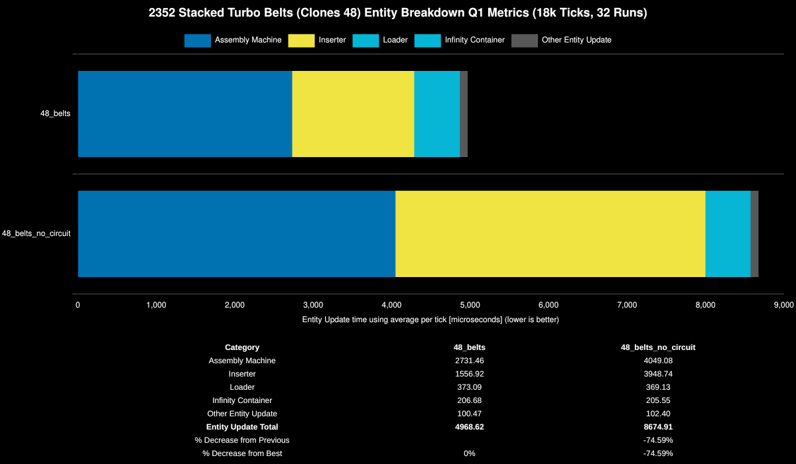

| Save File                    | Assembly Machine | Inserter | Loader | Infinity Container | Other  | Entity Update Total | % vs clocked |
| ---------------------------- | ---------------- | -------- | ------ | ------------------ | ------ | ------------------- | ------------ |
| 48_belts_clone_48            | 2731.46          | 1556.92  | 373.09 | 206.68             | 100.47 | 4968.62             | —            |
| 48_belts_clone_48_no_circuit | 4049.08          | 3948.74  | 369.13 | 205.55             | 102.40 | 8674.91             | +75%         |

At clone_48, inserter cost alone increases by ~2,392 µs when circuits are removed (1,557→3,949 µs), accounting for virtually all of the ~3,706 µs total entity-update increase. Loaders, infinity containers, and other entities are unaffected by clocking.

### Multithreaded sub-metric breakdown (average aggregate µs)

Within `electricHeatFluidCircuitUpdate`, electric/fluid/heat/circuit sub-tasks run in parallel; the longest determines phase time.

| Clones | Q1 Electric | Q1 Fluid | Q2 LDS Electric | Q2 LDS Fluid | Q2 void Electric | Q2 void Fluid |
| ------ | ----------- | -------- | --------------- | ------------ | ---------------- | ------------- |
| 0      | 7           | 6        | 5               | 1            | 5                | **0**         |
| 9      | 60          | 53       | 37              | 6            | 40               | **0**         |
| 18     | 112         | 106      | 65              | 13           | 72               | **0**         |
| 30     | 180         | **241**  | 106             | 23           | 122              | **0**         |
| 48     | 307         | **522**  | 179             | 48           | 198              | **0**         |

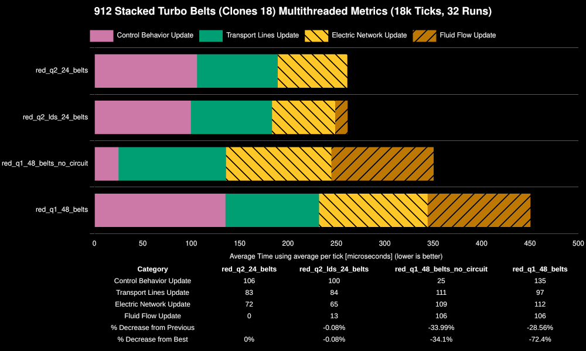

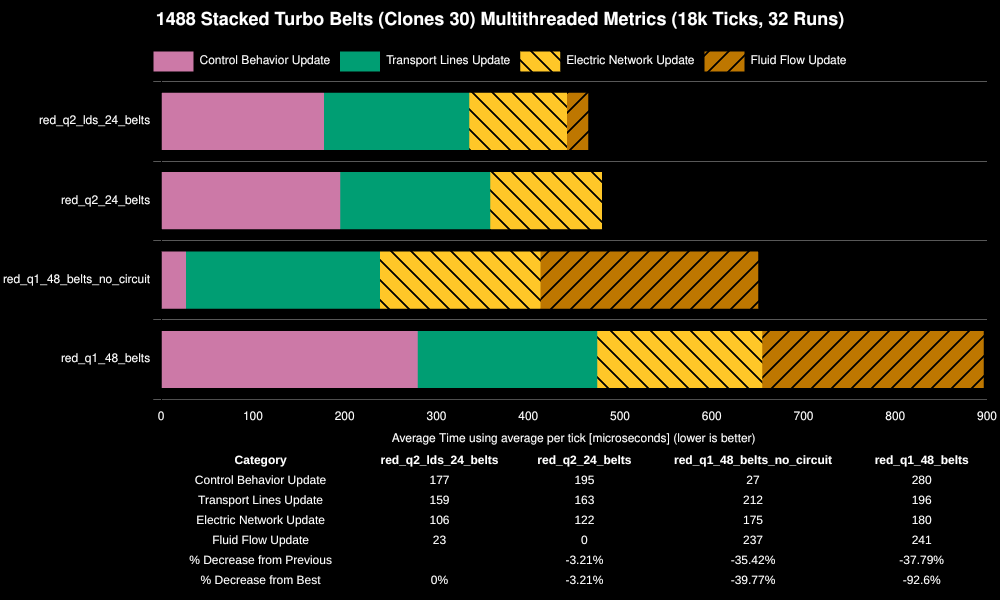

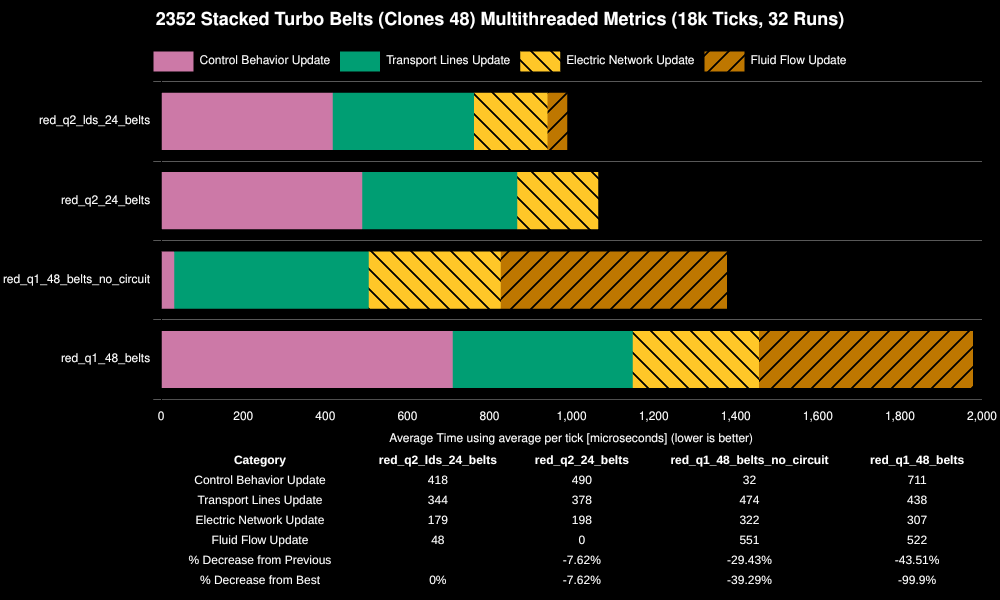

Key points:

1. **Q2 copper ore voiding has zero fluid overhead** — it uses no fluids, so its `electricHeatFluidCircuitUpdate` is pure electric.
2. **Q2 LDS shuffle has small fluid overhead** (48 µs at clone_48) from the foundry molten iron/copper used only for LDS.
3. **Q1's fluid flow overtakes its own electric network between clone_18 and clone_30** — the same window as the whole-update crossover. At clone_48, fluid flow (522 µs) is nearly the entire phase total (531 µs), making it the multithreading bottleneck. Unclocked Q1 fluid cost is essentially identical (551 vs 522 µs), confirming the fluid overhead is structural (foundry networks), not circuit-related.
4. **Q2 copper ore voiding has higher `controlBehaviorUpdate` than Q2 LDS shuffle** at every scale (490 vs 418 at clone_48; 195 vs 177 at clone_30), despite both using 24 belts.

### Q2 entity breakdown: LDS shuffle vs copper ore voiding

In Factorio's entity update, both standard furnaces and recyclers share the same "Furnace" entity class. The breakdown therefore shows:

- **`lds_24_belts` Furnace cost** — foundries producing molten iron/copper for LDS assembly, plus the recyclers recycling finished LDS back into copper plates and steel.
- **`24_belts` Furnace cost** — standard smelting furnaces processing copper and iron ore into plates, plus the ore-voiding recyclers upcycling raw ore to uncommon quality.

The ore voiding design consistently has **~38–47% higher furnace/recycler cost** at every scale. The LDS recycling loop recovers copper from a compact, high-value intermediate (each LDS recycle yields copper plates directly), so it can sustain the same copper plate throughput with fewer total furnace-class entity operations. Ore voiding must process raw ore at high volume — discarding the normal-quality output and keeping only the uncommon yield — which demands proportionally more recycler throughput.

The **mining drill** cost tells the same story: ore voiding needs roughly 2× the mining drill time at large scale (394 vs 203 µs at clone_48) because the higher ore discard rate requires significantly more raw ore input to hit the same effective throughput.

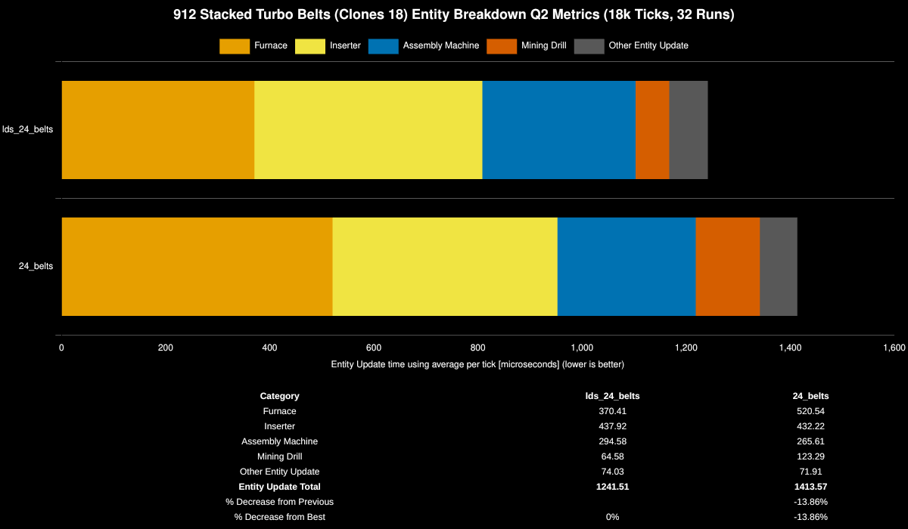

| Save File             | Furnace | Inserter | Assembly Machine | Mining Drill | Other | Entity Update Total | % vs LDS shuffle |
| --------------------- | ------- | -------- | ---------------- | ------------ | ----- | ------------------- | ---------------- |
| lds_24_belts_clone_18 | 370.41  | 437.92   | 294.58           | 64.58        | 74.03 | 1241.51             | —                |
| 24_belts_clone_18     | 520.54  | 432.22   | 265.61           | 123.29       | 71.91 | 1413.57             | +14%             |

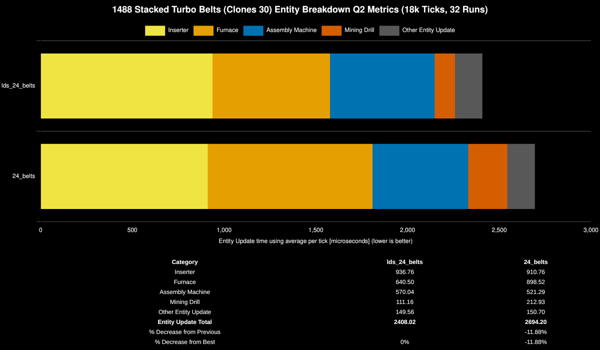

| Save File             | Inserter | Furnace | Assembly Machine | Mining Drill | Other  | Entity Update Total | % vs LDS shuffle |
| --------------------- | -------- | ------- | ---------------- | ------------ | ------ | ------------------- | ---------------- |
| lds_24_belts_clone_30 | 936.76   | 640.50  | 570.04           | 111.16       | 149.56 | 2408.02             | —                |
| 24_belts_clone_30     | 910.76   | 898.52  | 521.29           | 212.93       | 150.70 | 2694.20             | +12%             |

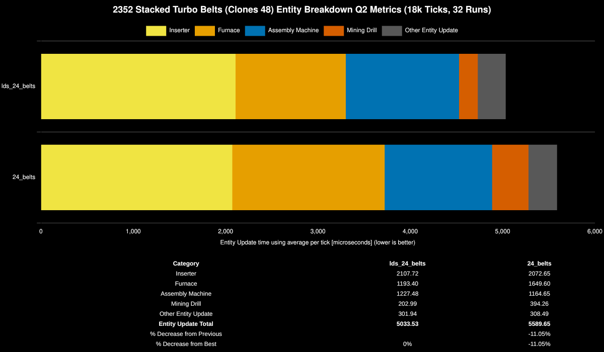

| Save File             | Inserter | Furnace | Assembly Machine | Mining Drill | Other  | Entity Update Total | % vs LDS shuffle |
| --------------------- | -------- | ------- | ---------------- | ------------ | ------ | ------------------- | ---------------- |
| lds_24_belts_clone_48 | 2107.72  | 1193.40 | 1227.48          | 202.99       | 301.94 | 5033.53             | —                |
| 24_belts_clone_48     | 2072.65  | 1649.60 | 1164.65          | 394.26       | 308.49 | 5589.65             | +11%             |

The entity update gap is remarkably consistent: LDS shuffle is ~11–14% cheaper in total entity update at every scale. Furnace cost is the primary driver, with mining drills as a secondary contributor — both stem from the higher raw material throughput the ore voiding design requires.

### Q1 vs Q2 entity breakdown: where the crossover hides

The combined entity breakdown charts show all four designs side by side and reveal something counterintuitive: **Q1 and Q2 LDS shuffle are essentially tied on entity update at large scale**. The whole-update crossover at clone_30+ is entirely an overhead story (fluid, control, transport) — not an entity-update story.

Three structural differences shape the Q1 vs Q2 LDS entity-update comparison:

1. **Assembly machines** — Q1 has ~2× the assemblers per clone (48 belts vs 24), so its assembly machine cost is persistently ~2× Q2 LDS's at every scale. This is Q1's entity-update disadvantage.
2. **Furnaces** — Q1 uses foundries for molten iron/copper, which are not tracked in the "Furnace" entity class. Q2 LDS carries a growing furnace/recycler cost (the LDS recycling loop). At clone_48, Q2 LDS furnace cost alone is 1,193 µs.
3. **Inserters** — Q1 clocking suppresses inserter cost at every scale. At clone_0, Q1's inserter cost is less than half Q2 LDS's (10 vs 22 µs); the advantage narrows but persists through clone_48 (1,557 vs 2,108 µs, ~26% lower).

At small scale, Q1's furnace savings plus clamped inserter cost outweigh its assembly machine penalty, producing a decisive entity-update lead. As scale increases, Q1's assembly machine cost (which grows proportionally with belt count) converges with Q2 LDS's furnace + inserter growth, and the two meet near clone_18–30.

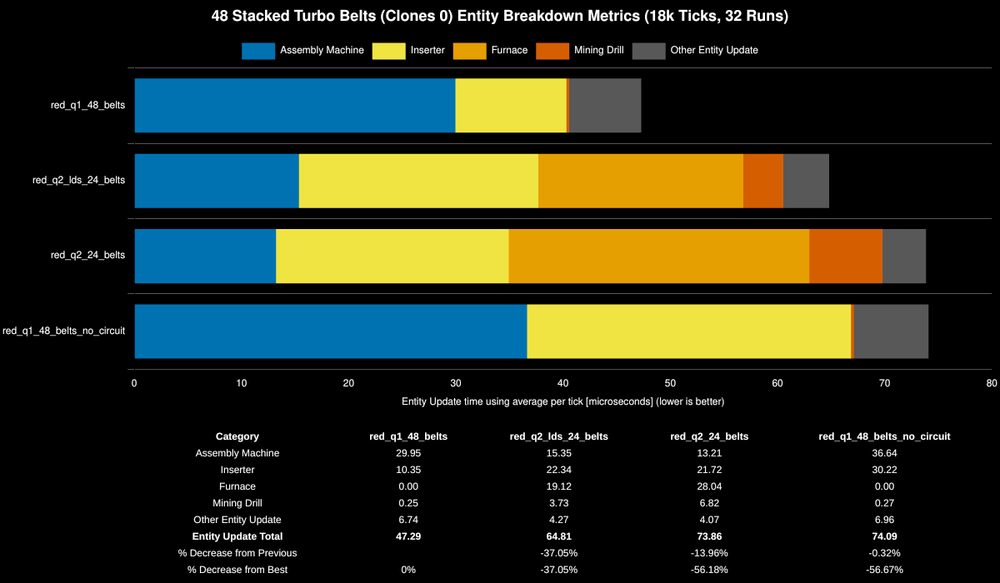

| Design         | Assembly Machine | Inserter | Furnace | Mining Drill | Other | Entity Update Total |
| -------------- | ---------------- | -------- | ------- | ------------ | ----- | ------------------- |
| Q1 clocked     | 29.95            | 10.35    | 0       | 0.25         | 6.74  | **47.29**           |
| Q2 LDS shuffle | 15.35            | 22.34    | 19.12   | 3.73         | 4.27  | 64.81 (+37%)        |
| Q2 ore voiding | 13.21            | 21.72    | 28.04   | 6.82         | 4.07  | 73.86 (+56%)        |

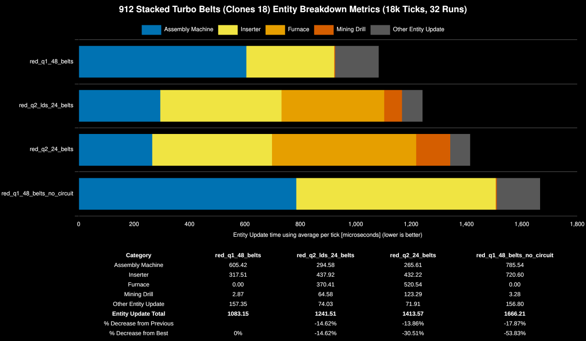

| Design         | Assembly Machine | Inserter | Furnace | Mining Drill | Other  | Entity Update Total |
| -------------- | ---------------- | -------- | ------- | ------------ | ------ | ------------------- |
| Q1 clocked     | 605.42           | 317.51   | 0       | 2.87         | 157.35 | **1083.15**         |
| Q2 LDS shuffle | 294.58           | 437.92   | 370.41  | 64.58        | 74.03  | 1241.51 (+15%)      |
| Q2 ore voiding | 265.61           | 432.22   | 520.54  | 123.29       | 71.91  | 1413.57 (+30%)      |

At clone_18, Q1 still holds a 15% entity-update lead over Q2 LDS. Q1's zero furnace cost and clamped inserter cost (~318 vs ~438 µs) more than offset the ~311 µs assembly machine penalty (605 vs 295 µs). Even at this clone count — where the whole-update gap has nearly closed — entity update alone favors Q1.

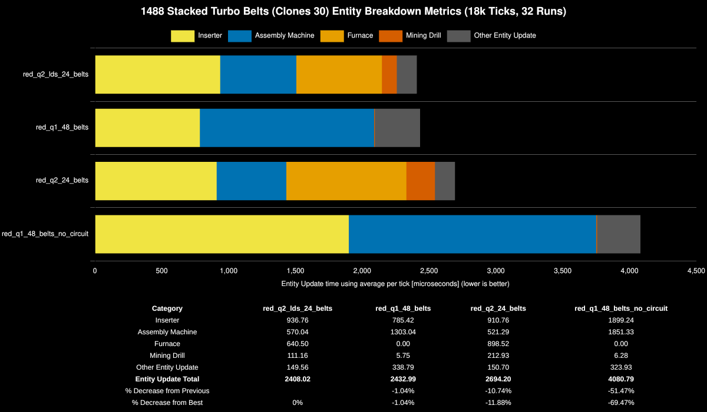

| Design         | Inserter | Assembly Machine | Furnace | Mining Drill | Other  | Entity Update Total |
| -------------- | -------- | ---------------- | ------- | ------------ | ------ | ------------------- |
| Q2 LDS shuffle | 936.76   | 570.04           | 640.50  | 111.16       | 149.56 | **2408.02**         |
| Q1 clocked     | 785.42   | 1303.04          | 0       | 5.75         | 338.79 | 2432.99 (+1%)       |
| Q2 ore voiding | 910.76   | 521.29           | 898.52  | 212.93       | 150.70 | 2694.20 (+12%)      |

By clone_30, Q1's assembly machine cost (1,303 µs) has grown to 2.3× Q2 LDS's (570 µs), and Q2 LDS's furnace cost has grown to 641 µs. Those two effects nearly cancel: Q1 saves ~733 µs on furnace, loses ~733 µs on assembly machines, and retains a ~151 µs inserter advantage — leaving entity update essentially tied (2,433 vs 2,408 µs, within 1%).

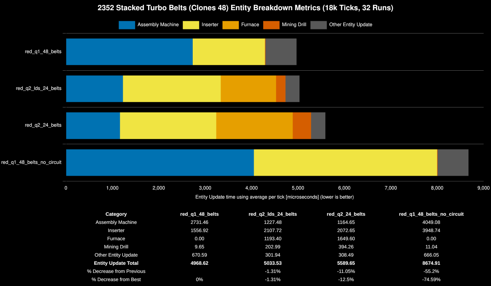

| Design         | Assembly Machine | Inserter | Furnace | Mining Drill | Other  | Entity Update Total |
| -------------- | ---------------- | -------- | ------- | ------------ | ------ | ------------------- |
| Q1 clocked     | 2731.46          | 1556.92  | 0       | 9.65         | 670.59 | **4968.62**         |
| Q2 LDS shuffle | 1227.48          | 2107.72  | 1193.40 | 202.99       | 301.94 | 5033.53 (+1%)       |
| Q2 ore voiding | 1164.65          | 2072.65  | 1649.60 | 394.26       | 308.49 | 5589.65 (+13%)      |

At clone_48, the pattern holds: Q1's assembly machine penalty (~1,504 µs extra) is offset by furnace savings (~1,193 µs) and inserter savings (~551 µs). Entity update is again within 1%.

**The bottom line:** Q2 LDS shuffle overtakes Q1 on whole update at clone_30 not because it wins on entity update — it doesn't, entity update is tied — but because Q1's per-clone fluid network costs nearly 3× more in `electricHeatFluidCircuitUpdate` and its circuit network adds ~2× the `controlBehaviorUpdate` overhead. The entity-update efficiency Q1 gains from clocking is real and persistent; Q1 simply loses the overhead race at scale.

### Why the 9800X3D matters

The 9800X3D is an 8-core Zen 5 chip with a single CCD and 96 MB unified L3 (64 MB 3D V-Cache + 32 MB conventional), so multithreaded updates share cache with no cross-chiplet penalties. Both fluid and circuit processing are graph/pointer-chasing workloads that live or die on L3 hit rate (~4 ns hit vs ~50–80 ns DDR5 miss).

We did not measure cache behavior directly, so the following is a **hypothesis**, not a confirmed cause: Q1's much larger per-clone fluid network may be exhausting the 96 MB cache at a lower clone count. Its fluid cost grows 87× (6→522 µs) over 48× the entities, and this superlinear scaling is *consistent with* cache pressure — but other factors (e.g. algorithmic scaling of the fluid solver) have not been ruled out. Denser networks likely also lengthen tail tasks, increasing thread-barrier wait time.

## Notes

- **Per-run variance is very low (~1–2%)** at all clone counts — stable, reliable conditions.
- Suggested follow-ups: (1) thread-count sweep (1/2/4/8) at clone_30 and clone_48 to separate cache saturation from thread-sync effects; (2) intermediate clone counts (20–28) to see whether the crossover has a sharp cache-capacity knee or is gradual.
