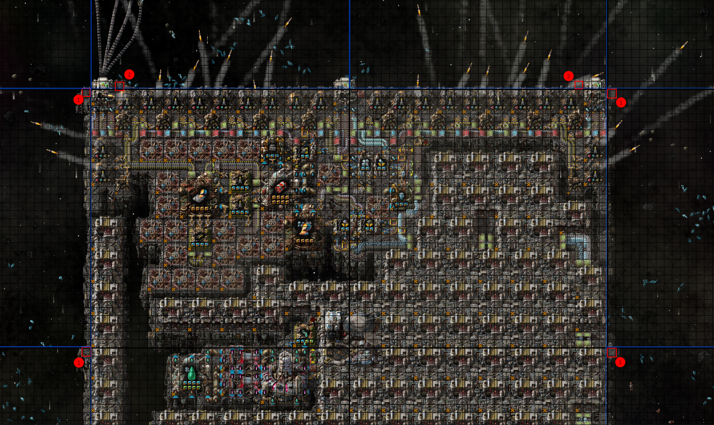
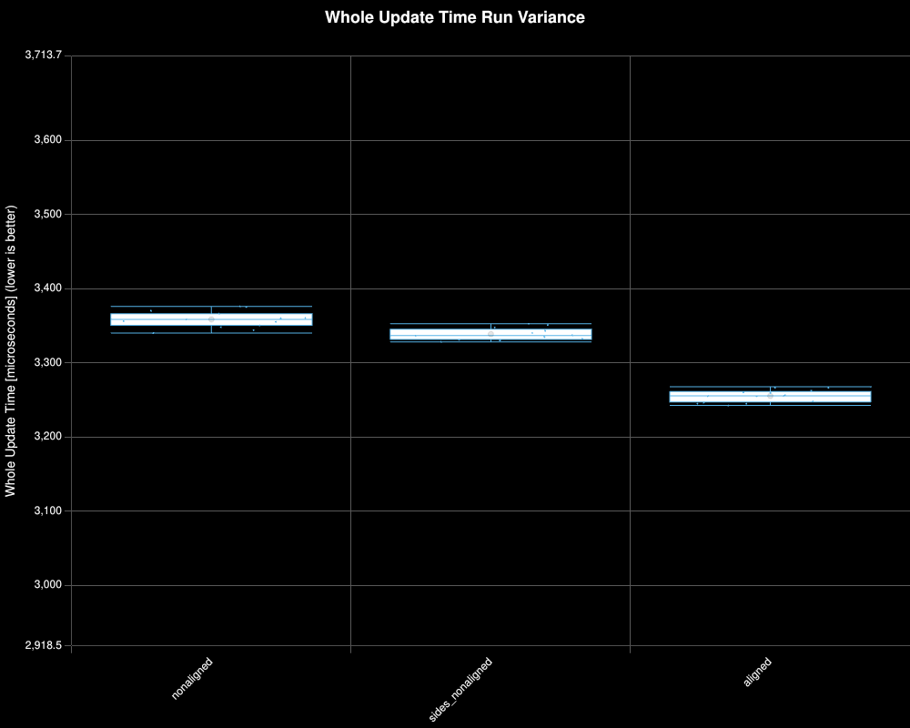
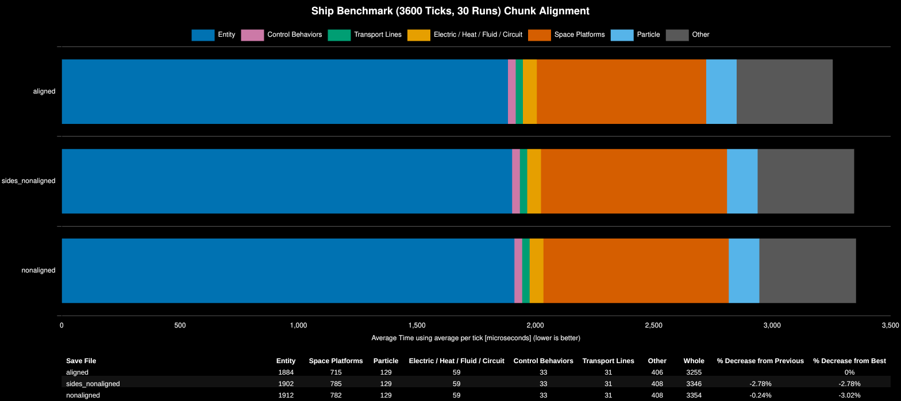
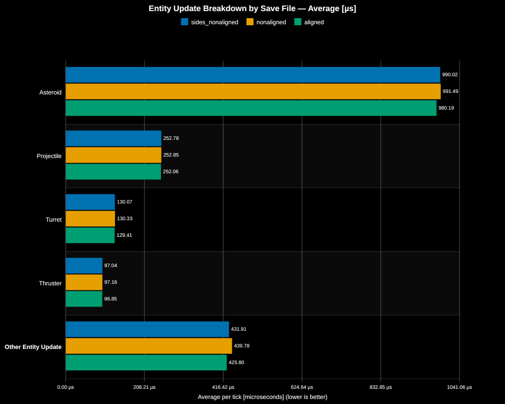
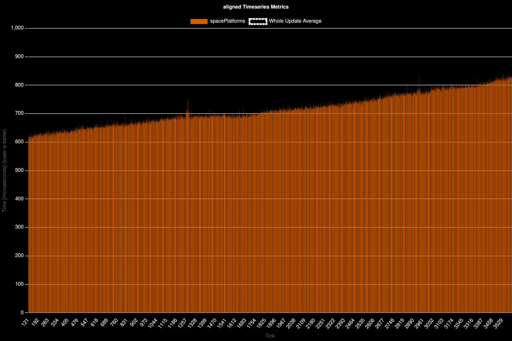
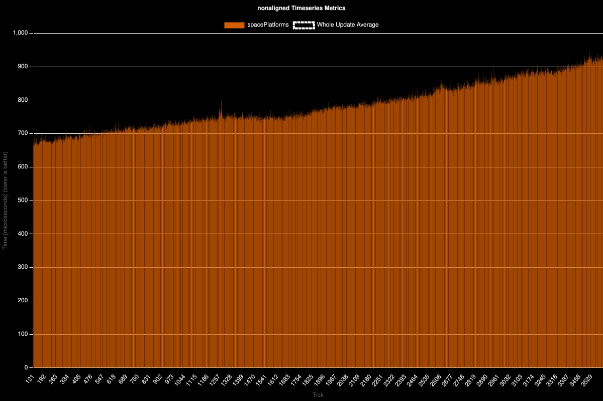
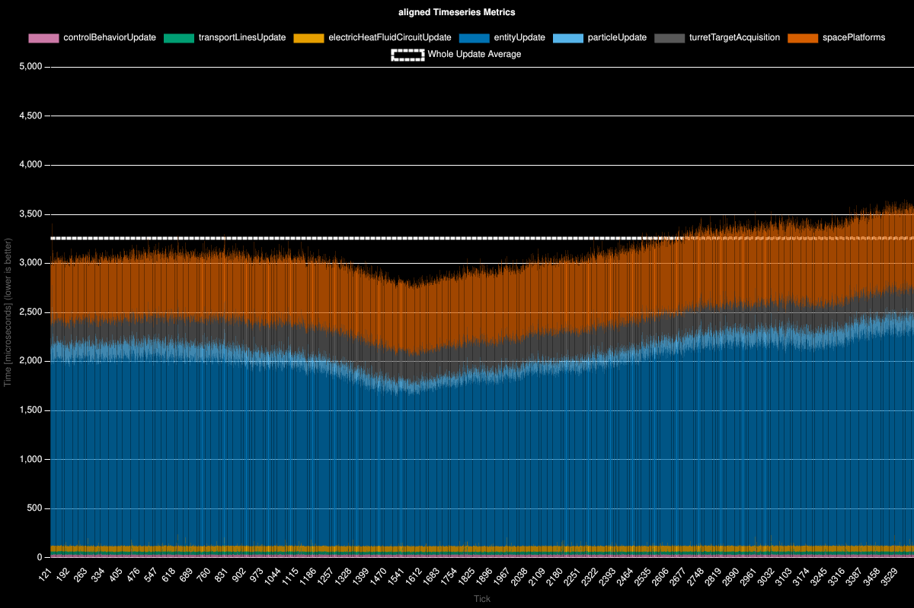
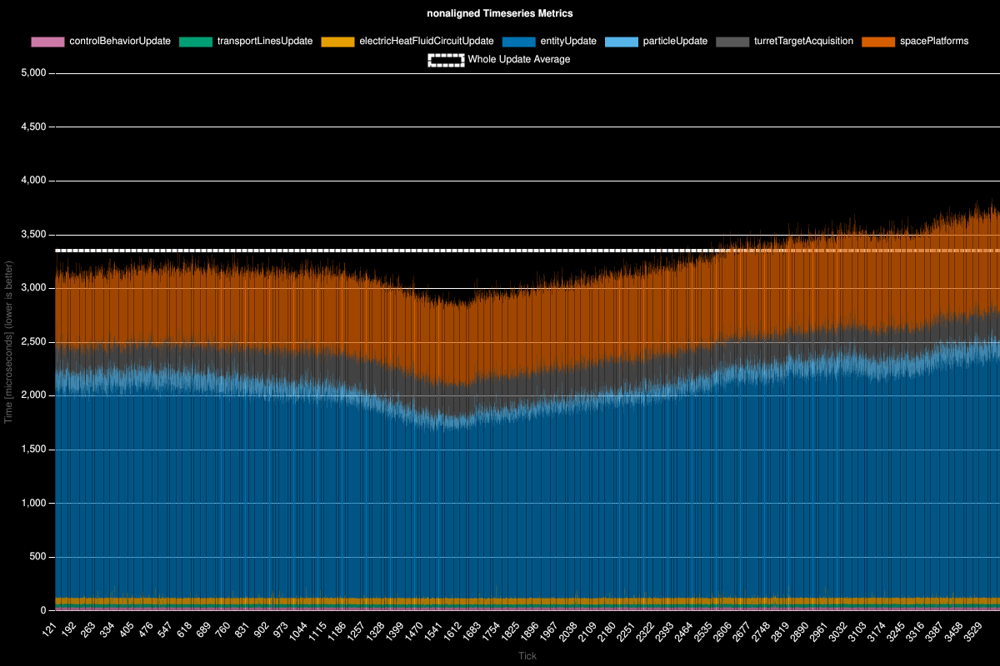

# Space Platform Chunk Alignment

**Platform:** linux-x86_64

**Factorio Version:** 2.1.17

**Date:** 2026-09-08

**CPU:** Ryzen 9800X3D

**Coauthor:** Tappi

## The Question
Does chunk alignment of a space platform matter for space platform update time?

## The Answer
Plausible. It has a detectable impact to space platform update time, but is a very small impact compared to the total entity update time taken resulting in a relative delta of 3% at the most extreme.

Main takeaway is that if a ship has many thruster stacks, chunk aligning the stacks is preferred. The impact of this optimization is minimal.

## Scenario

A template ship was created with a mass of 5559. Two additional variants were built where the width remained constant and the mass is equal across all three save files. 50 copies are created of each save file and are positioned along a route between Aquillo to Gleba at roughly the same position in the flight path. Each save file is created by taking the template (aligned) save file with the game paused and modifying each ship in place so that all save files start from the same tick. The details of the differences between save files is described below.

The above graphic shows two points of interest:
1. The item labeled (1) is a single side tile within the side chunk adjacent to the platform
2. The item labeled (2) is a single tile in the two chunks in front of the ship

These save files are labeled as following:

| Save File Name                         | Alias            | Tile 1 (Side) | Tile 2 (Front) | Additional Chunks Occupied |
| -------------------------------------- | ---------------- | ------------- | -------------- | -------------------------- |
| ship_benchmark_50_aligned.zip          | aligned          | no            | no             | 0                          |
| ship_benchmark_50_nonaligned.zip       | nonaligned       | yes           | yes            | 64                         |
| ship_benchmark_50_sides_nonaligned.zip | sides_nonaligned | yes           | no             | 62                         |

Each save file was run for 30 runs for 3600 ticks.

### Run Distribution

### Metrics

| Save File        | Entity | Space Platforms | Particle | Electric / Heat / Fluid / Circuit | Control Behaviors | Transport Lines | Other | Whole | % Decrease from Previous | % Decrease from Best |
| ---------------- | ------ | --------------- | -------- | --------------------------------- | ----------------- | --------------- | ----- | ----- | ------------------------ | -------------------- |
| aligned          | 1884   | 715             | 129      | 59                                | 33                | 31              | 406   | 3255  |                          | 0%                   |
| sides_nonaligned | 1902   | 785             | 129      | 59                                | 33                | 31              | 408   | 3346  | -2.78%                   | -2.78%               |
| nonaligned       | 1912   | 782             | 129      | 59                                | 33                | 31              | 408   | 3354  | -0.24%                   | -3.02%               |

The largest difference is in space platform update time which sees the most benefit from chunk alignment. Entity update time is also impacted but much less drastically and is broken down below.

### Entity Update Time Breakdown

Asteroid update time seems to be most impacted by the number of chunks occupied as the difference
between `sides_nonaligned` and `nonaligned` is only 1 microsecond compared to a difference of 10 microseconds when fully aligned.

### Space Platform Update Timeseries
The following charts show the space platform update time over the course of the run for visual comparison.

For a sense of scale, the following shows all other additional metrics recorded in this scenario.

