# Disabled Collectors

**Platform:** linux-x86_64

**Factorio Version:** 2.1.17

**Date:** 2026-09-11

**CPU:** Ryzen 9800X3D

**Coauthor:** Atlan

## The Question
Do asteroid collectors consume update time when disabled?

## The Answer

Yes. There is a linear correlation between entity update time as a whole metric and the total number of collectors present when moving through a densely populated chunk field.

## Scenario
Each save was tested for 3600 ticks and 6 runs

A member of abucnasty's discord, Atlan, created a promethium ship save file for us to use in this test.

There are three copies of the save file with all ships in the same position traveling indefinitely towards the shattered planet. All saves are prepared by pausing the game and adding / removing collectors. The collectors that are tested are the side collectors marked in red in the below screenshot.

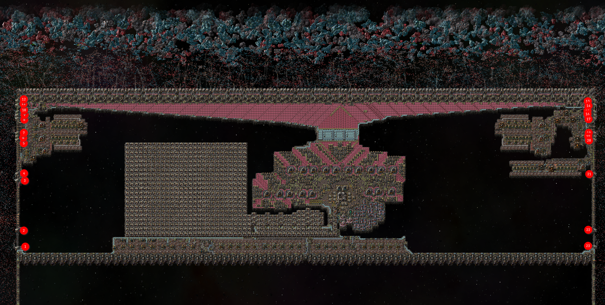

All of these side collectors are empty and have no items in them when initialized and are **disabled by the circuit network**.

Save file terminology:
1. postfix of `removed_##` is the number of collectors in total per platform that was removed.
   1. they are removed from the southmost collectors to the north

## Results

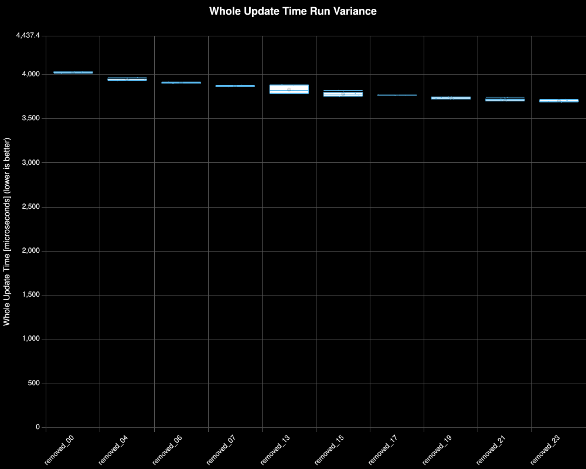

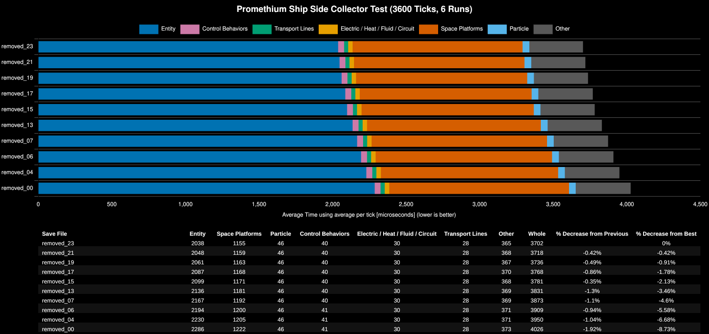

| Save File  | Entity | Space Platforms | Particle | Control Behaviors | Electric / Heat / Fluid / Circuit | Transport Lines | Other | Whole | % Decrease from Previous | % Decrease from Best |
| ---------- | ------ | --------------- | -------- | ----------------- | --------------------------------- | --------------- | ----- | ----- | ------------------------ | -------------------- |
| removed_23 | 2038   | 1155            | 46       | 40                | 30                                | 28              | 365   | 3702  |                          | 0%                   |
| removed_21 | 2048   | 1159            | 46       | 40                | 30                                | 28              | 368   | 3718  | -0.42%                   | -0.42%               |
| removed_19 | 2061   | 1163            | 46       | 40                | 30                                | 28              | 367   | 3736  | -0.49%                   | -0.91%               |
| removed_17 | 2087   | 1168            | 46       | 40                | 30                                | 28              | 370   | 3768  | -0.86%                   | -1.78%               |
| removed_15 | 2099   | 1171            | 46       | 40                | 30                                | 28              | 368   | 3781  | -0.35%                   | -2.13%               |
| removed_13 | 2136   | 1181            | 46       | 40                | 30                                | 28              | 369   | 3831  | -1.3%                    | -3.46%               |
| removed_07 | 2167   | 1192            | 46       | 40                | 30                                | 28              | 369   | 3873  | -1.1%                    | -4.6%                |
| removed_06 | 2194   | 1200            | 46       | 41                | 30                                | 28              | 371   | 3909  | -0.94%                   | -5.58%               |
| removed_04 | 2230   | 1205            | 46       | 41                | 30                                | 28              | 371   | 3950  | -1.04%                   | -6.68%               |
| removed_00 | 2286   | 1222            | 46       | 41                | 30                                | 28              | 373   | 4026  | -1.92%                   | -8.73%               |

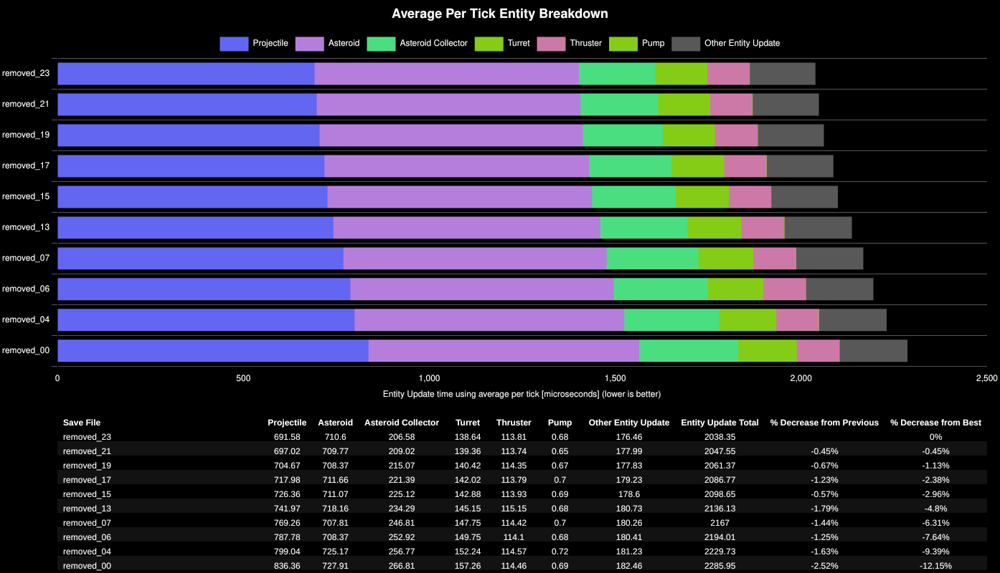

| Save File  | Projectile | Asteroid | Asteroid Collector | Turret | Thruster | Pump | Other Entity Update | Entity Update Total | % Decrease from Previous | % Decrease from Best |
| ---------- | ---------- | -------- | ------------------ | ------ | -------- | ---- | ------------------- | ------------------- | ------------------------ | -------------------- |
| removed_23 | 691.58     | 710.6    | 206.58             | 138.64 | 113.81   | 0.68 | 176.46              | 2038.35             |                          | 0%                   |
| removed_21 | 697.02     | 709.77   | 209.02             | 139.36 | 113.74   | 0.65 | 177.99              | 2047.55             | -0.45%                   | -0.45%               |
| removed_19 | 704.67     | 708.37   | 215.07             | 140.42 | 114.35   | 0.67 | 177.83              | 2061.37             | -0.67%                   | -1.13%               |
| removed_17 | 717.98     | 711.66   | 221.39             | 142.02 | 113.79   | 0.7  | 179.23              | 2086.77             | -1.23%                   | -2.38%               |
| removed_15 | 726.36     | 711.07   | 225.12             | 142.88 | 113.93   | 0.69 | 178.6               | 2098.65             | -0.57%                   | -2.96%               |
| removed_13 | 741.97     | 718.16   | 234.29             | 145.15 | 115.15   | 0.68 | 180.73              | 2136.13             | -1.79%                   | -4.8%                |
| removed_07 | 769.26     | 707.81   | 246.81             | 147.75 | 114.42   | 0.7  | 180.26              | 2167                | -1.44%                   | -6.31%               |
| removed_06 | 787.78     | 708.37   | 252.92             | 149.75 | 114.1    | 0.68 | 180.41              | 2194.01             | -1.25%                   | -7.64%               |
| removed_04 | 799.04     | 725.17   | 256.77             | 152.24 | 114.57   | 0.72 | 181.23              | 2229.73             | -1.63%                   | -9.39%               |
| removed_00 | 836.36     | 727.91   | 266.81             | 157.26 | 114.46   | 0.69 | 182.46              | 2285.95             | -2.52%                   | -12.15%              |

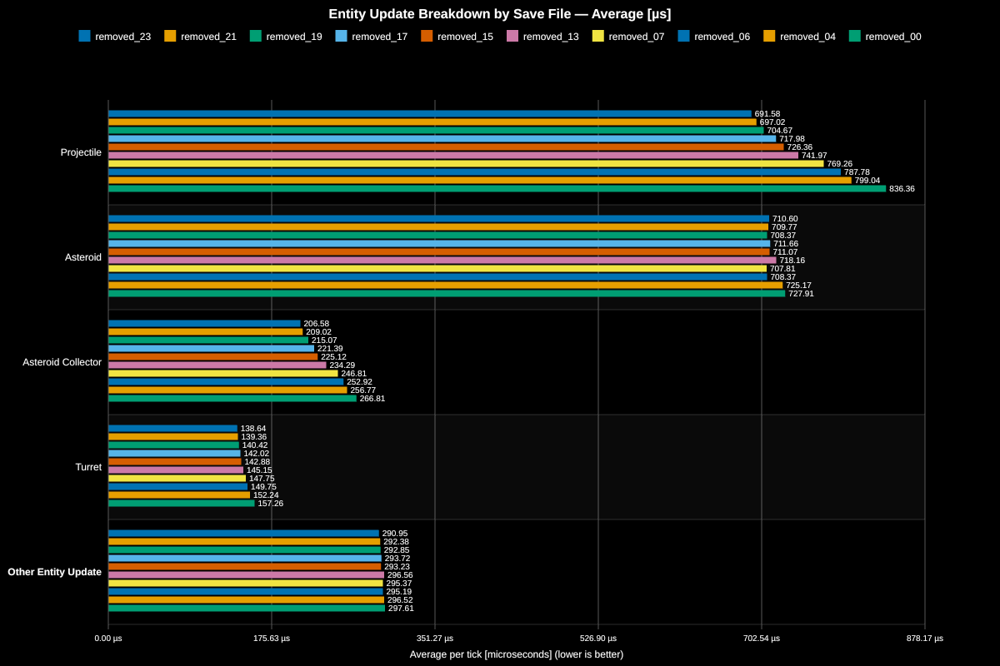

The reduction of Asteroid Collector update time is expected, but surprisingly Projectile updates also reduced. It is unclear why the projectile damage decreased during these tests and requires further investigation in future benchmarks.

## Observations and Hypothesis on Results

### Navmesh Changes
The navmesh is impacted as collectors are removed.

The following is the navmesh from `removed_23`
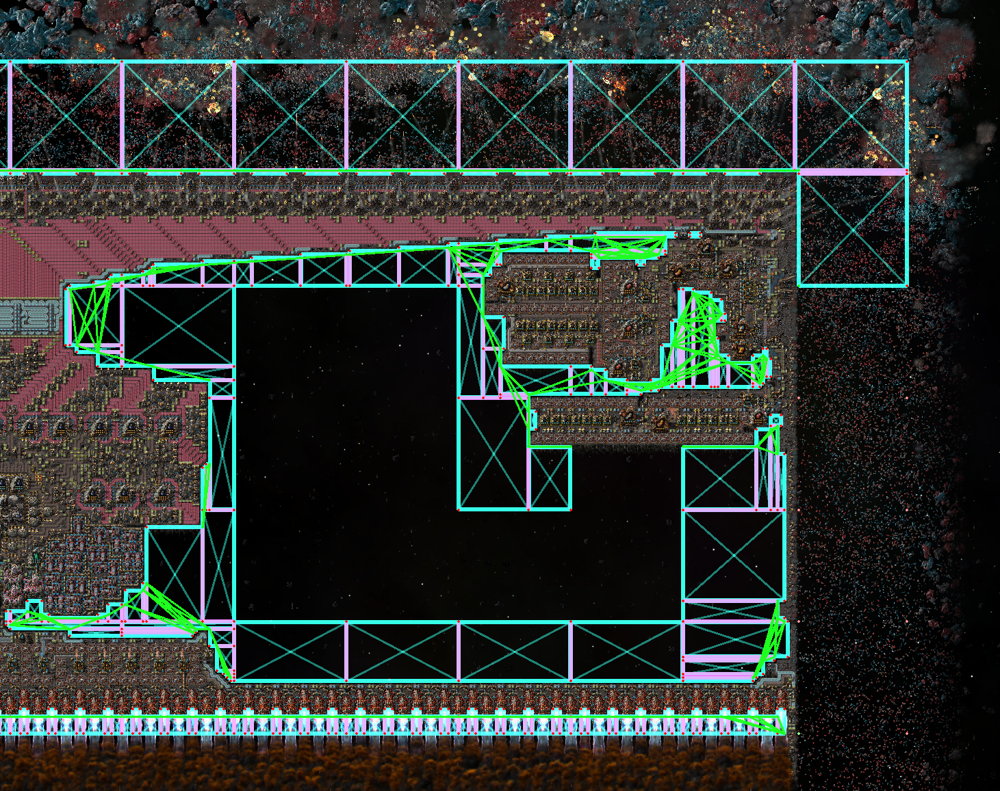

The following is the navmesh from `removed_00`
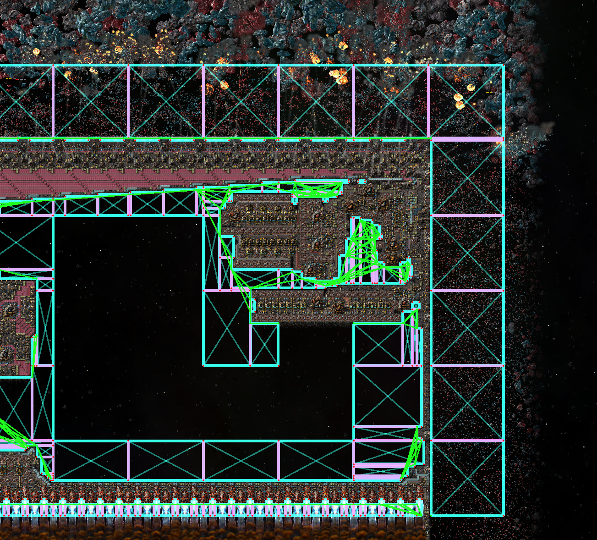

There are more chunks in the mesh as more collectors are added.

## Collector Tracking when Disabled

Even when disabled, the collectors appear to still be actively tracking chunks to pick up.

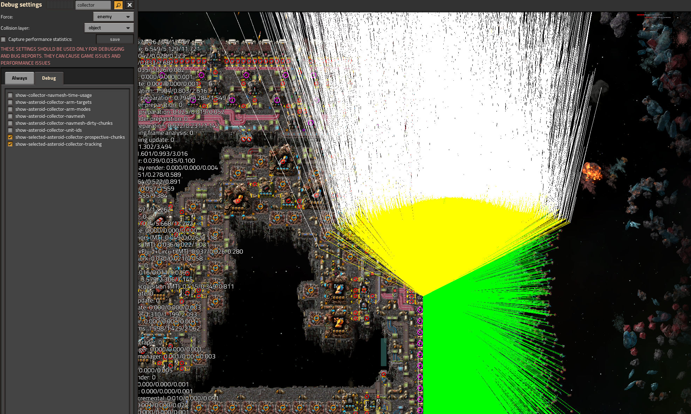

This could explain why the number of collectors matter.

## Collector Tracking Max Chunk Distance

The southmost collector is tracking chunks multiple chunks in front of it. The primary test in this benchmark removed the collectors from the south to the north, so if the number of chunks being tracked mattered or was global then there is a potential this is missed in the primary test.

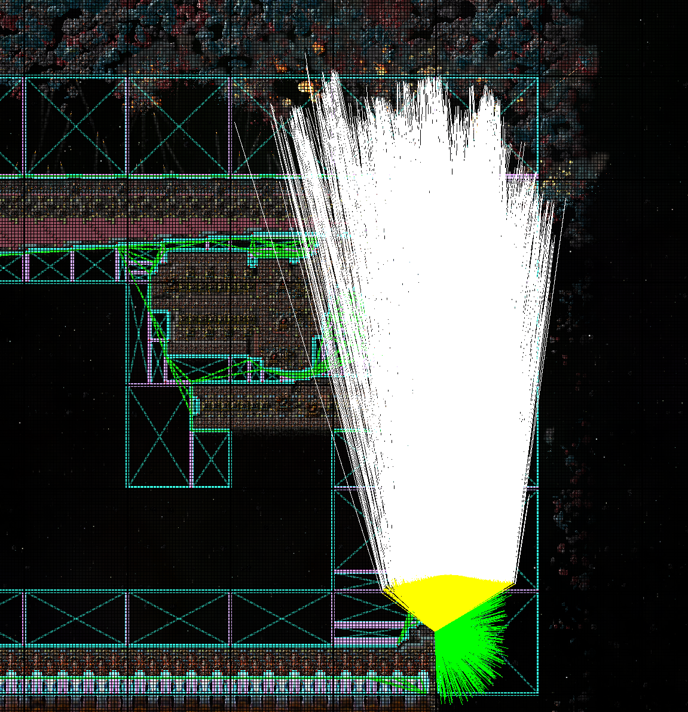

To rule this out, the results found in [collector_placement_results](./collector_placement_results/) yield the answer we are looking for and proves that the position of the collector does not matter.

This test only keeps one collector on both sides of the ship. One in the "north" and another save while where it has only one in the "south" of the ship.

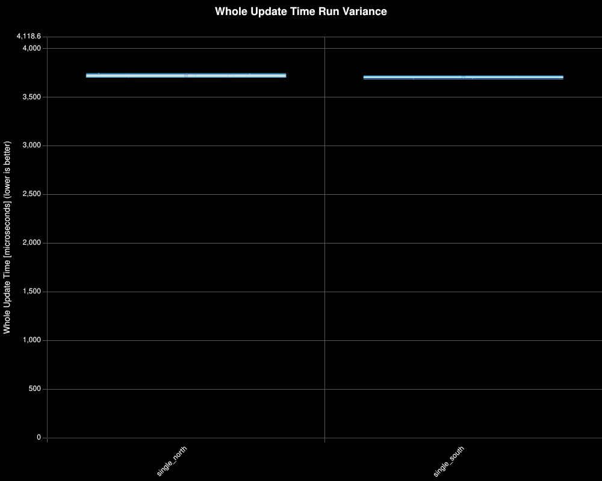

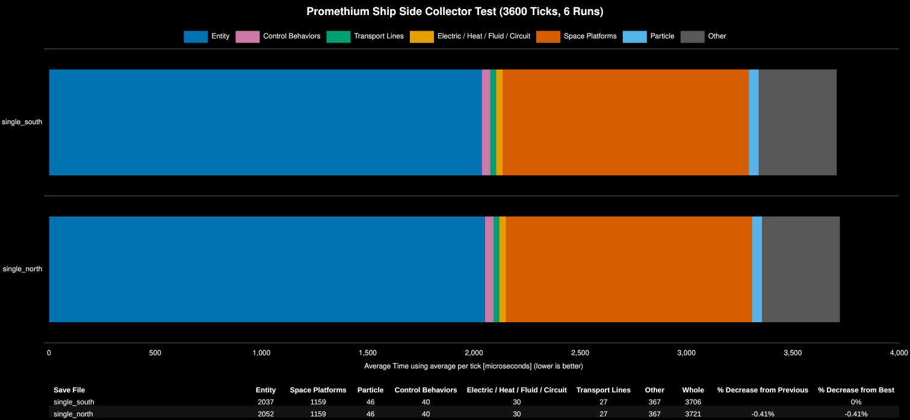

| Save File    | Entity | Space Platforms | Particle | Control Behaviors | Electric / Heat / Fluid / Circuit | Transport Lines | Other | Whole | % Decrease from Previous | % Decrease from Best |
| ------------ | ------ | --------------- | -------- | ----------------- | --------------------------------- | --------------- | ----- | ----- | ------------------------ | -------------------- |
| single_south | 2037   | 1159            | 46       | 40                | 30                                | 27              | 367   | 3706  |                          | 0%                   |
| single_north | 2052   | 1159            | 46       | 40                | 30                                | 27              | 367   | 3721  | -0.41%                   | -0.41%               |

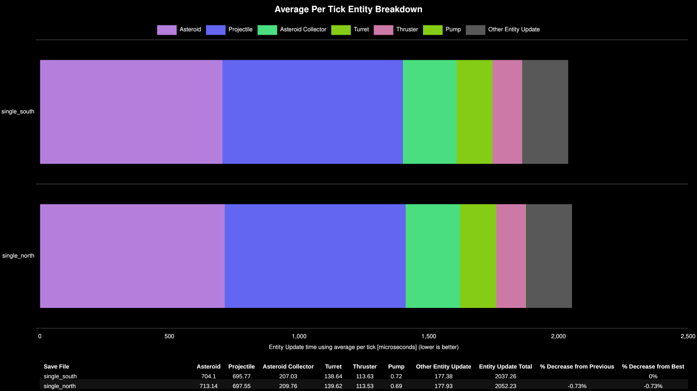

| Save File    | Asteroid | Projectile | Asteroid Collector | Turret | Thruster | Pump | Other Entity Update | Entity Update Total | % Decrease from Previous | % Decrease from Best |
| ------------ | -------- | ---------- | ------------------ | ------ | -------- | ---- | ------------------- | ------------------- | ------------------------ | -------------------- |
| single_south | 704.1    | 695.77     | 207.03             | 138.64 | 113.63   | 0.72 | 177.38              | 2037.26             |                          | 0%                   |
| single_north | 713.14   | 697.55     | 209.76             | 139.62 | 113.53   | 0.69 | 177.93              | 2052.23             | -0.73%                   | -0.73%               |

There is no observable difference in any of these metrics to the degree that shows up in the primary test case, so the collector position is ruled out as something that matters.

## What about the front collectors?

The question was posed about what happens if we remove all of the collectors completely from the ship. The save file was altered to disable all collectors on the ship and then separate save files were created to remove the side collectors, front collectors, along with keeping all of them, and removing all of them.

Although this doesn't necessarily help us draw any knew conclusions, it does drive consistency that removal of collectors is a linear relationship with entity update time.

The raw results are found here: [edge_removal_results](./edge_removal_results/)

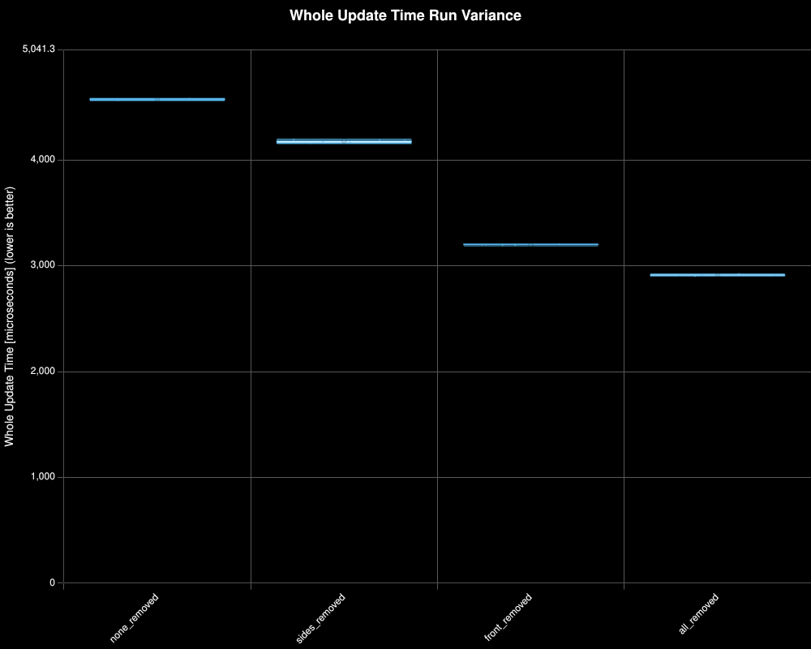

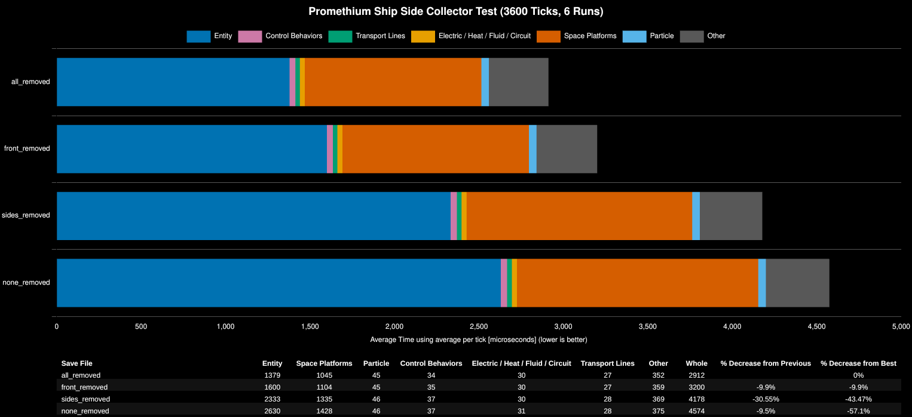

| Save File     | Entity | Space Platforms | Particle | Control Behaviors | Electric / Heat / Fluid / Circuit | Transport Lines | Other | Whole | % Decrease from Previous | % Decrease from Best |
| ------------- | ------ | --------------- | -------- | ----------------- | --------------------------------- | --------------- | ----- | ----- | ------------------------ | -------------------- |
| all_removed   | 1379   | 1045            | 45       | 34                | 30                                | 27              | 352   | 2912  |                          | 0%                   |
| front_removed | 1600   | 1104            | 45       | 35                | 30                                | 27              | 359   | 3200  | -9.9%                    | -9.9%                |
| sides_removed | 2333   | 1335            | 46       | 37                | 30                                | 28              | 369   | 4178  | -30.55%                  | -43.47%              |
| none_removed  | 2630   | 1428            | 46       | 37                | 31                                | 28              | 375   | 4574  | -9.5%                    | -57.1%               |

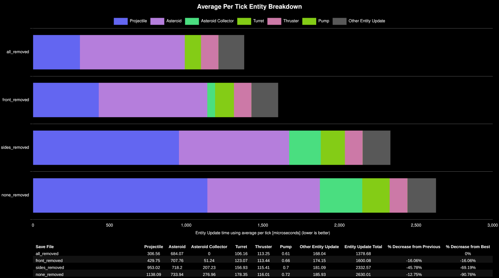
| Save File     | Projectile | Asteroid | Asteroid Collector | Turret | Thruster | Pump | Other Entity Update | Entity Update Total | % Decrease from Previous | % Decrease from Best |
| ------------- | ---------- | -------- | ------------------ | ------ | -------- | ---- | ------------------- | ------------------- | ------------------------ | -------------------- |
| all_removed   | 306.56     | 684.07   | 0                  | 106.16 | 113.25   | 0.61 | 168.04              | 1378.68             |                          | 0%                   |
| front_removed | 429.75     | 707.76   | 51.24              | 123.07 | 113.44   | 0.66 | 174.15              | 1600.08             | -16.06%                  | -16.06%              |
| sides_removed | 953.02     | 718.2    | 207.23             | 156.93 | 115.41   | 0.7  | 181.09              | 2332.57             | -45.78%                  | -69.19%              |
| none_removed  | 1138.09    | 733.94   | 276.96             | 178.35 | 116.01   | 0.72 | 185.93              | 2630.01             | -12.75%                  | -90.76%              |

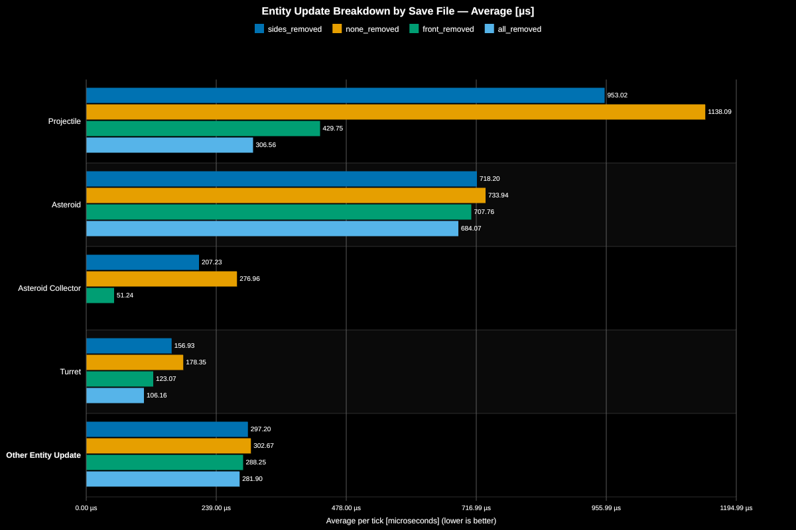

Again, surprisingly projectiles are impacted on the same order of magnitude as Asteroid Collectors so there seems to be some correlation between collectors and projectiles.