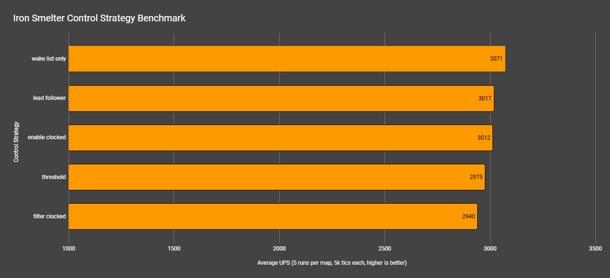

## Overview

## Test Scenario
Same test scenario as the base [inserter-clocking-methods](https://github.com/abucnasty/factorio-benchmarks/blob/master/benchmarks/inserter-clocking-methods/README.md) but just has a yellow belt on the output of the steel furnace smelters to limit the throughput.

## Results
| Map Name                          | Mean UPS | Mean Avg (ms) | Mean Min (ms) | Mean Max (ms) |
|----------------------------------|----------|----------------|----------------|----------------|
| inserter_bm_wake_list_only.zip   | 3071     | 0.3268         | 0.1874         | 1.9446         |
| inserter_bm_lead_follower.zip    | 3017     | 0.3328         | 0.1964         | 1.8314         |
| inserter_bm_enable_clocked.zip   | 3012     | 0.3326         | 0.1968         | 2.7656         |
| inserter_bm_threshold.zip        | 2975     | 0.3364         | 0.2264         | 2.8356         |
| inserter_bm_filter_clocked.zip   | 2940     | 0.3406         | 0.1882         | 1.8680         |

Reviewing the test data, the differences are less than the standard deviation across tests so they are effectively the same ups when not being fully consumed upstream. So the circuit throttling methods are best for limiting inserter active time when running at faster machine speeds.