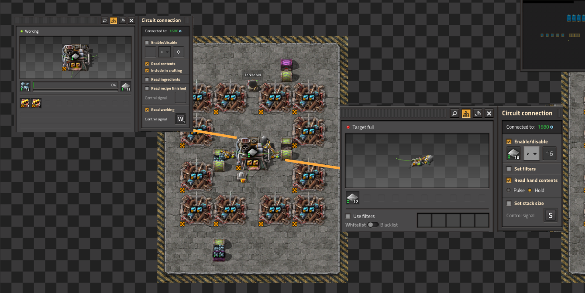
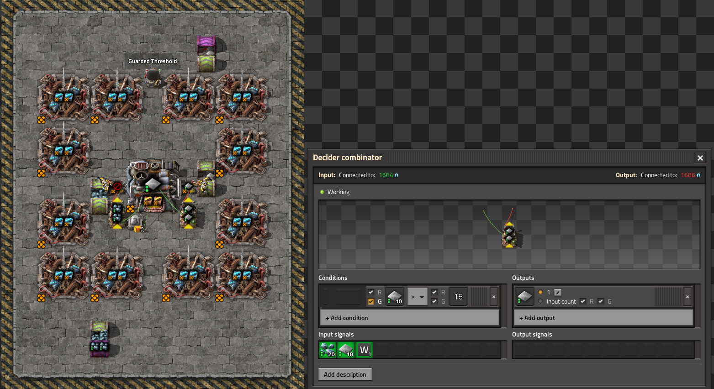

## Overview

## Test Scenario

- steal smelter making 240 steel per second
  - fully beaconed
  - 16 legendary furnaces (8 smelting iron, 8 smelting steel)
  - 24 legendary stack inserters per module
- each test file contains 128 copies of the base module with different inserter control strategies
- camera and player model is in the same location for each file
- each run is executed for 10,000 tics at 100x speed
- blueprints used: [blueprints](./blueprints.txt)

Why was this chosen as the candidate?
- requires separate clocks for each inserter
  - clock pulling from turbo belt into iron plate smelter
  - clock pulling from iron smelter into steel smelter
  - clock pulling from steel smelter and dropping on turbo belt
- This a real world example that would be used, requiring varying inserter clocks for a single assembly module

Preview of furnace stack (specifically the wake list only variation):

## Control Strategy Definitions

### Enable Clocked

Enable / disable inserter based on clock

### Filter Clocked

Set filter on inserters based on clock. (same clock setup as in "Enable Clocked")

### Threshold
Directly connected circuit network to furnace or assembly machine with "read contents" and "include in crafting" enabled.

Sets the inserter enable / disable based on *threshold* values.

### Threshold Guarded

Same as `Threshold` but uses decider combinators to intercept the signal. This is to test the theory that an inserter should be "guarded" from upstream changes to the circuit network and only send a single pulse value when it should be enabled or disabled.

## Results

### 🔍 **Overview of Metrics**

| Metric            | Description                                          |
| ----------------- | ---------------------------------------------------- |
| **Mean UPS**      | Updates per second – higher is better                |
| **Mean Avg (ms)** | Average frame time in milliseconds – lower is better |
| **Mean Min (ms)** | Minimum frame time – lower is better                 |
| **Mean Max (ms)** | Maximum frame time – lower is better                 |

### 📈 **Summary of Results**

| Control Strategy          | Mean UPS | Mean Avg (ms) | Mean Min (ms) | Mean Max (ms) |
| ------------------------- | -------- | ------------- | ------------- | ------------- |
| threshold             | **1500** | **0.6668**    | 0.5106        | 2.7910        |
| enable clocked            | 1483     | 0.6744        | 0.4030        | 2.7044        |
| enable clocked split side | 1474     | 0.6786        | **0.3898**    | **2.2896**    |
| filter clocked            | 1450     | 0.6900        | 0.4334        | 2.4576        |
| filter clocked split side | 1446     | 0.6928        | 0.4218        | 3.2238        |
| threshold guarded         | 1402     | 0.7138        | 0.5036        | 3.0740        |
| wake list only            | **1366** | **0.7322**    | 0.5100        | 2.4302        |

### 🧠 **Analysis**

#### ✅ **Best Overall Performance**

* **Threshold Control**

  * **Highest Average UPS** (1500)
  * **Lowest average frame time** (0.6668 ms)
  * Good across all metrics
  * This suggests it's the most efficient and consistent strategy.

#### 💡 **Best Responsiveness (Lowest Min & Max)**

* **Enable clocked split side**:

  * **Lowest min (0.3898 ms)** and **max (2.2896 ms)** frame times
  * Suggests smoother and more predictable performance
  * But slightly lower UPS compared to `threshold` control, but by only 17 UPS with a 1.14% difference

#### ⚠️ **Least Efficient**

* **Wake list only**:

  * **Lowest UPS (1366)** and **highest average frame time (0.7322 ms)**

#### 🧐 **Threshold vs Threshold Guarded**

* Adding "guarded" appears to **reduce UPS by ~6.5%** and **increase latency slightly**

  * Indicates that the overhead of guarding might not be worth it in this case
