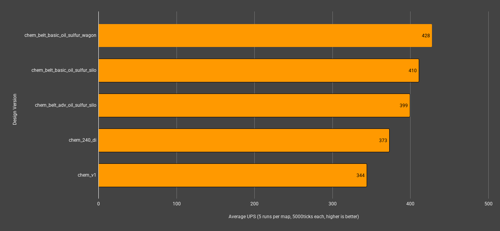
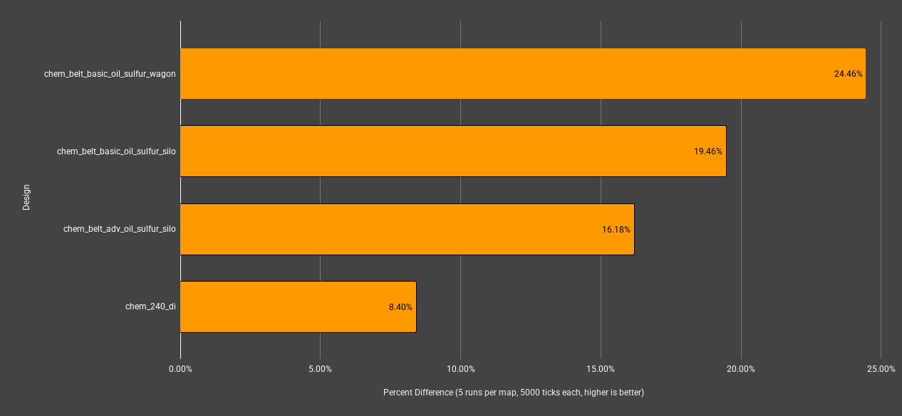

## Test Scenario
- comparing new chemical science build v2 verse my original v1 in my uncommon 4million espm base
- 940k/min chemical science produced in each map
- v2 differences
  - uses lead / follow inserter throttling
  - optimized sulfur production ratio using [csv file](./q2-sulfur-sim.csv) generated by simulator script
- Each design is included in the save files listed in this directory

### 📈 **Results**

| map_name                         | mean_ups | mean_avg_ms | mean_min_ms | mean_max_ms |
| -------------------------------- | -------- | ----------- | ----------- | ----------- |
| chem_belt_basic_oil_sulfur_wagon | **428**  | **2.3380**  | **1.5796**  | **4.4626**  |
| chem_belt_basic_oil_sulfur_silo  | 410      | 2.4360      | 1.6550      | 4.8910      |
| chem_belt_adv_oil_sulfur_silo    | 399      | 2.5046      | 1.9808      | 5.3860      |
| chem_240_di                      | 373      | 2.6848      | 2.2498      | 5.3884      |
| chem_v1                          | 344      | 2.9114      | 1.9716      | 6.9478      |

> bold indicates best in that category.

| map_name                         | percent_diff_from_base |
| -------------------------------- | ---------------------- |
| chem_belt_basic_oil_sulfur_wagon | **24.46%**                 |
| chem_belt_basic_oil_sulfur_silo  | 19.46%                 |
| chem_belt_adv_oil_sulfur_silo    | 16.18%                 |
| chem_240_di                      | 8.40%                  |
| chem_v1                          | 0.00%                  |

> bold indicates best in that category.

### 🧠 **Conculsions**

The V2 designs clearly are more efficient than the V1 design. It is interesting how big of a jump basic oil processing makes over advanced oil. It is also interesting that cargo wagons are clearly superior in this specific scenario over silo chests. The assumtion is that the reduction in inserters and the ability for the recyclers to directly output into the wagon is the most likely explanation.

Overall improvement is a 24.46% increase in UPS over V1 with the `chem_belt_basic_oil_sulfur_wagon` design being the best overall.