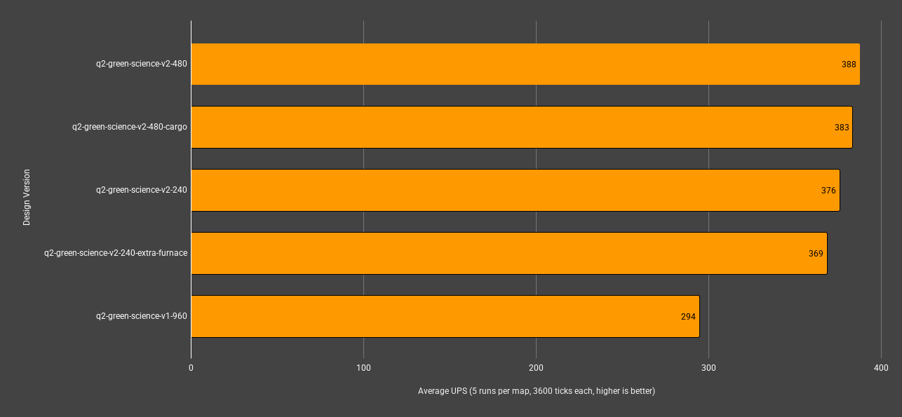
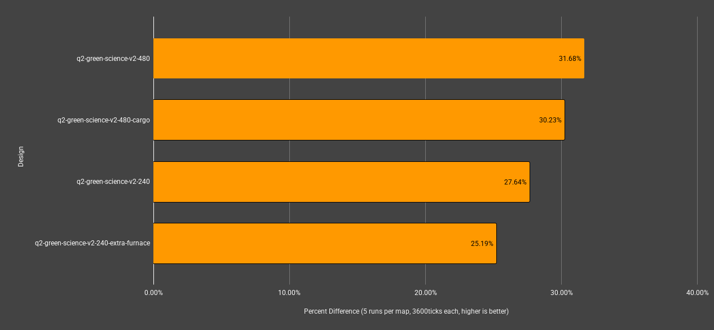

## Test Scenario
- comparing new logistic science build v2 verse my original v1 in my uncommon 4million espm base
- 1.8 million uncommon logistic science produced per minute in each map
- v2 uses lead / follow inserter throttling
- Each design is included in the save files listed in this directory

### 📈 **Results**

| map_name                              | mean_ups | mean_avg_ms | mean_min_ms | mean_max_ms |
| ------------------------------------- | -------- | ----------- | ----------- | ----------- |
| q2-green-science-v2-480               | **388**  | **2.5806**  | 1.8262      | 5.3506      |
| q2-green-science-v2-480-cargo         | 383      | 2.6096      | 1.9368      | **5.0796**  |
| q2-green-science-v2-240               | 376      | 2.6616      | 1.6268      | 6.1460      |
| q2-green-science-v2-240-extra-furnace | 369      | 2.7136      | **1.4956**  | 5.4422      |
| q2-green-science-v1-960               | 294      | 3.3990      | 2.8412      | 7.2176      |

> bold indicates best in that category.

| map_name                              | percent_diff_from_base |
| ------------------------------------- | ---------------------- |
| q2-green-science-v2-480               | **31.68%**             |
| q2-green-science-v2-480-cargo         | 30.23%                 |
| q2-green-science-v2-240               | 27.64%                 |
| q2-green-science-v2-240-extra-furnace | 25.19%                 |
| q2-green-science-v1-960               | 0.00%                  |

> bold indicates best in that category.

### 🧠 **Conculsions**

The V2 designs clearly are more efficient than the V1 design. The combined 480 designs proove to be better than single lane designs which makes me think that if you can in general get away with just one building, its better over having a dedicated building that is not running as often.

Overall improvement is a 31.7% increase in UPS over V1 with the `q2-green-science-v2-480` design being the best overall.