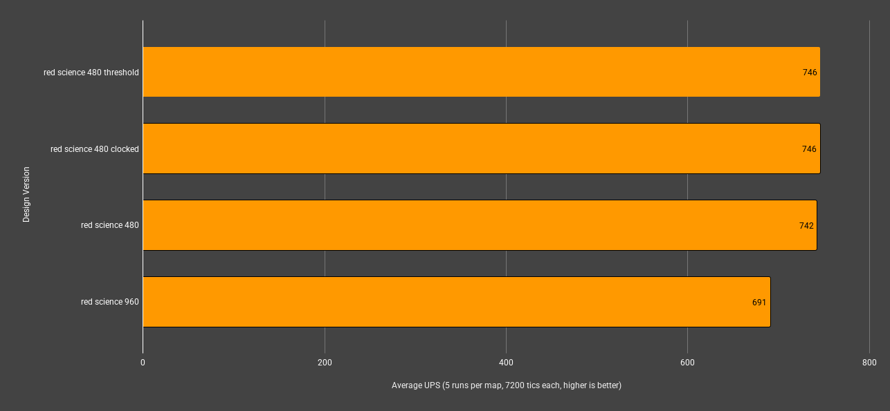
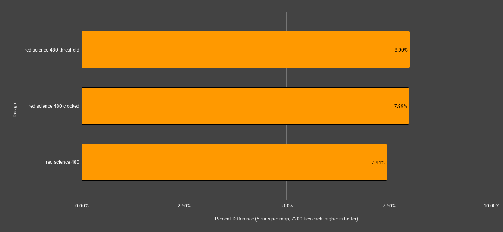

## Test Scenario
- comparing new automation science build v3 verse v2
- 1.4 million uncommon automation science produced per minute in each map
- v3 uses lead / follow inserter throttling
  - the maps with the postfix of `threshold` and `clocked` change the inserter throttling on the gear assembly machine to use their respective inserter control strategy.
- v2 uses threshold inserter throttling

### 📈 **Results**

| map_name                      | mean_ups | mean_avg_ms | mean_min_ms | mean_max_ms | percent_diff_from_base |
| ----------------------------- | -------- | ----------- | ----------- | ----------- | ---------------------- |
| red_science_480_threshold.zip | **746**  | **1.3404**  | **0.8724**  | 3.2022      | 8.00%                  |
| red_science_480_clocked.zip   | **746**  | 1.3408      | 0.8850      | **3.0618**  | 7.99%                  |
| red_science_480.zip           | 742      | 1.3474      | 0.9032      | 3.5830      | 7.44%                  |
| red_science_960.zip           | 691      | 1.4480      | 1.0310      | 3.1798      |                        |

> bold indicates best in that category.

### 🧠 **Conculsions**

The V3 designs clearly are more efficient than the V2 design. The difference in clocking strategies used on the gear assembly machine is minimal so either the threshold or clocked version are the winner here.

Overall improvement is 8.0% increase in UPS over V2.