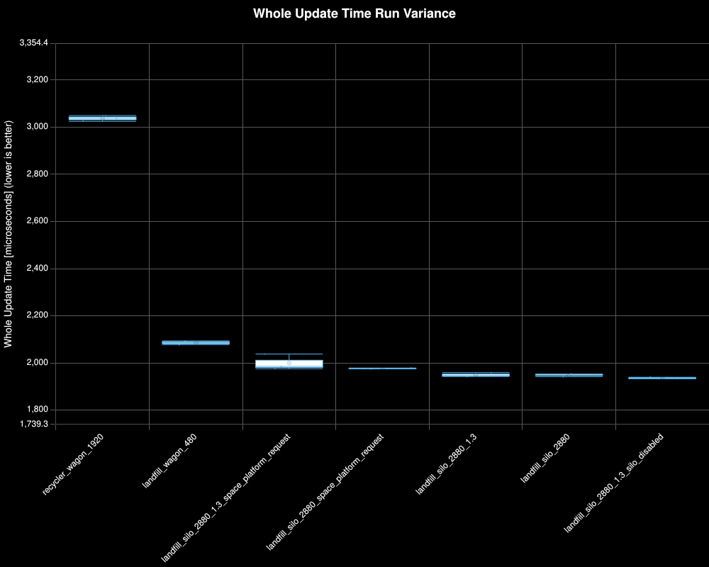
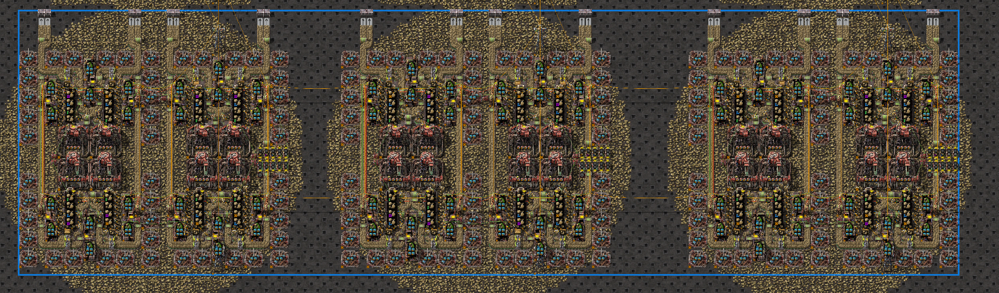
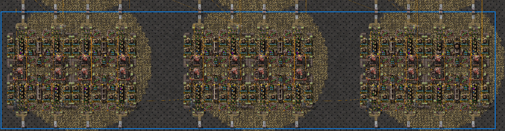
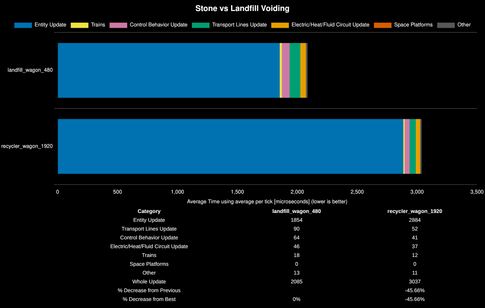
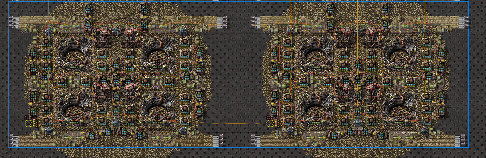
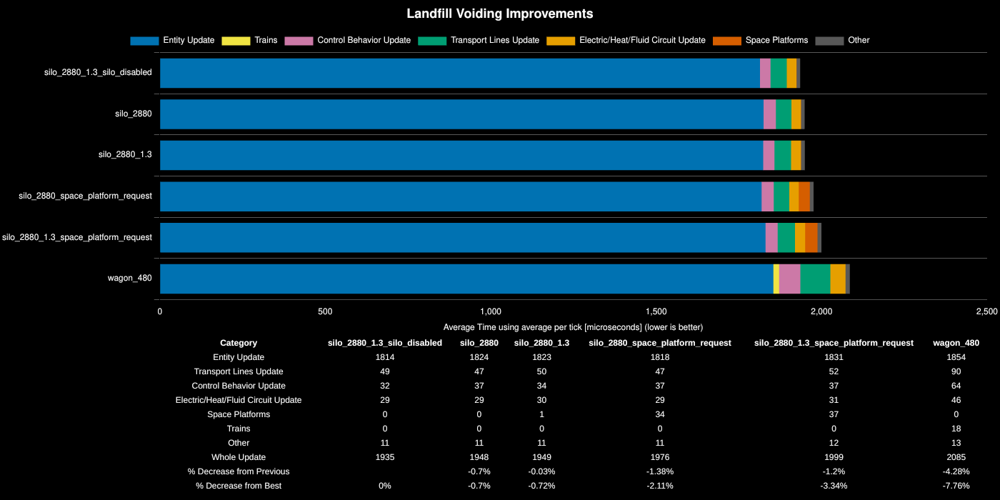

# Q2 Stone Washing Methods

**Platform:** linux-x86_64

**Factorio Version:** 2.0.76

**Date:** 2026-04-15

## Scenario
* Each save was tested for 18000 tick(s) and 3 run(s)
* 960 Stacked belts of Q2 stone is produced in each save file (230400 per second)
* All saves were tested at mining productivity level 17000

## Benchmark Run Distribution



## Test 1: Landfill Crafting vs Directly Voiding Raw Stone

Design `bm_recycler_wagon_1920` directly voids Q1 stone in double facing recyclers.



Design `bm_landfill_wagon_480` first crafts from Q1 stone and then voids the landfill in a recycler.



The performance of directly voiding stone was 46% worse than first crafting landfill. Landfill voiding is substantially better.



| Save File           | Entity Update | Transport Lines Update | Control Behavior Update | Electric/Heat/Fluid Circuit Update | Trains | Space Platforms | Other | Whole Update | % Decrease from Previous |
| ------------------- | ------------- | ---------------------- | ----------------------- | ---------------------------------- | ------ | --------------- | ----- | ------------ | ------------------------ |
| landfill_wagon_480  | 1854          | 90                     | 64                      | 46                                 | 18     | 0               | 13    | 2085         |                          |
| recycler_wagon_1920 | 2884          | 52                     | 41                      | 37                                 | 12     | 0               | 11    | 3037         | -45.66%                  |


## Test 2: Improvements to the Landfill Voider Using Silos

Silos offer the ability to use less mining drills by being able to fit more inserters around the silo perimeter to be used for voiding Q1 stone.

The following design is `bm_landfill_silo_2880_1.3`.



The difference between 1.3 and the original silo version is that 1.3 uses a dedicated clock for the outserters of landfill and Q3+ ore. The original silo version monitored the contents of the silo to conditionally remove ore instead.

The benefit of clocking is that we can disable the silos by executing the following command in the game:
```lua
/c for _, v in pairs(game.player.surface.find_entities_filtered{type="rocket-silo"}) do
    v.active = false
end
```
Disabling silos will also disable their circuit network updates so we can no longer read their contents, hence an external clock is used.

For the tests with the postfix of `space_platform_request`, a space platform is present over Nauvis that requests biter eggs from the surface to simulate a ship hovering over the planet. As of 2.0.73, when a ship has an unfulfilled request from the surface it is orbitting, space platform time is increased while it scans for available silos that can fulfill its request. By disabling the silos, it can skip this check.



Some smaller improvements could be made to further reduce the update time by leveraging more direct insertion and utilizing less mining drills.

## Conclusion

Voiding without first crafting landfill is at least 46% worse.