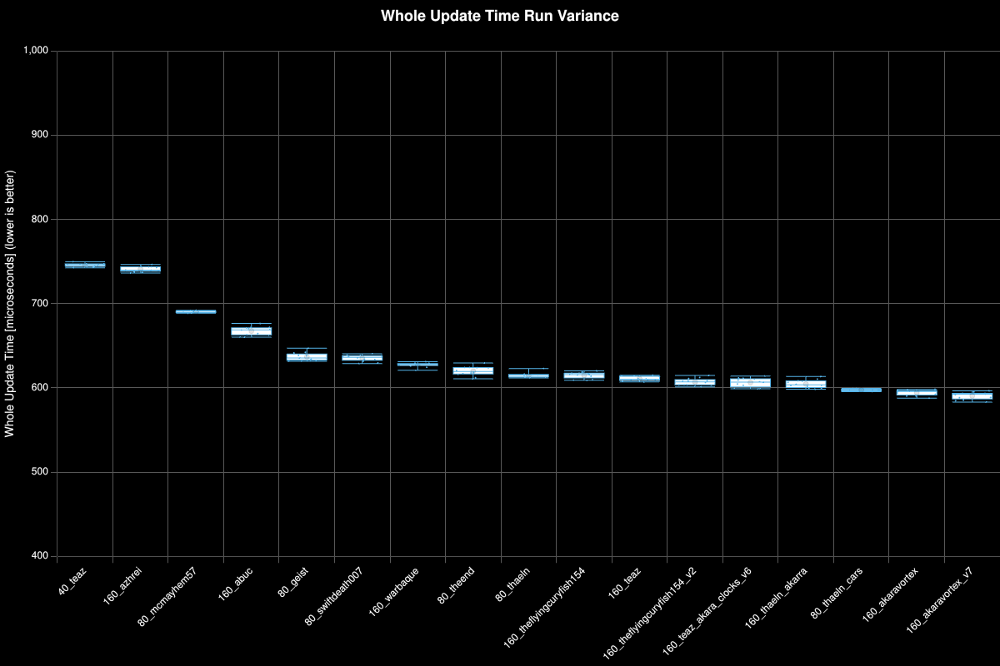
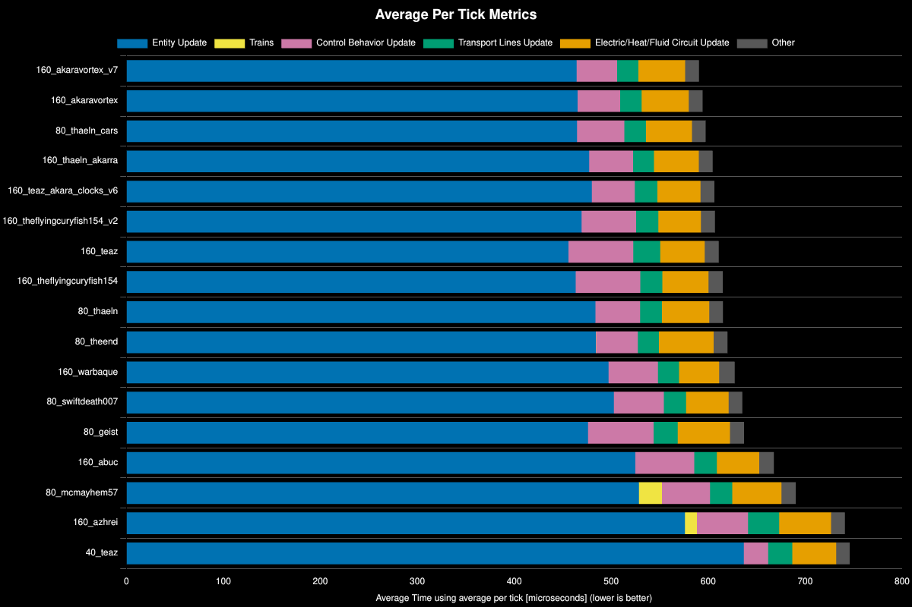
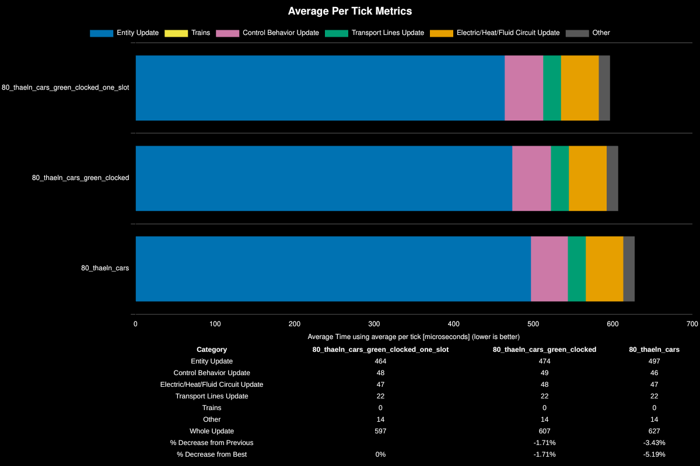

# Production Modules

**Platform:** windows-x86_64

**Factorio Version:** 2.0.72

## Scenario
* Each save was tested for 24000 tick(s) and 24 run(s)
* 80 copies of 160/s prod modules (total of 384k / min)
* all design blueprints are [here](./blueprints.txt)
* all designs are throttled to 160/s with circuit controlled inserters

## Results

| Save File                   | Entity Update | Electric/Heat/Fluid Circuit Update | Control Behavior Update | Transport Lines Update | Trains | Other | Whole Update | % Decrease from Previous | % Decrease from Best |
| --------------------------- | ------------- | ---------------------------------- | ----------------------- | ---------------------- | ------ | ----- | ------------ | ------------------------ | -------------------- |
| 160_akaravortex_v7          | 464           | 48                                 | 42                      | 22                     | 0      | 14    | 591          |                          | 0%                   |
| 160_akaravortex             | 465           | 49                                 | 44                      | 22                     | 0      | 14    | 594          | -0.63%                   | -0.63%               |
| 80_thaeln_cars              | 465           | 47                                 | 49                      | 22                     | 0      | 14    | 597          | -0.53%                   | -1.16%               |
| 160_thaeln_akarra           | 477           | 46                                 | 45                      | 22                     | 0      | 14    | 605          | -1.2%                    | -2.38%               |
| 160_teaz_akara_clocks_v6    | 480           | 44                                 | 44                      | 23                     | 0      | 14    | 606          | -0.28%                   | -2.67%               |
| 160_theflyingcuryfish154_v2 | 469           | 44                                 | 56                      | 23                     | 0      | 15    | 607          | -0.11%                   | -2.78%               |
| 160_teaz                    | 456           | 46                                 | 67                      | 28                     | 0      | 14    | 611          | -0.65%                   | -3.45%               |
| 160_theflyingcuryfish154    | 463           | 48                                 | 67                      | 23                     | 0      | 15    | 615          | -0.66%                   | -4.13%               |
| 80_thaeln                   | 484           | 49                                 | 46                      | 22                     | 0      | 14    | 615          | -0.04%                   | -4.17%               |
| 80_theend                   | 484           | 56                                 | 43                      | 22                     | 0      | 14    | 620          | -0.76%                   | -4.96%               |
| 160_warbaque                | 497           | 41                                 | 51                      | 22                     | 0      | 16    | 627          | -1.22%                   | -6.24%               |
| 80_swiftdeath007            | 503           | 44                                 | 52                      | 23                     | 0      | 14    | 635          | -1.26%                   | -7.57%               |
| 80_geist                    | 476           | 54                                 | 68                      | 25                     | 0      | 15    | 637          | -0.27%                   | -7.87%               |
| 160_abuc                    | 525           | 44                                 | 61                      | 23                     | 0      | 15    | 668          | -4.81%                   | -13.05%              |
| 80_mcmayhem57               | 529           | 51                                 | 50                      | 23                     | 24     | 15    | 690          | -3.38%                   | -16.87%              |
| 160_azhrei                  | 576           | 53                                 | 53                      | 32                     | 12     | 14    | 741          | -7.37%                   | -25.49%              |
| 40_teaz                     | 637           | 45                                 | 25                      | 25                     | 0      | 14    | 746          | -0.64%                   | -26.3%               |

## Major Steps of Performance Improvement

### Belted Red Circuits and No clocking
| Save File  | Entity Update | Control Behavior Update | Electric/Heat/Fluid Circuit Update | Transport Lines Update | Trains | Other | Whole Update |
| ---------- | ------------- | ----------------------- | ---------------------------------- | ---------------------- | ------ | ----- | ------------ |
| 40_teaz    | 637           | 45                      | 25                                 | 25                     | 0      | 14    | 746          |
| 160_azhrei | 576           | 53                      | 53                                 | 32                     | 12     | 14    | 741          |

`160_azhrei` belts red circuits and `40_teaz` has no clocking but is fully DI.

### Excessive Chest Chaining
| Save File     | Entity Update | Control Behavior Update | Electric/Heat/Fluid Circuit Update | Transport Lines Update | Trains | Other | Whole Update |
| ------------- | ------------- | ----------------------- | ---------------------------------- | ---------------------- | ------ | ----- | ------------ |
| 80_geist      | 476           | 54                      | 68                                 | 25                     | 0      | 15    | 637          |
| 160_abuc      | 525           | 44                      | 61                                 | 23                     | 0      | 15    | 668          |
| 80_mcmayhem57 | 529           | 51                      | 50                                 | 23                     | 24     | 15    | 690          |

These three designs use a chest buffer for plastic and copper wire. The main difference in performance improvement from mcmayhem57's design to the other two comes down to clocking the higher wake list inserters.

Specifically, the better inserters to clock were the inputs to advanced circuit and all inserters to prod module EM plants. This is due to the high craft events causing wake events to trigger inserters 15 times per second for productivity modules and over 45 times per second for advanced circuits.

### The 1% Delta Club
| Save File                   | Entity Update | Electric/Heat/Fluid Circuit Update | Control Behavior Update | Transport Lines Update | Trains | Other | Whole Update | % Decrease from Previous | % Decrease from Best |
| --------------------------- | ------------- | ---------------------------------- | ----------------------- | ---------------------- | ------ | ----- | ------------ | ------------------------ | -------------------- |
| 160_akaravortex_v7          | 464           | 48                                 | 42                      | 22                     | 0      | 14    | 591          |                          | 0%                   |
| 160_akaravortex             | 465           | 49                                 | 44                      | 22                     | 0      | 14    | 594          | -0.63%                   | -0.63%               |
| 80_thaeln_cars              | 465           | 47                                 | 49                      | 22                     | 0      | 14    | 597          | -0.53%                   | -1.16%               |
| 160_thaeln_akarra           | 477           | 46                                 | 45                      | 22                     | 0      | 14    | 605          | -1.2%                    | -2.38%               |
| 160_teaz_akara_clocks_v6    | 480           | 44                                 | 44                      | 23                     | 0      | 14    | 606          | -0.28%                   | -2.67%               |
| 160_theflyingcuryfish154_v2 | 469           | 44                                 | 56                      | 23                     | 0      | 15    | 607          | -0.11%                   | -2.78%               |
| 160_teaz                    | 456           | 46                                 | 67                      | 28                     | 0      | 14    | 611          | -0.65%                   | -3.45%               |
| 160_theflyingcuryfish154    | 463           | 48                                 | 67                      | 23                     | 0      | 15    | 615          | -0.66%                   | -4.13%               |
| 80_thaeln                   | 484           | 49                                 | 46                      | 22                     | 0      | 14    | 615          | -0.04%                   | -4.17%               |
| 80_theend                   | 484           | 56                                 | 43                      | 22                     | 0      | 14    | 620          | -0.76%                   | -4.96%               |
| 160_warbaque                | 497           | 41                                 | 51                      | 22                     | 0      | 16    | 627          | -1.22%                   | -6.24%               |
| 80_swiftdeath007            | 503           | 44                                 | 52                      | 23                     | 0      | 14    | 635          | -1.26%                   | -7.57%               |

These designs made iterative improvements to clocking and removing chest chaining wherever possible.

The top three designs are all fully DI.

### Cars

A separate test was conducted after realizing that swapping out a 3 inserter chest chain from green to red circuits was worse with a car.

| Save File                             | Entity Update | Control Behavior Update | Electric/Heat/Fluid Circuit Update | Transport Lines Update | Trains | Other | Whole Update | % Decrease from Previous | % Decrease from Best |
| ------------------------------------- | ------------- | ----------------------- | ---------------------------------- | ---------------------- | ------ | ----- | ------------ | ------------------------ | -------------------- |
| 80_thaeln_cars_green_clocked_one_slot | 464           | 48                      | 47                                 | 22                     | 0      | 14    | 597          |                          | 0%                   |
| 80_thaeln_cars_green_clocked          | 474           | 49                      | 48                                 | 22                     | 0      | 14    | 607          | -1.71%                   | -1.71%               |
| 80_thaeln_cars                        | 497           | 46                      | 47                                 | 22                     | 0      | 14    | 627          | -3.43%                   | -5.19%               |

These tests found that clocking the inputs to a car was better than leaving it on a wakelist. The working theory is that by guarding the circuit, it isn't checking if the car is moving every tick. The cars were disabled via a console command.

## Conclusion
- Direct insertion was better than inserter chains
- Clocking high craft update items saw major improvements
- Clocking inputs to green circuits for example was worse
- Clocking inputs to a car in a chest chain is better than leaving it relying on wakelists (presumably due to it constantly checking if the car is moving)