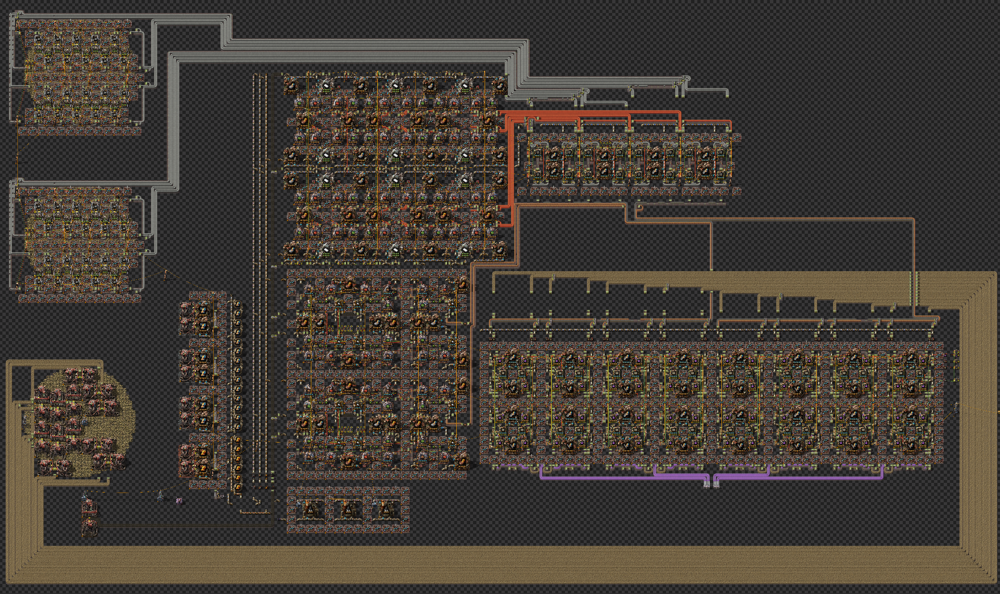
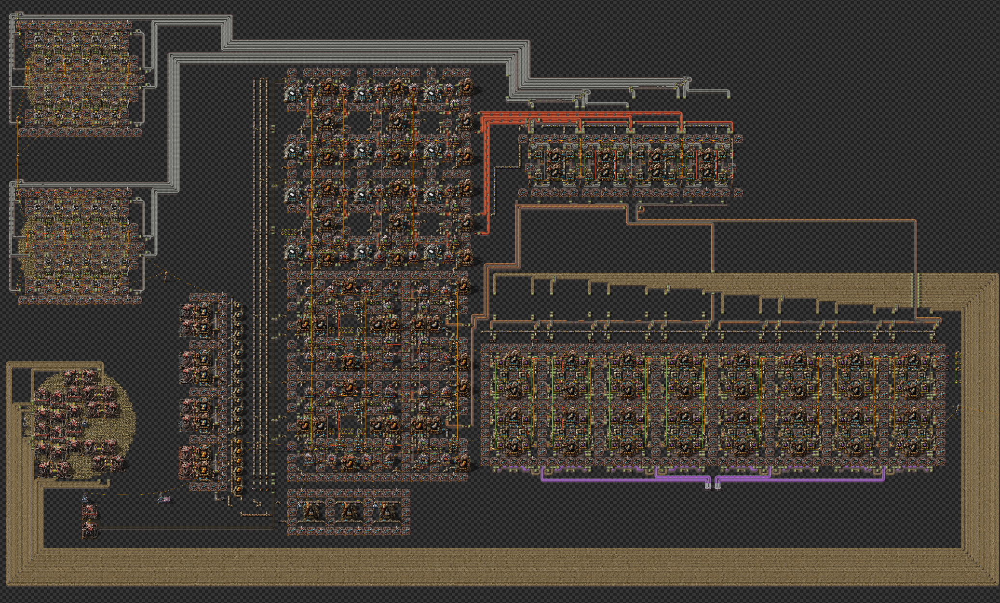
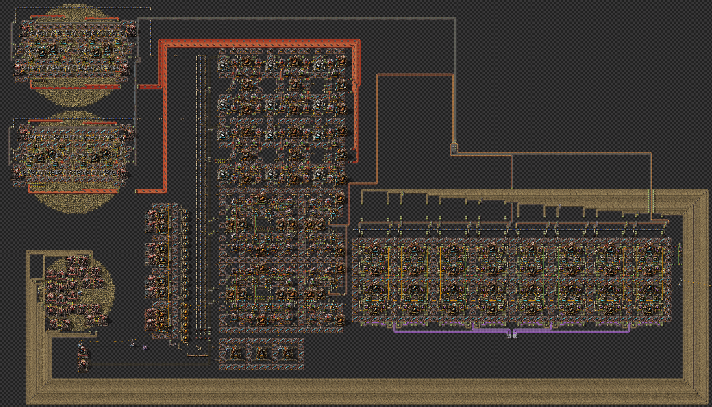
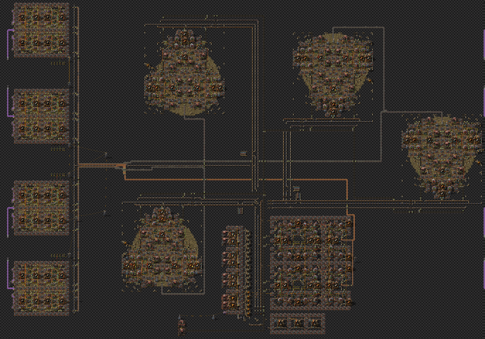
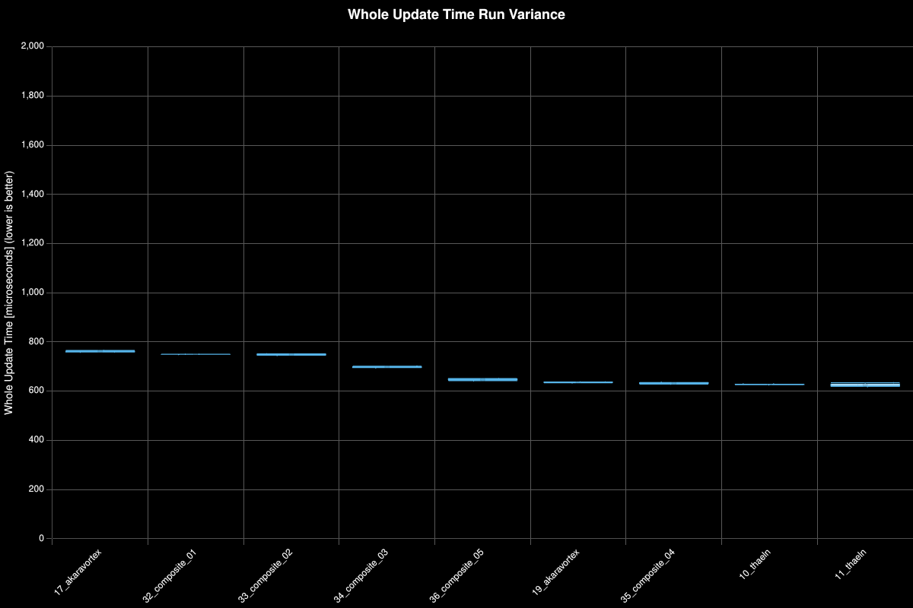
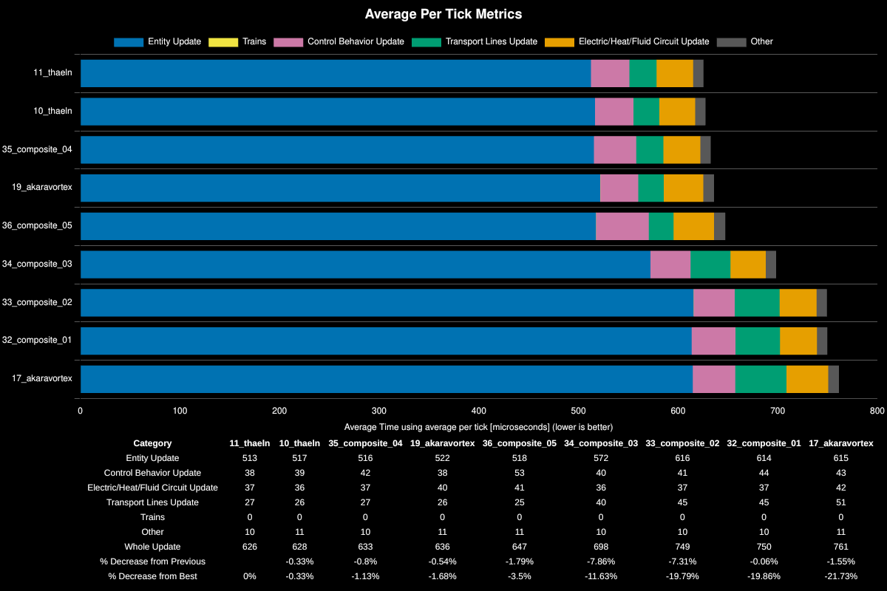
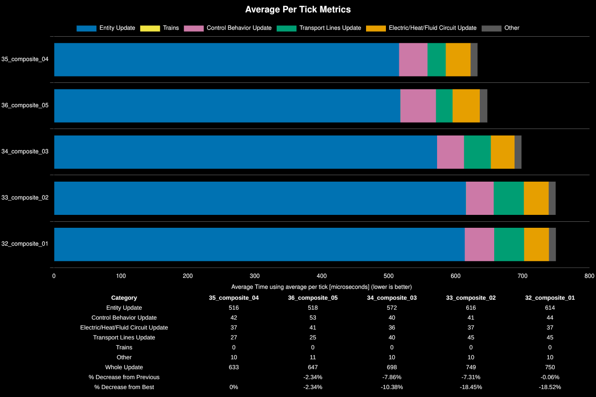

<h1>Composite Designs</h1>

<h2> Table of Contents </h2>

- [Overview](#overview)
- [Composite Designs](#composite-designs)
  - [composite\_01 (100%)](#composite_01-100)
  - [composite\_02 (100%)](#composite_02-100)
  - [composite\_03 (200%)](#composite_03-200)
  - [composite\_04 (200%)](#composite_04-200)
  - [composite\_05 (200%)](#composite_05-200)
- [Test Environment](#test-environment)
- [Scenario](#scenario)
- [Results](#results)
  - [Run Distribution](#run-distribution)
  - [Metrics](#metrics)
  - [Composite Design Metrics](#composite-design-metrics)
- [Conclusions](#conclusions)

## Overview

The goal of composite designs is to test in isolation on patch direct insertion benefits for the intermediary materials.

The primary questions to be answered:
1. Belting stone bricks vs belting stone ore
2. Direct insert red circuits on patch for electric furnaces vs belting
3. Belting stone bricks vs on patch electric furnace production with belted red circuits
4. belted stone vs direct insert stone for rails

These designs are compared to the best designs from round 2 in the competition in their respective categories:

1. 17_akaravortex (any% off patch production)
2. 19_akaravortex (100% patch size DI stone)
3. 11_thaeln (200% patch size DI stone)
4. 10_thaeln (600% patch size DI stone)

## Composite Designs

### composite_01 (100%)

**Design Attributes:**
- belted bricks with DI miners into furnaces
- 200/s red circuit design by abucnasty
- 80/s productivity modules by Thaeln
- 8 beacon purple science block 
  - belted stone
  - 16 assembly machines per 240/s (15/s each assembler)

### composite_02 (100%)

This design tests how much of a difference the advanced circuit design matters overall if both are properly clocked to 200/s per block but have different layouts.

**Design Attributes:**
- belted bricks with DI miners into furnaces
- 200/s red circuit design by Thaeln
- 80/s productivity modules by Thaeln
- 8 beacon purple science block 
  - belted stone
  - 16 assembly machines per 240/s (15/s each assembler)

### composite_03 (200%)

This design brings the furnace production on patch. It requires slightly larger patch sizes of 200% in order to fit the design onto the patches.

**Design Attributes:**
- 80/s furnace block adapted from the design by Em & Thaeln
  - The full 160/s furnace block could not fit on a 200% patch size consistently
- 200/s red circuit design by Thaeln
- 80/s productivity modules by Thaeln
- 8 beacon purple science block 
  - belted stone
  - 16 assembly machines per 240/s (15/s each assembler)

### composite_04 (200%)

This design incorporates electric mining drill direct insertion into rail assemblers for the production science blocks. The clocking is effectively the same for the production science block with the exception that the mining drills are clocked at the effective mining drill output at mining productivity level 8000. 

The above screenshots shows the difference from this direct insert mining drill setup for production science. The difference here is only that the science block swaps the legendary stack inserter picking up stone from a belt with a legendary electric mining drill.

**Design Attributes:**
- 80/s furnace block adapted from the design by Em & Thaeln
  - The full 160/s furnace block could not fit on a 200% patch size consistently
- 200/s red circuit design by Thaeln
- 80/s productivity modules by Thaeln
- 8 beacon purple science block 
  - electric mining direct insert stone
  - 16 assembly machines per 240/s (15/s each assembler)

### composite_05 (200%)

Same as composite_04 but incorporates direct insert red circuits for electric furnace production.

**Design Attributes:**
- 4x 40/s furnace block adapted from Geist
- 80/s productivity modules by Thaeln
- 8 beacon purple science block 
  - electric mining direct insert stone
  - 16 assembly machines per 240/s (15/s each assembler)

## Test Environment
**Platform:** linux-x86_64

**Factorio Version:** 2.0.76

**Date:** 2026-04-09

## Scenario
* Each save was tested for 108000 tick(s) and 3 run(s)
* 12 copies of each design are cloned
* Each design produces 4 stacked turbo belts of production science (960/s)
* Each save produces 11520 production science per second (691_200 / min)

## Results
| Metric            | Description                           |
| ----------------- | ------------------------------------- |
| **Mean UPS**      | Updates per second - higher is better |
| **Mean Avg (ms)** | Average frame time - lower is better  |
| **Mean Min (ms)** | Minimum frame time - lower is better  |
| **Mean Max (ms)** | Maximum frame time - lower is better  |

| Save            | Avg (ms) | Min (ms) | Max (ms) | UPS      | Execution Time (ms) |
| --------------- | -------- | -------- | -------- | -------- | ------------------- |
| 17_akaravortex  | 0.762    | 0.348    | 4.658    | 1312     | 246852              |
| 32_composite_01 | 0.750    | 0.256    | 6.266    | 1332     | 243066              |
| 33_composite_02 | 0.750    | 0.275    | 4.069    | 1333     | 242905              |
| 34_composite_03 | 0.699    | 0.266    | 4.112    | 1431     | 226377              |
| 36_composite_05 | 0.648    | 0.242    | 5.376    | 1543     | 209872              |
| 19_akaravortex  | 0.636    | 0.178    | 7.523    | 1571     | 206220              |
| 10_thaeln       | 0.628    | 0.159    | 7.318    | 1592     | 203492              |
| 11_thaeln       | 0.626    | 0.153    | 6.281    | 1597     | 202801              |
| 35_composite_04 | 0.603    | 0.217    | 3.833    | **1660** | 195150              |

### Run Distribution

### Metrics

| Save File       | Entity Update | Control Behavior Update | Electric/Heat/Fluid Circuit Update | Transport Lines Update | Trains | Other | Whole Update | % Decrease from Previous | % Decrease from Best |
| --------------- | ------------- | ----------------------- | ---------------------------------- | ---------------------- | ------ | ----- | ------------ | ------------------------ | -------------------- |
| 11_thaeln       | 513           | 38                      | 37                                 | 27                     | 0      | 10    | 626          |                          | 0%                   |
| 10_thaeln       | 517           | 39                      | 36                                 | 26                     | 0      | 11    | 628          | -0.33%                   | -0.33%               |
| 35_composite_04 | 516           | 42                      | 37                                 | 27                     | 0      | 10    | 633          | -0.8%                    | -1.13%               |
| 19_akaravortex  | 522           | 38                      | 40                                 | 26                     | 0      | 11    | 636          | -0.54%                   | -1.68%               |
| 36_composite_05 | 518           | 53                      | 41                                 | 25                     | 0      | 11    | 647          | -1.79%                   | -3.5%                |
| 34_composite_03 | 572           | 40                      | 36                                 | 40                     | 0      | 10    | 698          | -7.86%                   | -11.63%              |
| 33_composite_02 | 616           | 41                      | 37                                 | 45                     | 0      | 10    | 749          | -7.31%                   | -19.79%              |
| 32_composite_01 | 614           | 44                      | 37                                 | 45                     | 0      | 10    | 750          | -0.06%                   | -19.86%              |
| 17_akaravortex  | 615           | 43                      | 42                                 | 51                     | 0      | 11    | 761          | -1.55%                   | -21.73%              |

### Composite Design Metrics

## Conclusions

The benchmark results provide clear answers to the original questions:

1. **Belting stone bricks vs stone ore**: On-patch furnace production (stone ore) outperforms belted bricks. Moving furnaces on-patch (composite_03) improved performance by ~7% compared to belted brick designs (composite_01/02).

2. **Direct insert red circuits for electric furnaces**: Belting red circuits is superior. composite_05 with DI red circuits achieved 647µs compared to composite_04's 633µs with belted circuits—a 2% performance loss. Not worth the added complexity.

3. **Belted stone bricks vs on-patch furnaces with belted red circuits**: On-patch furnace production wins decisively. The 200% patch designs (composite_03/04) achieved 633-698µs vs ~750µs for the 100% belted brick designs.

4. **Belted stone vs direct insert stone for rails**: Direct insert mining drills for stone outperform belted stone. composite_04 (DI stone) achieved 633µs vs composite_03's 698µs (belted stone)—a **9% improvement**.

**Overall Winner**: 11_thaeln remains the fastest design at **626µs**, narrowly beating composite_04 (633µs) by ~1%. The composite designs failed to surpass the existing Thaeln designs despite incorporating direct insertion optimizations. The 11_thaeln design's efficiency comes from its integrated 200% patch approach without the overhead introduced by direct insert mining drills.

The red circuit layout (abucnasty vs Thaeln) showed no meaningful performance difference when both are properly clocked to 200/s (composite_01 vs composite_02).
