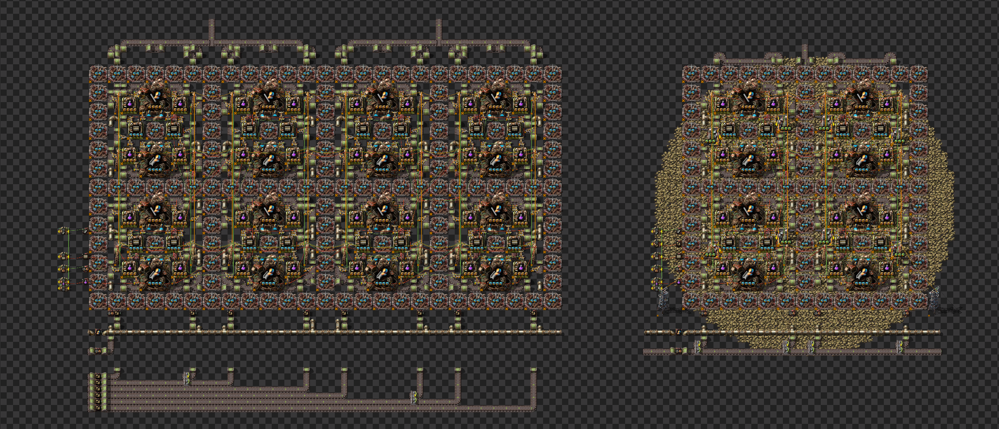
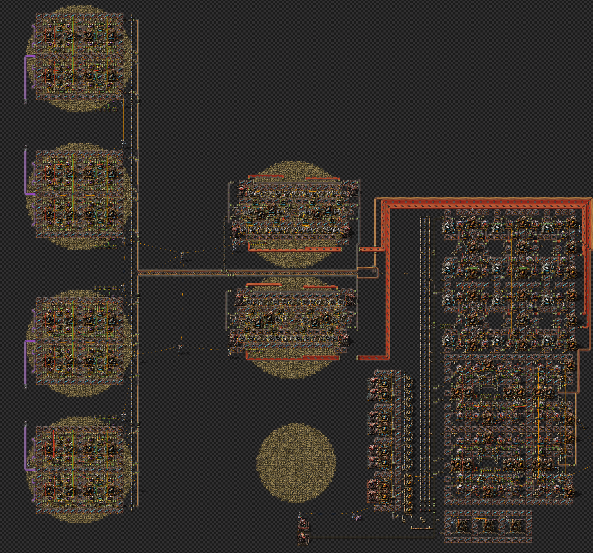
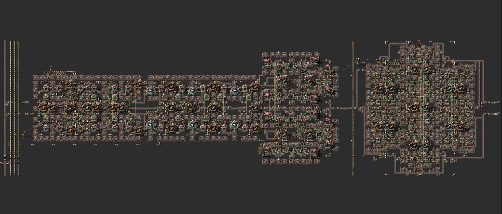

<h1> Production Science: High-Level Conclusions</h1>

This document summarizes the key design decisions for UPS-optimized production science. These are actionable guidelines based on benchmarking 36 full science designs, 28 furnace designs, and 17 productivity module designs but your mileage as always may vary.

<h2> Table of Contents</h2>

- [Stone Handling](#stone-handling)
  - [Should you direct insert stone from mining drills or belt it?](#should-you-direct-insert-stone-from-mining-drills-or-belt-it)
  - [Should you clock mining drills?](#should-you-clock-mining-drills)
- [Electric Furnace Production](#electric-furnace-production)
  - [Should you produce furnaces on-patch or belt stone bricks?](#should-you-produce-furnaces-on-patch-or-belt-stone-bricks)
  - [What inserters should be clocked for furnace production?](#what-inserters-should-be-clocked-for-furnace-production)
- [Stone Patch Size](#stone-patch-size)
  - [Does patch size matter for on-patch designs?](#does-patch-size-matter-for-on-patch-designs)
  - [10\_thaeln vs 11\_thaeln: Why the smaller patch design won](#10_thaeln-vs-11_thaeln-why-the-smaller-patch-design-won)
- [Advanced Circuits for Electric Furnaces](#advanced-circuits-for-electric-furnaces)
  - [Should you direct insert red circuits into electric furnace assemblers?](#should-you-direct-insert-red-circuits-into-electric-furnace-assemblers)
  - [Does the red circuit block layout matter?](#does-the-red-circuit-block-layout-matter)
- [Steel Handling](#steel-handling)
  - [Should you direct insert steel or belt it?](#should-you-direct-insert-steel-or-belt-it)
  - [Should you clock steel inserters from foundries for electric furnace production?](#should-you-clock-steel-inserters-from-foundries-for-electric-furnace-production)
- [Productivity Module Production](#productivity-module-production)
  - [Should you use inserter chains or direct insertion?](#should-you-use-inserter-chains-or-direct-insertion)
  - [Should you use cars as buffers?](#should-you-use-cars-as-buffers)
- [Rail Production](#rail-production)
  - [Should you direct insert stone into rail assemblers?](#should-you-direct-insert-stone-into-rail-assemblers)
- [Inserter Clocking Guidelines](#inserter-clocking-guidelines)
  - [The 80% Uptime Rule](#the-80-uptime-rule)
  - [When to clock inserters](#when-to-clock-inserters)
  - [Clocking principle](#clocking-principle)
- [Belt Design Principles](#belt-design-principles)
  - [Pull from straight belts, not undergrounds](#pull-from-straight-belts-not-undergrounds)
- [Summary: The Optimal Design](#summary-the-optimal-design)

## Stone Handling

### Should you direct insert stone from mining drills or belt it?

**Direct insert mining drills outperform belted stone.**

Testing composite designs showed that using electric mining drills to directly insert stone into rail assemblers (composite_04) achieved **9% better performance** than belting stone to the same assemblers (composite_03).

| Design | Stone Method | Whole Update (µs) |
|--------|--------------|-------------------|
| composite_04 | Direct insert mining | 633 |
| composite_03 | Belted stone | 698 |

The key insight is that direct insertion eliminates the intermediate belt transfer every tick.

### Should you clock mining drills?

**Yes, clocking mining drills is worth it** when directly inserting into furnaces. The clocking reduces intermediate transfer events.

---

## Electric Furnace Production

### Should you produce furnaces on-patch or belt stone bricks?

**On-patch furnace production is better (~7% improvement).**

Moving furnace production onto the stone patch eliminates belt transportation overhead entirely.

| Composite Design | Furnace Method | Whole Update (µs) |
|------------------|----------------|-------------------|
| composite_03 | On-patch (200%) | 698 |
| composite_01/02 | Belted bricks (100%) | ~750 |

Composite_03 (on-patch furnaces) achieved 698µs compared to ~750µs for composite_01/02 (belted bricks)—a 7% improvement with everything else held constant.

### What inserters should be clocked for furnace production?

| Inserter | Clock? | Reason |
|----------|--------|--------|
| Stone from belt | **No** | Unclocked performs better |
| Stone brick output | **Yes** | Worth clocking |
| Red circuit input | **Yes** | Worth clocking |
| Steel DI from foundry | **No** | Not worth clocking |

---

## Stone Patch Size

### Does patch size matter for on-patch designs?

**Patch size has minimal impact on performance (~1-3%).**

Comparing the top on-patch designs across patch size categories:

| Design | Patch Size | Whole Update (µs) | % from Best |
|--------|------------|-------------------|-------------|
| 10_thaeln | 600% (single 34-brush patch) | 622 | baseline |
| 11_thaeln | 200% (two patches: 21+23 brush) | 630 | -1.3% |
| 19_akaravortex | 100% (two small patches) | 640 | -2.9% |

The performance difference between 600% and 100% patch sizes is only ~3%. This is negligible compared to the ~20%+ difference between on-patch and off-patch designs.

### 10_thaeln vs 11_thaeln: Why the smaller patch design won

Interestingly, in the composite designs benchmark, **11_thaeln (200% patches) narrowly beat 10_thaeln (600% patch)** with 626µs vs 628µs.

| Design | Patch Size | Whole Update (µs) |
|--------|------------|-------------------|
| 11_thaeln | 200% | 626 |
| 10_thaeln | 600% | 628 |

Both designs by Thaeln use the same core approach—on-patch production with DI stone. The 200% design requires two patches (21-brush + 23-brush circles) while the 600% design fits on a single 34-brush patch.

This may be an artifact from running the tests for round_02 independently from the composite comparisons. However it does show the diminishing returns that patches sizes beyond 200% bring to the table.

---

## Advanced Circuits for Electric Furnaces

### Should you direct insert red circuits into electric furnace assemblers?

**No. Belting red circuits is superior.**

Direct insertion of red circuits for electric furnace production performed **2% worse** than belting them.

| Design | Red Circuit Method | Whole Update (µs) |
|--------|-------------------|-------------------|
| composite_04 | Belted | 633 |
| composite_05 | Direct insert | 647 |

The increased complexity and control behavior overhead from direct insertion outweighs the belt elimination benefits for this specific use case. Not worth the added complexity.

### Does the red circuit block layout matter?

**Layout matters less than proper clocking.** When both designs are properly clocked to the same output rate (200/s), there was negligible difference between different layouts (composite_01 vs composite_02 both achieved ~1333 UPS).

---

## Steel Handling

### Should you direct insert steel or belt it?

**Direct insert steel from foundries** performs better than belting. The baseline design which belted steel performed worst in the competition.

### Should you clock steel inserters from foundries for electric furnace production?

**No.** Testing showed that unclocked steel inserters with a 4-slot buffer performed slightly better than clocked versions when inserting steel into electric furnace assemblers.

| Variant | Whole Update (µs) |
|---------|------------------|
| Unclocked + 4 slot buffer | 591 |
| Clocked steel | 598 |

> **Note:** This data is specifically for **steel → electric furnace assemblers** where inserter uptime exceeds 80%. For steel → rail assemblers (~66% uptime), the same principle likely applies but was not explicitly tested.

---

## Productivity Module Production

### Should you use inserter chains or direct insertion?

**Direct insertion is better than inserter chains.**

Designs using chest buffers for plastic and copper wire performed measurably worse. The top two productivity module designs were fully direct insertion.

| Design Type | Best Whole Update (µs) |
|-------------|------------------------|
| Full DI | 591 |
| Chest chains | 635+ |

### Should you use cars as buffers?

If you must use cars in a chest chain, **clock the inputs to the car** rather than relying on wakelists. Unclocked inserters inputting into a car seem to constantly check if they're moving every tick.

| Car Method | Whole Update (µs) |
|------------|------------------|
| Clocked input + 1 slot | 597 |
| Clocked input | 607 |
| Unclocked wakelist | 627 |

---

## Rail Production

### Should you direct insert stone into rail assemblers?

**Yes.** Using direct insert mining drills for stone in production science blocks (composite_04) achieved 9% better performance than belting stone (composite_03).

This change—swapping a belt-fed stack inserter with a direct insert mining drill—is a meaningful optimization, though the existing 11_thaeln design still narrowly outperforms composite_04 overall.

---

## Inserter Clocking Guidelines

### The 80% Uptime Rule

**If an inserter is running more than ~80% of the time, don't bother clocking it.**

This is a general principle that applies across any design, not just production science. Examples:

| Inserter | Approximate Uptime | Clock? |
|----------|-------------------|--------|
| Steel → Electric Furnace assembler | >83% (5/6) | **No** |
| Steel → Rail assembler | ~66% (2/3) | **Probably No** |
| Stone from belt | High | **No** |
| Brick output from furnaces | Varies | **Yes** |
| Red circuit input | Varies | **Yes** |

The overhead of circuit network signals and control behavior updates outweighs the wake list reduction when inserters are already running most of the time anyway.

### When to clock inserters

| Scenario | Clock? | Reason |
|----------|--------|--------|
| High craft rate outputs (>15/s) | **Yes** | Reduces wake events |
| Inputs to high craft rate buildings | **Yes** | Reduces wake events |
| Mining drills (DI into furnaces) | **Yes** | Reduces intermediate transfer |
| Brick output from furnaces | **Yes** | Worth the overhead |
| Red circuit input to furnace assemblers | **Yes** | Worth the overhead |
| Inserters with >80% uptime | **No** | Already running constantly |
| Stone input from belt | **No** | High uptime, overhead exceeds benefit |
| Steel from foundry → furnaces | **No** | >80% uptime |
| Green circuit inputs | **No** | Craft rate too low |

### Clocking principle

The benefit of clocking comes from reducing **wake list events**. Buildings with high craft rates (like advanced circuits at 45+/s or prod modules at 15/s) trigger many wake events per second. Clocking the inserters feeding these buildings reduces entity updates significantly.

However, if an inserter is already running almost constantly (>80% uptime), the wake list events are minimal compared to the circuit network overhead from clocking. In these cases, simply let the inserter run unclocked.

---

## Belt Design Principles

### Pull from straight belts, not undergrounds

Pulling from undergrounds for constantly moving belts is worse than pulling from straight belts.

---

## Summary: The Optimal Design

The winning design is **11_thaeln** at **626µs**, narrowly beating composite_04 (633µs) by ~1%. The key design principles are:

1. **On-patch furnace production** (80/s block)
2. **Belted red circuits** (not direct insert)
3. **Direct insert mining drills for stone** in production science blocks
4. **Clock inserters with low uptime** (<80%), leave high-uptime inserters unclocked
5. **200% stone patch size** (balance between patch availability and design fit)

The composite designs incorporating direct insertion optimizations did not surpass the existing Thaeln designs, though they came within 1%. The key takeaway is that integrated on-patch designs with proper clocking principles outperform off-patch belted designs by **20%+**.