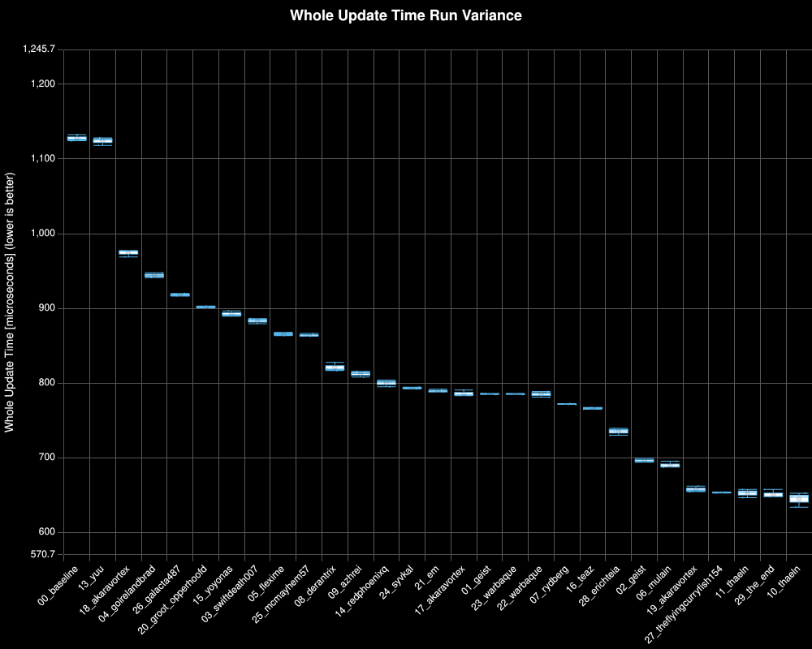
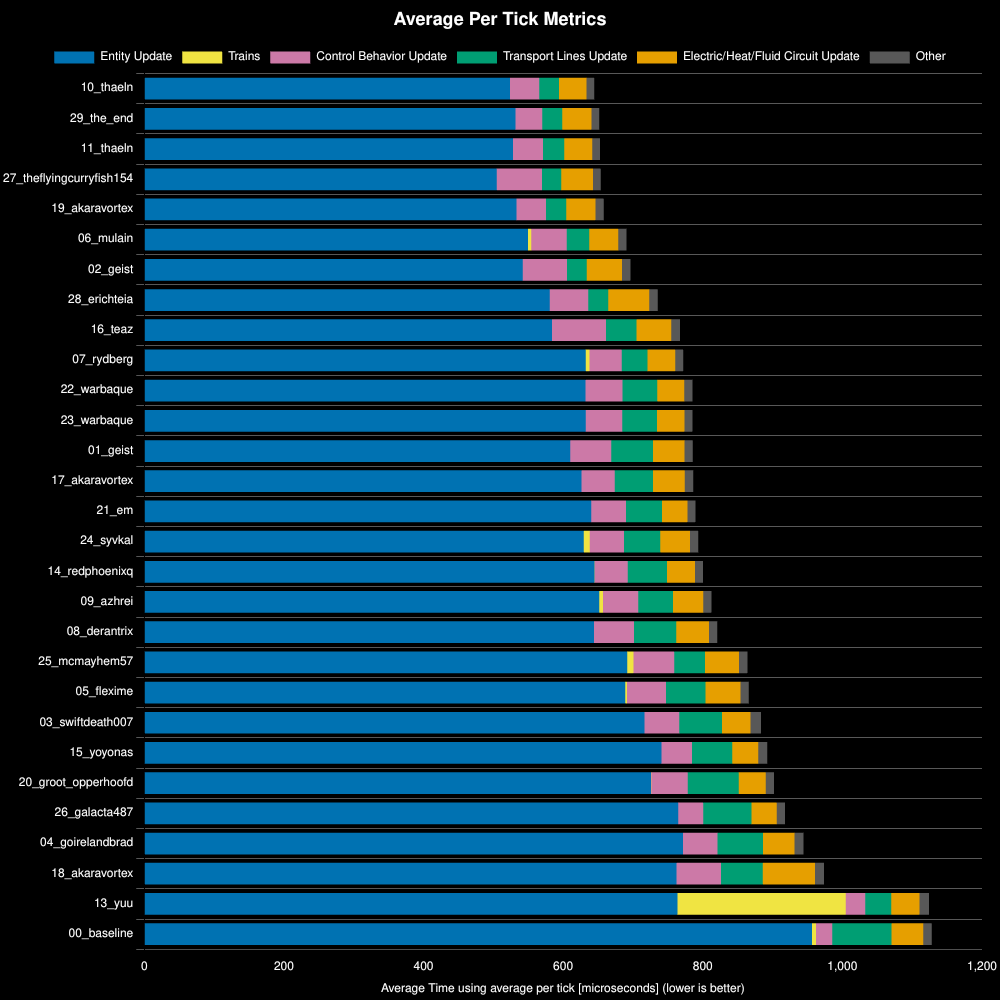
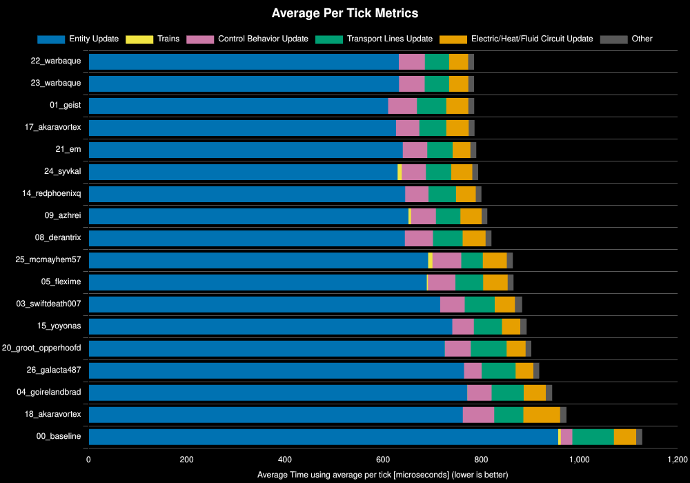
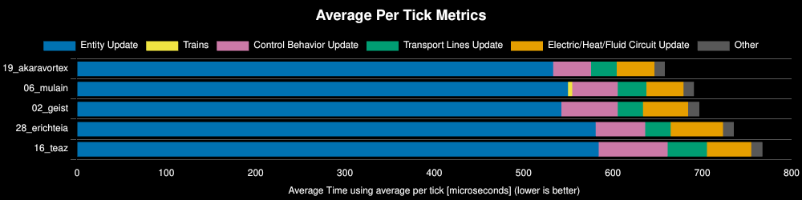
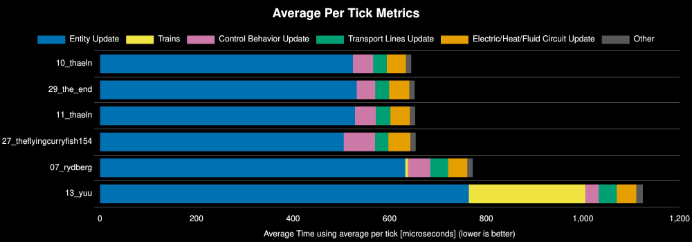

<h1>Q1 Production Science Competition: Round 1 Qualifiers</h1>

<h2> Table of Contents</h2>

- [Test Environment](#test-environment)
- [Scenario](#scenario)
- [Results](#results)
  - [Run Distribution](#run-distribution)
  - [All Designs](#all-designs)
  - [Any%](#any)
  - [100%](#100)
  - [200%+](#200)
  - [Analysis](#analysis)
  - [Designs Moving On](#designs-moving-on)

## Test Environment
**Platform:** linux-x86_64

**Factorio Version:** 2.0.76

**Date:** 2026-04-09

## Scenario
* Each save was tested for 18000 tick(s) and 3 run(s)
* an initial save file of 960/s science are submitted by each author
* 12 copies of the save file are region cloned
* total production per save is 960/s * 12 which is 11520/s or 691_200 per minute

## Results
| Metric            | Description                           |
| ----------------- | ------------------------------------- |
| **Mean UPS**      | Updates per second - higher is better |
| **Mean Avg (ms)** | Average frame time - lower is better  |
| **Mean Min (ms)** | Minimum frame time - lower is better  |
| **Mean Max (ms)** | Maximum frame time - lower is better  |

| Save                     | Avg (ms) | Min (ms) | Max (ms) | UPS      | Execution Time (ms) | % Difference from Worst |
| ------------------------ | -------- | -------- | -------- | -------- | ------------------- | ----------------------- |
| 00_baseline              | 1.129    | 0.835    | 4.611    | 886      | 60943               | 0.00%                   |
| 13_yuu                   | 1.125    | 0.748    | 5.765    | 888      | 60747               | 0.32%                   |
| 18_akaravortex           | 0.975    | 0.279    | 7.107    | 1025     | 52636               | 15.78%                  |
| 04_goirelandbrad         | 0.945    | 0.506    | 4.276    | 1058     | 51037               | 19.41%                  |
| 26_galacta487            | 0.919    | 0.552    | 3.953    | 1088     | 49597               | 22.88%                  |
| 20_groot_opperhoofd      | 0.903    | 0.497    | 3.337    | 1107     | 48736               | 25.05%                  |
| 15_yoyonas               | 0.893    | 0.526    | 4.102    | 1119     | 48231               | 26.36%                  |
| 03_swiftdeath007         | 0.884    | 0.405    | 4.822    | 1131     | 47730               | 27.68%                  |
| 05_flexime               | 0.866    | 0.429    | 3.912    | 1154     | 46780               | 30.28%                  |
| 25_mcmayhem57            | 0.865    | 0.402    | 4.828    | 1156     | 46703               | 30.49%                  |
| 08_derantrix             | 0.821    | 0.350    | 3.956    | 1217     | 44368               | 37.36%                  |
| 09_azhrei                | 0.813    | 0.252    | 4.062    | 1230     | 43888               | 38.86%                  |
| 14_redphoenixq           | 0.801    | 0.342    | 4.131    | 1248     | 43249               | 40.92%                  |
| 24_syvkal                | 0.794    | 0.358    | 4.431    | 1258     | 42892               | 42.08%                  |
| 21_em                    | 0.790    | 0.276    | 3.443    | 1265     | 42673               | 42.81%                  |
| 17_akaravortex           | 0.787    | 0.363    | 3.528    | 1271     | 42486               | 43.44%                  |
| 01_geist                 | 0.786    | 0.390    | 4.073    | 1271     | 42461               | 43.52%                  |
| 22_warbaque              | 0.786    | 0.273    | 2.848    | 1272     | 42438               | 43.61%                  |
| 23_warbaque              | 0.786    | 0.281    | 3.627    | 1272     | 42425               | 43.65%                  |
| 07_rydberg               | 0.772    | 0.336    | 3.416    | 1294     | 41717               | 46.08%                  |
| 16_teaz                  | 0.768    | 0.305    | 4.082    | 1301     | 41491               | 46.88%                  |
| 28_erichteia             | 0.736    | 0.313    | 3.512    | 1358     | 39747               | 53.33%                  |
| 02_geist                 | 0.697    | 0.334    | 4.720    | 1434     | 37652               | 61.86%                  |
| 06_mulain                | 0.691    | 0.274    | 3.377    | 1446     | 37322               | 63.29%                  |
| 19_akaravortex           | 0.659    | 0.188    | 8.624    | 1517     | 35574               | 71.32%                  |
| 27_theflyingcurryfish154 | 0.655    | 0.237    | 3.131    | 1527     | 35341               | 72.44%                  |
| 11_thaeln                | 0.653    | 0.150    | 4.700    | 1530     | 35284               | 72.73%                  |
| 29_the_end               | 0.652    | 0.135    | 4.634    | 1533     | 35207               | 73.10%                  |
| 10_thaeln                | 0.645    | 0.177    | 5.043    | **1550** | 34843               | 74.93%                  |

### Run Distribution

### All Designs

### Any%

### 100%

### 200%+

### Analysis
- baseline performed worse due to belting steel instead of direct insertion
- designs with less inserters from a belt for high throughput items (e.g. stone & steel) perform better
- on patch presents a logistic problem of routing the designs onto real patches depending on map generation settings
- pulling from undergrounds for constantly moving belts is worse than from straight belts

### Designs Moving On
All designs move on to the next round as they performed above the baseline.