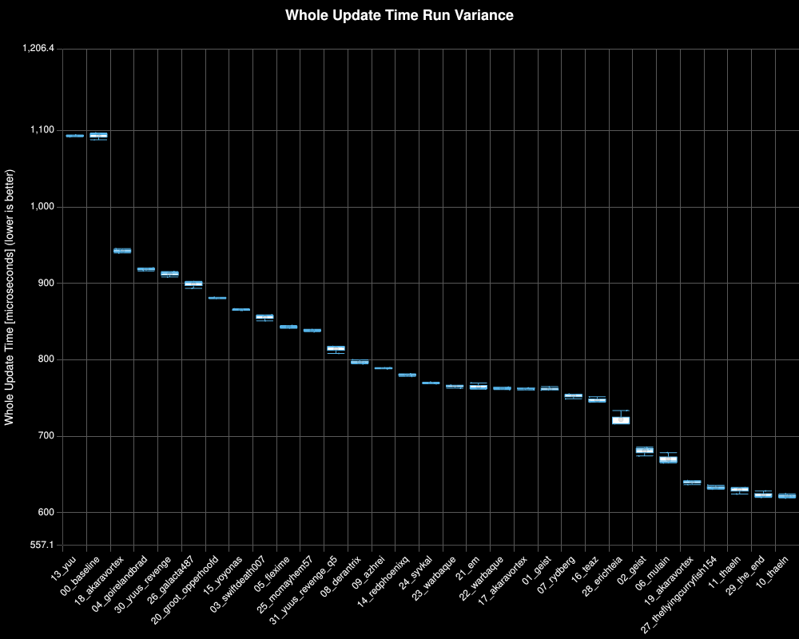
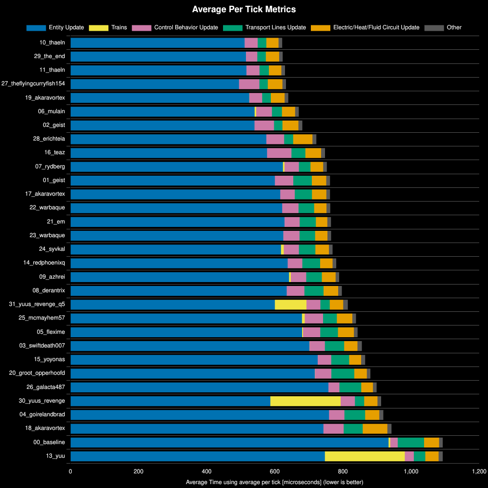
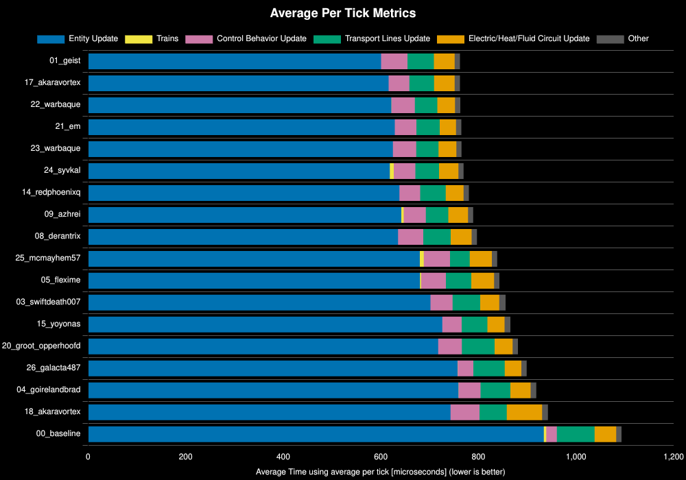
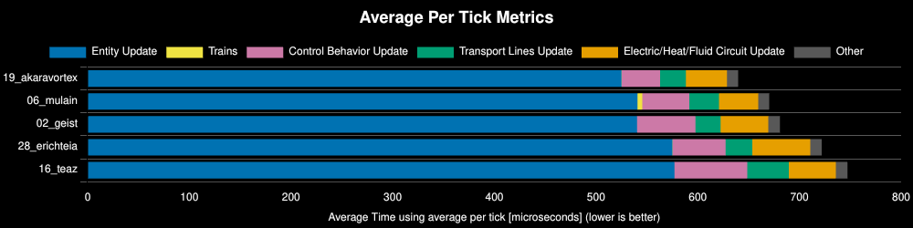
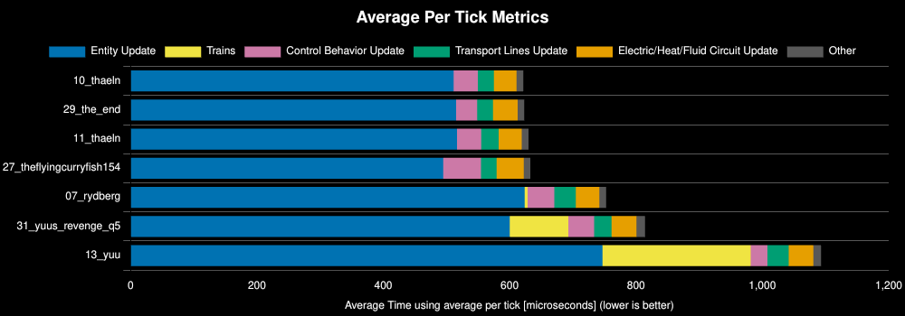
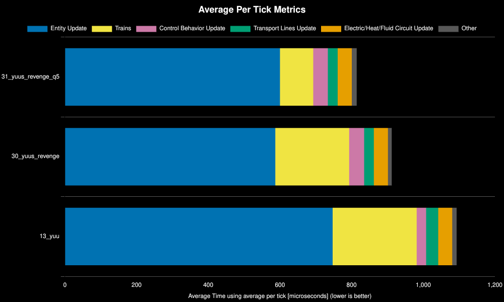

<h1>Q1 Production Science Competition: Round 2 Stress Test</h1>

<h2> Table of Contents</h2>

- [Test Environment](#test-environment)
- [Scenario](#scenario)
- [Results](#results)
  - [Run Distribution](#run-distribution)
  - [All Designs](#all-designs)
  - [Any%](#any)
  - [100%](#100)
  - [200%+](#200)
  - [Train Improvements](#train-improvements)

## Test Environment
**Platform:** linux-x86_64

**Factorio Version:** 2.0.76

**Date:** 2026-04-09

## Scenario
* Each save was tested for 108000 tick(s) and 3 run(s)
* an initial save file of 960/s science are submitted by each author
* 12 copies of the save file are region cloned
* total production per save is 960/s * 12 which is 11520/s or 691_200 per minute

An additional two designs were submitted through a collaboration of Akaravortex and Yuu. 

`30_yuus_revenge`
- introduces clocking and a new productivity module design from Akaravortex

`31_yuus_revenge_q5`
- uses a mod to crate quality train wagons to increase the size of the cargo bays
- this is the only modded save file in this list and is called 

## Results
| Metric            | Description                           |
| ----------------- | ------------------------------------- |
| **Mean UPS**      | Updates per second - higher is better |
| **Mean Avg (ms)** | Average frame time - lower is better  |
| **Mean Min (ms)** | Minimum frame time - lower is better  |
| **Mean Max (ms)** | Maximum frame time - lower is better  |

| Save                     | Avg (ms) | Min (ms) | Max (ms) | UPS      | Execution Time (ms) | % Difference from Worst |
| ------------------------ | -------- | -------- | -------- | -------- | ------------------- | ----------------------- |
| 13_yuu                   | 1.094    | 0.725    | 5.757    | 914      | 354321              | 0.00%                   |
| 00_baseline              | 1.093    | 0.825    | 4.058    | 914      | 354290              | 0.01%                   |
| 18_akaravortex           | 0.943    | 0.266    | 6.010    | 1060     | 305485              | 15.99%                  |
| 04_goirelandbrad         | 0.919    | 0.496    | 4.933    | 1088     | 297712              | 19.01%                  |
| 30_yuus_revenge          | 0.912    | 0.299    | 5.712    | 1096     | 295617              | 19.86%                  |
| 26_galacta487            | 0.899    | 0.519    | 4.834    | 1111     | 291382              | 21.60%                  |
| 20_groot_opperhoofd      | 0.881    | 0.476    | 4.561    | 1134     | 285495              | 24.11%                  |
| 15_yoyonas               | 0.866    | 0.510    | 4.096    | 1155     | 280506              | 26.31%                  |
| 03_swiftdeath007         | 0.856    | 0.407    | 4.941    | 1168     | 277345              | 27.76%                  |
| 05_flexime               | 0.843    | 0.398    | 4.947    | 1185     | 273246              | 29.67%                  |
| 25_mcmayhem57            | 0.839    | 0.370    | 4.045    | 1192     | 271775              | 30.37%                  |
| 31_yuus_revenge_q5       | 0.815    | 0.243    | 5.910    | 1227     | 263964              | 34.23%                  |
| 08_derantrix             | 0.797    | 0.323    | 4.824    | 1254     | 258326              | 37.16%                  |
| 09_azhrei                | 0.789    | 0.237    | 5.118    | 1266     | 255762              | 38.54%                  |
| 14_redphoenixq           | 0.781    | 0.312    | 5.584    | 1281     | 252918              | 40.09%                  |
| 24_syvkal                | 0.770    | 0.311    | 4.893    | 1298     | 249473              | 42.03%                  |
| 23_warbaque              | 0.766    | 0.267    | 5.309    | 1306     | 248056              | 42.84%                  |
| 21_em                    | 0.765    | 0.269    | 5.251    | 1306     | 247908              | 42.93%                  |
| 22_warbaque              | 0.763    | 0.255    | 4.412    | 1310     | 247235              | 43.31%                  |
| 17_akaravortex           | 0.762    | 0.350    | 4.746    | 1311     | 247057              | 43.42%                  |
| 01_geist                 | 0.762    | 0.384    | 4.090    | 1311     | 247004              | 43.45%                  |
| 07_rydberg               | 0.753    | 0.296    | 5.524    | 1327     | 244022              | 45.20%                  |
| 16_teaz                  | 0.748    | 0.296    | 4.425    | 1337     | 242284              | 46.24%                  |
| 28_erichteia             | 0.722    | 0.296    | 4.734    | 1384     | 234043              | 51.41%                  |
| 02_geist                 | 0.681    | 0.305    | 6.700    | 1468     | 220682              | 60.56%                  |
| 06_mulain                | 0.671    | 0.241    | 4.652    | 1491     | 217272              | 63.09%                  |
| 19_akaravortex           | 0.640    | 0.167    | 7.549    | 1562     | 207377              | 70.86%                  |
| 27_theflyingcurryfish154 | 0.633    | 0.210    | 4.989    | 1579     | 205173              | 72.70%                  |
| 11_thaeln                | 0.630    | 0.141    | 4.759    | 1587     | 204162              | 73.55%                  |
| 29_the_end               | 0.624    | 0.123    | 4.987    | 1603     | 202018              | 75.40%                  |
| 10_thaeln                | 0.622    | 0.157    | 5.234    | **1607** | 201508              | 75.84%                  |

### Run Distribution

### All Designs

### Any%

| Save File           | Entity Update | Transport Lines Update | Control Behavior Update | Electric/Heat/Fluid Circuit Update | Trains | Other | Whole Update | % Decrease from Previous | % Decrease from Best |
| ------------------- | ------------- | ---------------------- | ----------------------- | ---------------------------------- | ------ | ----- | ------------ | ------------------------ | -------------------- |
| 01_geist            | 600           | 54                     | 54                      | 42                                 | 0      | 11    | 762          |                          | 0%                   |
| 17_akaravortex      | 616           | 51                     | 42                      | 42                                 | 0      | 11    | 762          | -0.03%                   | -0.03%               |
| 22_warbaque         | 622           | 46                     | 48                      | 36                                 | 0      | 11    | 763          | -0.06%                   | -0.09%               |
| 21_em               | 629           | 48                     | 44                      | 34                                 | 0      | 11    | 765          | -0.28%                   | -0.37%               |
| 23_warbaque         | 625           | 46                     | 48                      | 36                                 | 0      | 11    | 765          | -0.07%                   | -0.44%               |
| 24_syvkal           | 618           | 48                     | 45                      | 40                                 | 8      | 11    | 770          | -0.56%                   | -1.01%               |
| 14_redphoenixq      | 638           | 52                     | 43                      | 37                                 | 0      | 11    | 780          | -1.38%                   | -2.4%                |
| 09_azhrei           | 642           | 46                     | 45                      | 40                                 | 5      | 11    | 789          | -1.13%                   | -3.56%               |
| 08_derantrix        | 635           | 56                     | 52                      | 43                                 | 0      | 11    | 797          | -0.99%                   | -4.58%               |
| 25_mcmayhem57       | 680           | 41                     | 54                      | 45                                 | 8      | 11    | 838          | -5.21%                   | -10.04%              |
| 05_flexime          | 680           | 52                     | 50                      | 47                                 | 3      | 11    | 843          | -0.54%                   | -10.63%              |
| 03_swiftdeath007    | 702           | 57                     | 45                      | 39                                 | 0      | 13    | 856          | -1.5%                    | -12.29%              |
| 15_yoyonas          | 726           | 53                     | 40                      | 35                                 | 0      | 12    | 865          | -1.14%                   | -13.57%              |
| 20_groot_opperhoofd | 717           | 67                     | 48                      | 37                                 | 0      | 11    | 881          | -1.78%                   | -15.59%              |
| 26_galacta487       | 757           | 64                     | 32                      | 34                                 | 0      | 11    | 899          | -2.07%                   | -17.98%              |
| 04_goirelandbrad    | 759           | 61                     | 45                      | 42                                 | 0      | 12    | 918          | -2.17%                   | -20.54%              |
| 18_akaravortex      | 743           | 56                     | 59                      | 72                                 | 0      | 12    | 942          | -2.6%                    | -23.68%              |
| 00_baseline         | 934           | 77                     | 22                      | 44                                 | 5      | 11    | 1093         | -15.99%                  | -43.46%              |

### 100%

| Save File      | Entity Update | Electric/Heat/Fluid Circuit Update | Control Behavior Update | Transport Lines Update | Trains | Other | Whole Update | % Decrease from Previous | % Decrease from Best |
| -------------- | ------------- | ---------------------------------- | ----------------------- | ---------------------- | ------ | ----- | ------------ | ------------------------ | -------------------- |
| 19_akaravortex | 525           | 40                                 | 38                      | 25                     | 0      | 11    | 640          |                          | 0%                   |
| 06_mulain      | 541           | 39                                 | 46                      | 29                     | 5      | 11    | 670          | -4.78%                   | -4.78%               |
| 02_geist       | 540           | 47                                 | 57                      | 25                     | 0      | 11    | 681          | -1.57%                   | -6.42%               |
| 28_erichteia   | 575           | 57                                 | 52                      | 26                     | 0      | 11    | 722          | -6.05%                   | -12.86%              |
| 16_teaz        | 577           | 46                                 | 72                      | 41                     | 0      | 12    | 747          | -3.52%                   | -16.83%              |

### 200%+

| Save File                | Entity Update | Control Behavior Update | Electric/Heat/Fluid Circuit Update | Transport Lines Update | Trains | Other | Whole Update | % Decrease from Previous | % Decrease from Best |
| ------------------------ | ------------- | ----------------------- | ---------------------------------- | ---------------------- | ------ | ----- | ------------ | ------------------------ | -------------------- |
| 10_thaeln                | 511           | 38                      | 36                                 | 26                     | 0      | 11    | 622          |                          | 0%                   |
| 29_the_end               | 515           | 33                      | 39                                 | 25                     | 0      | 10    | 623          | -0.27%                   | -0.27%               |
| 11_thaeln                | 517           | 39                      | 37                                 | 27                     | 0      | 11    | 630          | -1.05%                   | -1.32%               |
| 27_theflyingcurryfish154 | 495           | 60                      | 43                                 | 25                     | 0      | 10    | 633          | -0.49%                   | -1.82%               |
| 07_rydberg               | 624           | 42                      | 37                                 | 34                     | 5      | 11    | 753          | -18.95%                  | -21.11%              |
| 31_yuus_revenge_q5       | 600           | 41                      | 39                                 | 27                     | 93     | 14    | 814          | -8.16%                   | -31%                 |
| 13_yuu                   | 747           | 27                      | 39                                 | 34                     | 234    | 12    | 1093         | -34.25%                  | -75.87%              |

### Train Improvements

These are the improvements via the two new design submissions in round 02 from Yuu & Akaravortex. Quality wagon mod does show a noticeable improvement over the vanilla wagons.

|Save File|Entity Update|Trains|Control Behavior Update|Electric/Heat/Fluid Circuit Update|Transport Lines Update|Other|Whole Update|% Decrease from Previous|% Decrease from Best|
|---|---|---|---|---|---|---|---|---|---|
|31_yuus_revenge_q5|600|93|41|39|27|14|814||0%|
|30_yuus_revenge|587|206|42|39|27|11|912|-12.02%|-12.02%|
|13_yuu|747|234|27|39|34|12|1093|-19.84%|-34.25%|