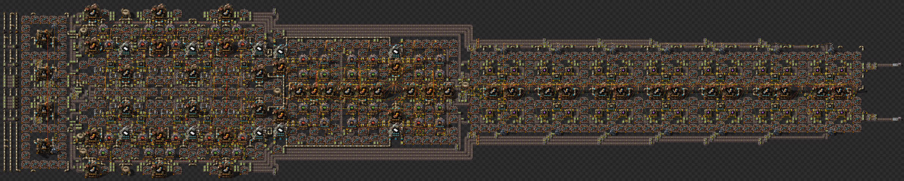
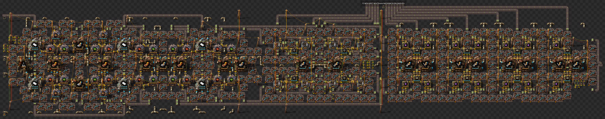
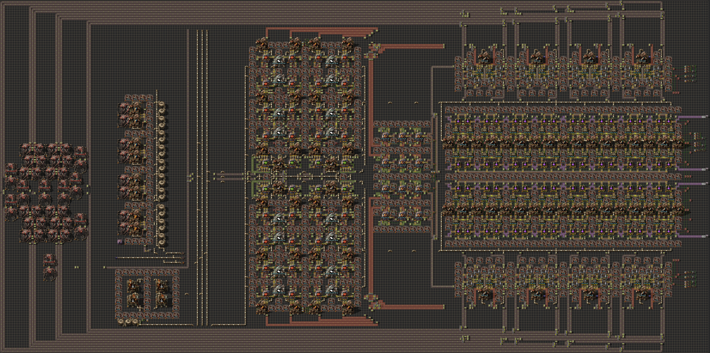
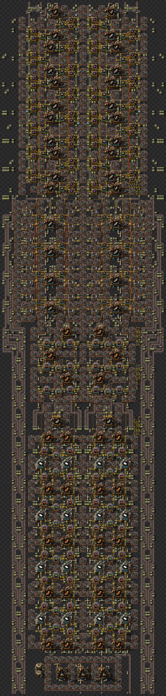
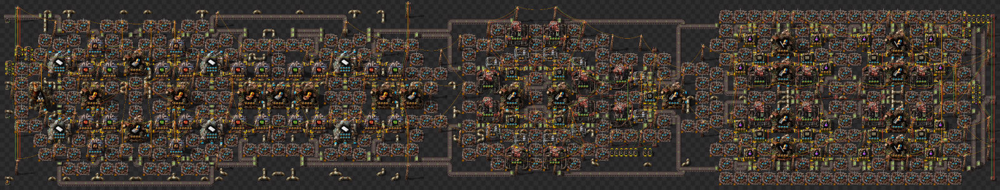
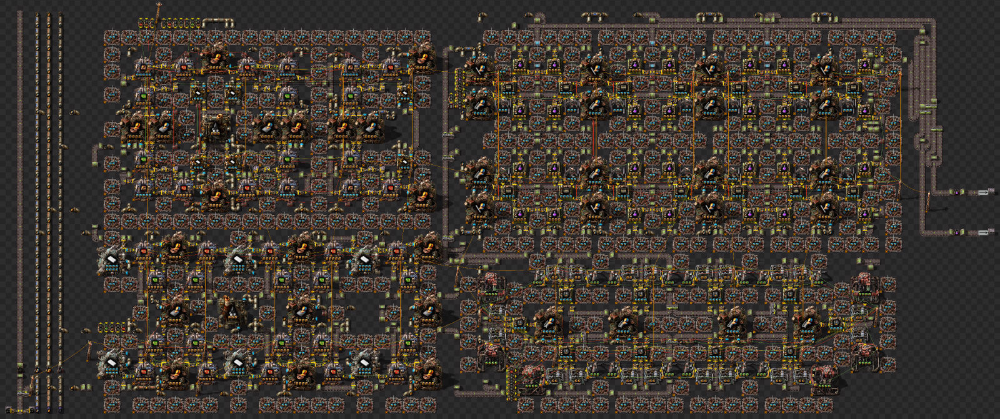
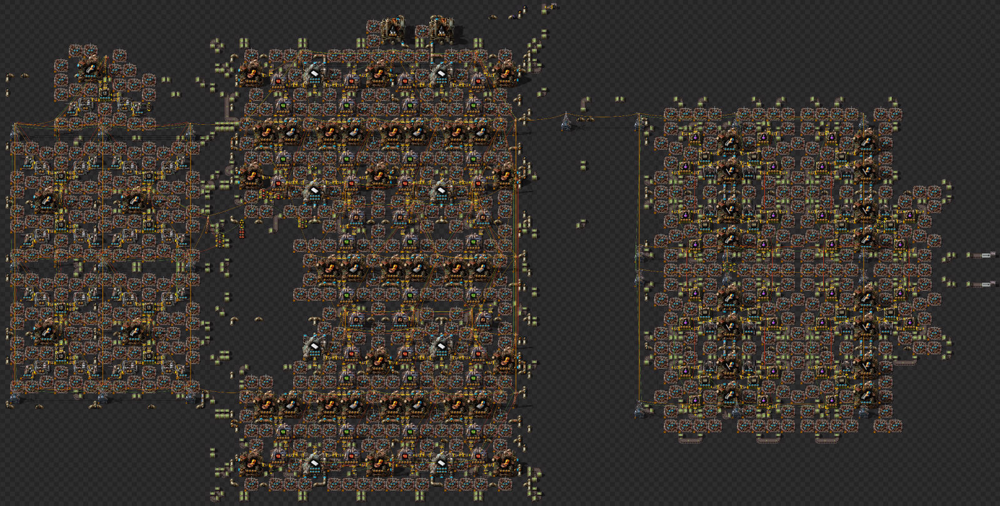

# Competition Winners by Category

## Any%

This category belts stone and does not rely on patch size.

There is a 4 way tie due to all designs falling within less than 1% of each other.

| Save File      | Screenshot                                                                                                                | Blueprint                                              | Whole Update | % Decrease from Previous | % Decrease from Best |
| -------------- | ------------------------------------------------------------------------------------------------------------------------- | ------------------------------------------------------ | ------------ | ------------------------ | -------------------- |
| 01_geist       |                    | [01_geist.txt](../blueprints/01_geist.txt)             | 762          |                          | 0%                   |
| 17_akaravortex |  | [17_akaravortex.txt](../blueprints/17_akaravortex.txt) | 762          | -0.03%                   | -0.03%               |
| 22_warbaque    |           | [22_warbaque.txt](../blueprints/22_warbaque.txt)       | 763          | -0.06%                   | -0.09%               |
| 21_em          |                             | [21_em.txt](../blueprints/21_em.txt)                   | 765          | -0.28%                   | -0.37%               |

## 100%
This category requires at least 100% sized stone patches.

From the original submissions, akaravortex won the 100% patch size designs with the second place design performing 5% worse.

| Save File      | Screenshot                                                                                                                | Blueprint                                              | Whole Update |
| -------------- | ------------------------------------------------------------------------------------------------------------------------- | ------------------------------------------------------ | ------------ |
| 19_akaravortex |  | [19_akaravortex.txt](../blueprints/19_akaravortex.txt) | 640          |

## 200%

This category requires at least 200% sized stone patches.

| Save File | Screenshot                                                                                                 | Blueprint                                    | Whole Update |
| --------- | ---------------------------------------------------------------------------------------------------------- | -------------------------------------------- | ------------ |
| 11_thaeln |  | [11_thaeln.txt](../blueprints/11_thaeln.txt) | 626          |

## 600%

This category requires at least 600% sized stone patches.

Designs by Thaeln and The End came in at an effective tie for this category.

| Save File  | Screenshot                                                                                                    | Blueprint                                      | Whole Update | % Decrease from Previous | % Decrease from Best |
| ---------- | ------------------------------------------------------------------------------------------------------------- | ---------------------------------------------- | ------------ | ------------------------ | -------------------- |
| 10_thaeln  |     | [10_thaeln.txt](../blueprints/10_thaeln.txt)   | 622          |                          | 0%                   |
| 29_the_end |  | [29_the_end.txt](../blueprints/29_the_end.txt) | 623          | -0.27%                   | -0.27%               |
