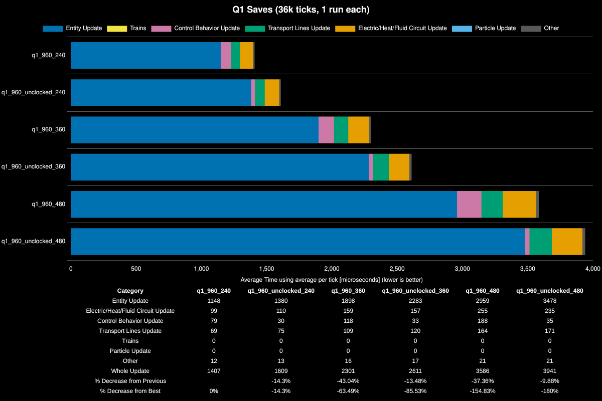
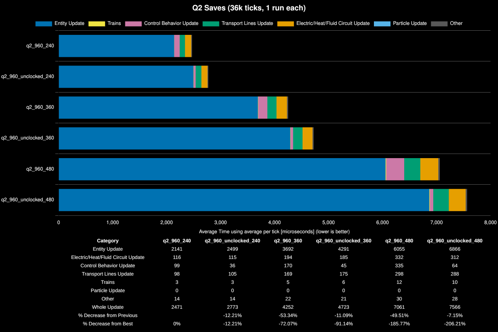

# Factorio Benchmark Results

**Platform:** linux-x86_64

**Factorio Version:** 2.0.77

**Date:** 2026-06-14

## Scenario
* Each save was tested for 36000 tick(s) and 1 run(s)
* Used for comparing if removing all clocks from a build vs clocking is worth it

## Results
| Metric            | Description                           |
| ----------------- | ------------------------------------- |
| **Mean UPS**      | Updates per second - higher is better |
| **Mean Avg (ms)** | Average frame time - lower is better  |
| **Mean Min (ms)** | Minimum frame time - lower is better  |
| **Mean Max (ms)** | Maximum frame time - lower is better  |

| Save                        | Avg (ms) | Min (ms) | Max (ms) | UPS     | Execution Time (ms) | % Difference from Worst |
| --------------------------- | -------- | -------- | -------- | ------- | ------------------- | ----------------------- |
| thaeln_q2_960_unclocked_480 | 7.567    | 6.035    | 18.828   | 132     | 272427              | 0.00%                   |
| thaeln_q2_960_480           | 7.062    | 3.716    | 15.600   | 141     | 254245              | 7.15%                   |
| thaeln_q2_960_unclocked_360 | 4.724    | 3.789    | 13.956   | 211     | 170059              | 60.20%                  |
| thaeln_q2_960_360           | 4.252    | 2.348    | 11.505   | 235     | 153089              | 77.95%                  |
| thaeln_q1_960_unclocked_480 | 3.941    | 2.622    | 12.734   | 253     | 141890              | 92.00%                  |
| thaeln_q1_960_480           | 3.588    | 1.528    | 14.549   | 278     | 129151              | 110.94%                 |
| thaeln_q2_960_unclocked_240 | 2.773    | 2.281    | 9.149    | 360     | 99842               | 172.86%                 |
| thaeln_q1_960_unclocked_360 | 2.612    | 1.750    | 9.206    | 382     | 94022               | 189.75%                 |
| thaeln_q2_960_240           | 2.472    | 1.464    | 7.460    | 404     | 88976               | 206.18%                 |
| thaeln_q1_960_360           | 2.302    | 1.044    | 11.020   | 434     | 82861               | 228.78%                 |
| thaeln_q1_960_unclocked_240 | 1.609    | 1.148    | 9.054    | 621     | 57930               | 370.26%                 |
| thaeln_q1_960_240           | 1.408    | 0.661    | 7.175    | **710** | 50687               | 437.46%                 |

## Conclusion

