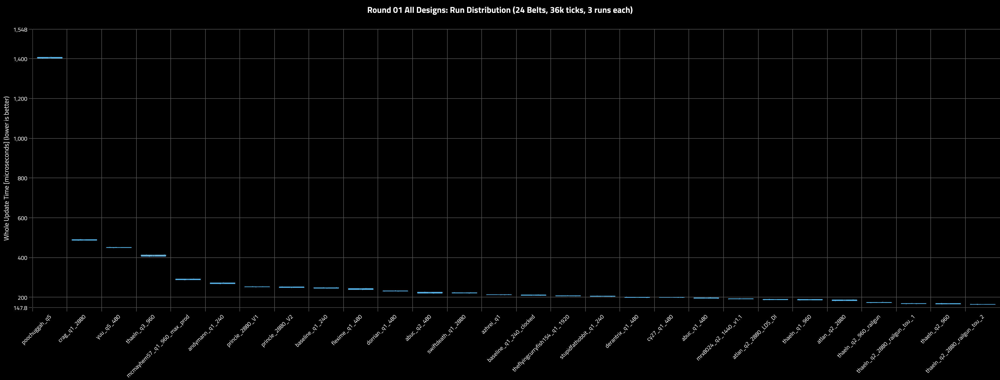
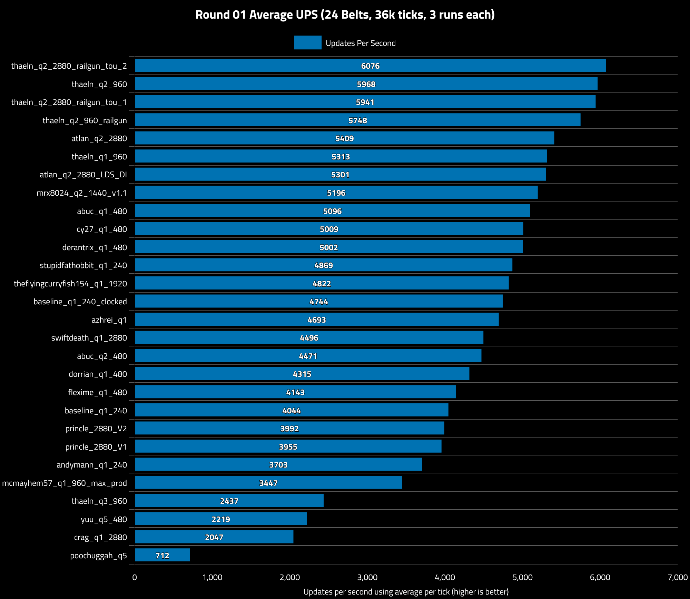
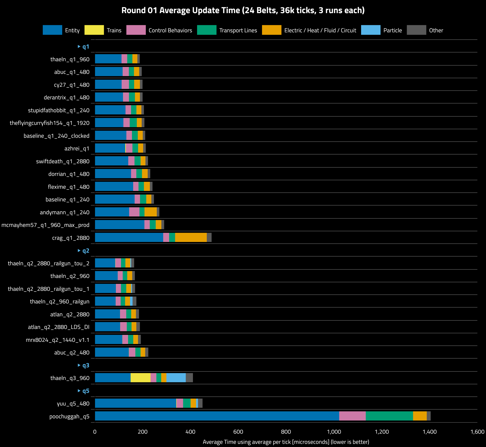
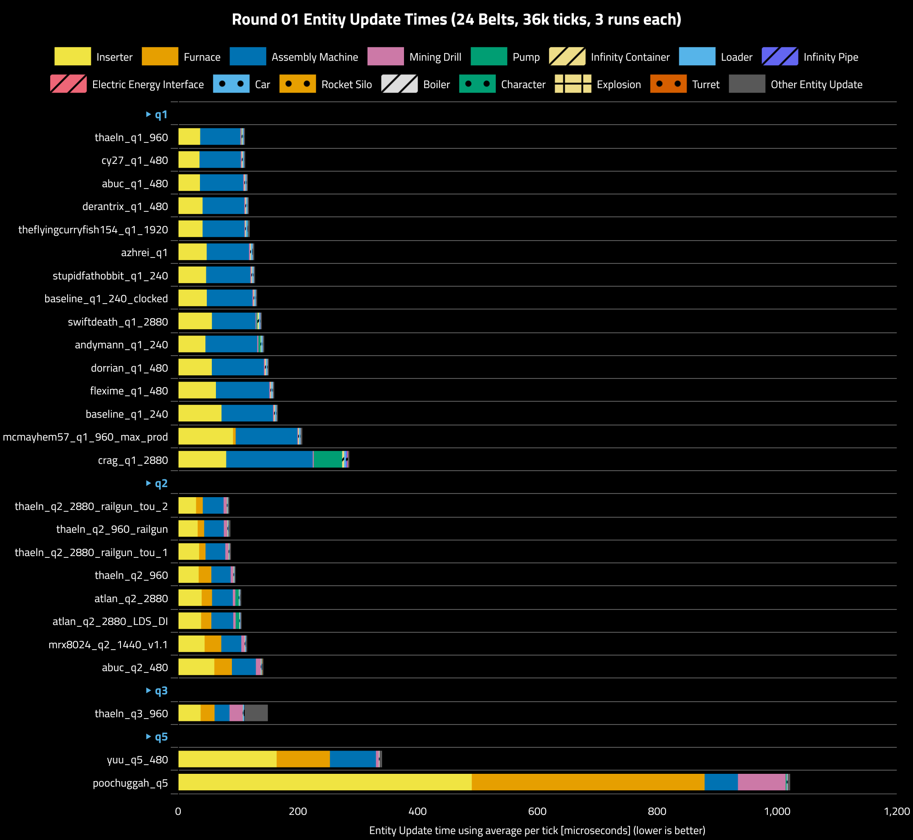
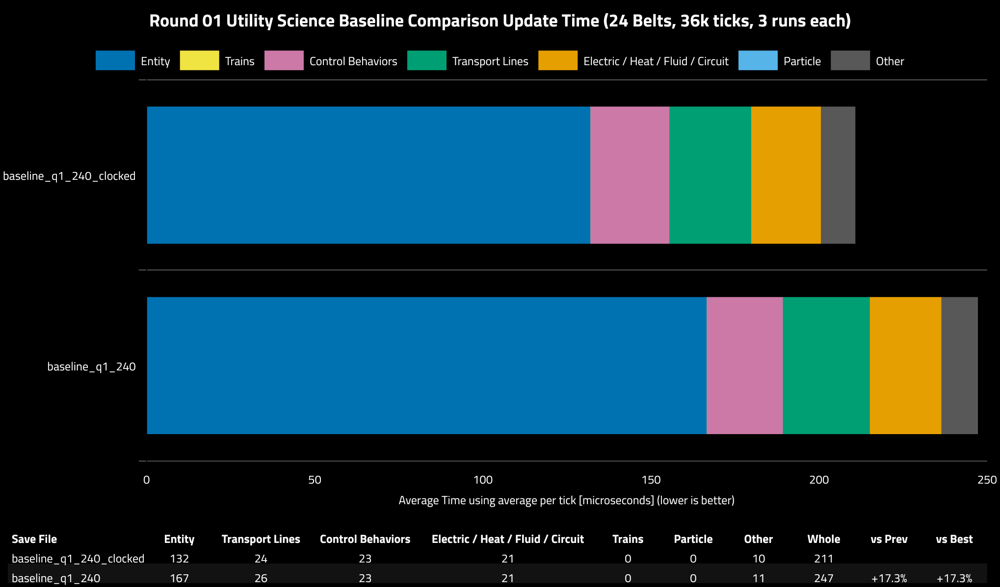
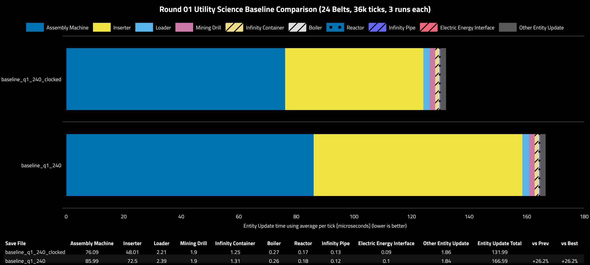

## Round 01

### Table of Contents

- [Round 01](#round-01)
  - [Table of Contents](#table-of-contents)
  - [Scenario](#scenario)
  - [Verification](#verification)
  - [Run Variance](#run-variance)
  - [Updates Per Second](#updates-per-second)
  - [Category Metrics](#category-metrics)
  - [Entity Metrics](#entity-metrics)
  - [Baseline Clocking Comparison](#baseline-clocking-comparison)


### Scenario

- **Platform:** linux-x86_64
- **CPU:** 9800X3D
- **Mods:** None
- **Factorio Version:** 2.1.20
- **Date:** 2026-09-23
- **Target Production Rate:** 5760/s Utility Science
- Each save was tested for 36000 ticks and 3 runs each

### Verification

The saves are tested by invoking:

```sh
factorio_path="$HOME/Games/factorio_locked_versions/2_1_20"
belt sanitize "$maps_dir" \
    --factorio-path "$factorio_path/bin/x64/factorio" \
    --pattern "utility_science_*" \
    --ticks 36000 \
    --items "utility-science-pack" \
    --fluids "" \
    --mods-dir "$factorio_path/mods" \
    --data-dir "$factorio_data_path" \
    --verbose
```

This uses the plugin provided by the mod [belt-sanitizer](https://mods.factorio.com/mod/belt-sanitizer?from=search) to record the production rate of any item. The respective quality is multiplied to produce an effective science production to make sure no design is underproducing. The results are below.

| Save                                          | Quality   | Amount    | Effective Science | Underproducing |
| --------------------------------------------- | --------- | --------- | ----------------- | -------------- |
| utility_science_abuc_q1_480                   | normal    | 3455136   | 3455136.00        |                |
| utility_science_abuc_q2_480                   | uncommon  | 1728048   | 3456096.00        |                |
| utility_science_andymann_q1_240               | normal    | 3456000   | 3456000.00        |                |
| utility_science_atlan_q2_2880                 | uncommon  | 1727765.3 | 3455530.60        |                |
| utility_science_atlan_q2_2880_LDS_DI          | uncommon  | 1728079.5 | 3456159.00        |                |
| utility_science_azhrei_q1                     | normal    | 3456338.5 | 3456338.50        |                |
| utility_science_baseline_q1_240               | normal    | 3456221   | 3456221.00        |                |
| utility_science_baseline_q1_240_clocked       | normal    | 3455827.3 | 3455827.30        |                |
| utility_science_crag_q1_2880                  | normal    | 3463511.5 | 3463511.50        |                |
| utility_science_cy27_q1_480                   | normal    | 3455524.8 | 3455524.80        |                |
| utility_science_derantrix_q1_480              | normal    | 3455323.3 | 3455323.30        |                |
| utility_science_dorrian_q1_480                | normal    | 3455952   | 3455952.00        |                |
| utility_science_flexime_q1_480                | normal    | 3456066.5 | 3456066.50        |                |
| utility_science_goirelandbrad_q1_480          | normal    | 1109834.4 | 1109834.40        | Yes            |
| utility_science_mcmayhem57_q1_960_max_prod    | normal    | 3455941.5 | 3455941.50        |                |
| utility_science_mrx8024_q2_1440_v1.1          | uncommon  | 1728087.3 | 3456174.60        |                |
| utility_science_poochuggah_q5                 | legendary | 576804    | 3460824.00        |                |
| utility_science_princle_2880_V1               | normal    | 3456071.3 | 3456071.30        |                |
| utility_science_princle_2880_V2               | normal    | 3455865.3 | 3455865.30        |                |
| utility_science_stupidfathobbit_q1_240        | normal    | 3454416   | 3454416.00        |                |
| utility_science_swiftdeath_q1_2880            | normal    | 3455936.8 | 3455936.80        |                |
| utility_science_thaeln_q1_960                 | normal    | 3455978.5 | 3455978.50        |                |
| utility_science_thaeln_q2_2880_railgun_tou_1  | uncommon  | 1728195   | 3456390.00        |                |
| utility_science_thaeln_q2_2880_railgun_tou_2  | uncommon  | 1728316.8 | 3456633.60        |                |
| utility_science_thaeln_q2_960                 | uncommon  | 1727598.6 | 3455197.20        |                |
| utility_science_thaeln_q2_960_railgun         | uncommon  | 1728207.6 | 3456415.20        |                |
| utility_science_thaeln_q3_960                 | rare      | 1151948   | 3455844.00        |                |
| utility_science_theflyingcurryfish154_q1_1920 | normal    | 3457771.3 | 3457771.30        |                |
| utility_science_yuu_q5_480                    | legendary | 575995.2  | 3455971.20        |                |

Since `utility_science_goirelandbrad_q1_480` did not meet target production rate and from a previous test in 2.0 was showing extreme UPS cost, it has been omitted from the competition and following rounds for benchmarking. It is not meeting demand now in 2.1 due to very tight fluid control ranges that don't work anymore in 2.1.

The following designs were modified from the original author submissions to work in 2.1:

| Design                                 | Issue                                    | Fixed |
| -------------------------------------- | ---------------------------------------- | ----- |
| `utility_science_abuc_q2_480`          | R/G circuit separation                   | yes   |
| `utility_science_azhrei_q1`            | R/G circuit separation                   | yes   |
| `utility_science_goirelandbrad_q1_480` | fluid latches                            | no    |
| `utility_science_thaeln_q1_960`        | requires molten copper fluid buffer tank | yes   |
| `utility_science_swiftdeath_q1_2880`   | R/G circuits & RS fluid latches          | yes   |

### Run Variance

The initial save files that are submitted to the competition are tested to ensure they qualify. This is low scale, 24 belts (5760/s) production. Higher quality would have an equivalent amount of science (e.g. uncommon would be 12 belts)



Run variance was very low in all runs giving high confidence in the results. Run variance was reduced by turning off CPU boosting. All save file runs were executed sequentially, one save at a time, for three runs each to eliminate temporal bias.

### Updates Per Second


### Category Metrics



| Group | Save File                     | Entity | Control Behaviors | Transport Lines | Electric / Heat / Fluid / Circuit | Trains | Particle | Other | Whole | vs Prev | vs Best |
| ----- | ----------------------------- | ------ | ----------------- | --------------- | --------------------------------- | ------ | -------- | ----- | ----- | ------- | ------- |
| q1    | thaeln_q1_960                 | 112    | 24                | 22              | 21                                | 0      | 0        | 10    | 188   |         |         |
| q1    | abuc_q1_480                   | 117    | 26                | 21              | 22                                | 0      | 0        | 11    | 196   | +4.3%   | +4.3%   |
| q1    | cy27_q1_480                   | 112    | 31                | 22              | 24                                | 0      | 0        | 11    | 200   | +1.7%   | +6.1%   |
| q1    | derantrix_q1_480              | 118    | 25                | 25              | 21                                | 0      | 0        | 11    | 200   | +0.1%   | +6.2%   |
| q1    | stupidfathobbit_q1_240        | 128    | 23                | 22              | 21                                | 0      | 0        | 11    | 205   | +2.7%   | +9.1%   |
| q1    | theflyingcurryfish154_q1_1920 | 120    | 26                | 30              | 20                                | 0      | 0        | 11    | 207   | +1.0%   | +10.2%  |
| q1    | baseline_q1_240_clocked       | 132    | 23                | 24              | 21                                | 0      | 0        | 10    | 211   | +1.7%   | +12.0%  |
| q1    | azhrei_q1                     | 127    | 28                | 23              | 21                                | 3      | 0        | 11    | 213   | +1.1%   | +13.2%  |
| q1    | swiftdeath_q1_2880            | 140    | 26                | 25              | 20                                | 0      | 0        | 11    | 222   | +4.4%   | +18.2%  |
| q1    | dorrian_q1_480                | 151    | 22                | 24              | 24                                | 0      | 0        | 11    | 232   | +4.2%   | +23.1%  |
| q1    | flexime_q1_480                | 161    | 22                | 23              | 25                                | 0      | 0        | 11    | 241   | +4.2%   | +28.2%  |
| q1    | baseline_q1_240               | 167    | 23                | 26              | 21                                | 0      | 0        | 11    | 247   | +2.4%   | +31.4%  |
| q1    | andymann_q1_240               | 144    | 43                | 21              | 52                                | 0      | 0        | 11    | 270   | +9.2%   | +43.5%  |
| q1    | mcmayhem57_q1_960_max_prod    | 207    | 22                | 25              | 24                                | 0      | 0        | 12    | 290   | +7.4%   | +54.1%  |
| q1    | crag_q1_2880                  | 286    | 25                | 25              | 133                               | 0      | 0        | 20    | 488   | +68.4%  | 2.60x   |
| q2    | thaeln_q2_2880_railgun_tou_2  | 85     | 23                | 18              | 21                                | 1      | 4        | 13    | 165   | -66.3%  | -12.5%  |
| q2    | thaeln_q2_960                 | 96     | 21                | 19              | 21                                | 0      | 0        | 11    | 168   | +1.8%   | -11.0%  |
| q2    | thaeln_q2_2880_railgun_tou_1  | 88     | 21                | 22              | 20                                | 0      | 4        | 13    | 168   | +0.4%   | -10.6%  |
| q2    | thaeln_q2_960_railgun         | 87     | 21                | 19              | 21                                | 0      | 11       | 16    | 174   | +3.4%   | -7.6%   |
| q2    | atlan_q2_2880                 | 105    | 26                | 21              | 20                                | 0      | 0        | 13    | 185   | +6.3%   | -1.8%   |
| q2    | atlan_q2_2880_LDS_DI          | 106    | 27                | 20              | 20                                | 0      | 0        | 15    | 189   | +2.0%   | +0.2%   |
| q2    | mrx8024_q2_1440_v1.1          | 115    | 23                | 22              | 20                                | 1      | 0        | 12    | 192   | +2.0%   | +2.3%   |
| q2    | abuc_q2_480                   | 142    | 26                | 21              | 20                                | 1      | 0        | 13    | 224   | +16.2%  | +18.8%  |
| q3    | thaeln_q3_960                 | 150    | 24                | 20              | 22                                | 83     | 81       | 30    | 410   | +83.5%  | 2.18x   |
| q5    | yuu_q5_480                    | 341    | 27                | 31              | 23                                | 2      | 8        | 19    | 451   | +9.8%   | 2.39x   |
| q5    | poochuggah_q5                 | 1022   | 111               | 198             | 57                                | 0      | 0        | 16    | 1405  | 3.12x   | 7.46x   |

From the results, the designs that surpass the baseline move on to the next round. To keep other qualities in scope of testing, `yuu_q5` and `thaeln_q3` are chosen to represent legendary and rare quality respectively.

### Entity Metrics


|Save File|Inserter|Assembly Machine|Furnace|Mining Drill|Pump|Loader|Infinity Container|Rocket Silo|Boiler|Turret|Infinity Pipe|Electric Energy Interface|Explosion|Other Entity Update|Entity Update Total|vs Prev|vs Best|
|---|---|---|---|---|---|---|---|---|---|---|---|---|---|---|---|---|---|
|thaeln_q1_960|390.03|665.19|0|13.43|4.7|19.87|11.93|0|0|0|1.01|0.39|0|23.08|1129.61|||
|theflyingcurryfish154_q1_1920|446.68|670.78|0|10.14|0|32.94|11.84|0|0|0|0.63|0.24|0|29.51|1202.78|+6.5%|+6.5%|
|cy27_q1_480|413.43|703.16|0|14.88|0|23.6|12.34|0|0|0|1.31|0.54|0|34.44|1203.69|+0.1%|+6.6%|
|derantrix_q1_480|473.16|684.64|0|14.29|0|22.85|12.48|0|0|0|1.08|0.4|0|31.21|1240.12|+3.0%|+9.8%|
|abuc_q1_480|420.85|746.42|0|14.56|0|25.44|12.39|0|1.67|0|0.9|0.39|0|25.31|1247.95|+0.6%|+10.5%|
|stupidfathobbit_q1_240|507.03|733.31|0|14.73|0|22.77|11.9|0|1.71|0|0.9|0.38|0|25.89|1318.61|+5.7%|+16.7%|
|azhrei_q1|561.47|706.1|0|15.75|0|23.26|13.21|0|0|0|1.07|0.56|0|34.93|1356.37|+2.9%|+20.1%|
|swiftdeath_q1_2880|565.91|702.71|0|13.9|14.31|26.03|26.56|0|0|0|1.28|0.08|0|31.9|1382.67|+1.9%|+22.4%|
|baseline_q1_240_clocked|558.25|802.91|0|14.78|0|24.11|12.4|0|1.7|0|0.92|0.37|0|23.84|1439.27|+4.1%|+27.4%|
|dorrian_q1_480|585.51|897.84|0|16.08|0|25.93|12.65|0|1.63|0|0.93|0.39|0|20.8|1561.76|+8.5%|+38.3%|
|flexime_q1_480|631.33|888.43|0|16.04|0|24.62|11.96|0|3.04|0|1.22|0.38|0|25.91|1602.92|+2.6%|+41.9%|
|baseline_q1_240|703.9|851.85|0|14.87|0|23.98|11.98|0|1.65|0|0.91|0.37|0|23.35|1632.85|+1.9%|+44.5%|
|mcmayhem57_q1_960_max_prod|970.95|1077.54|49.02|10.25|0|24.22|11.23|0|1.08|0|0.99|0.4|0|37.21|2182.88|+33.7%|+93.2%|
|andymann_q1_240|908.86|1261.6|0|19.23|48.98|33.44|22.02|0|2.86|0|1.93|0.44|0|30.2|2329.55|+6.7%|2.06x|
|tou_q2_2880_railgun_2_offset|289.68|342.06|105.38|48.18|0.6|10.38|5.9|0|0|0.72|0.6|1.16|0|15.35|820|-64.8%|-27.4%|
|thaeln_q2_960_railgun|305.9|322.18|99.62|54.93|2.3|10.25|6.32|0|0|2.13|0.49|0.31|0.04|19.7|824.16|+0.5%|-27.0%|
|tou_q2_2880_railgun_1_offset|328.68|318.29|103.26|48.06|2.71|10.06|5.82|0|0|0.71|0.47|0.56|0|14.1|832.72|+1.0%|-26.3%|
|thaeln_q2_960|315.15|318.39|201.47|40.91|2.27|10.23|6.23|0|0|0|0.49|0.3|0|12.12|907.54|+9.0%|-19.7%|
|atlan_q2_2880|373.81|335.2|164.71|38.65|51.77|9.13|6.23|0|0|0|0.63|0.3|0|17.2|997.64|+9.9%|-11.7%|
|atlan_q2_2880_LDS_DI|360.86|351.27|164.49|38.68|53.19|8.87|6.31|0|0|0|0.64|0.29|0|14.91|999.5|+0.2%|-11.5%|
|mrx8024_q2_1440_v1.1|424.43|322.32|267.86|52.09|0|11.72|5.95|0|0|0|1.09|0.58|0|17.77|1103.81|+10.4%|-2.3%|
|abuc_q2_480|594.24|398.22|275.36|74.3|0|12.39|6.02|11.06|0|0|1.04|0.33|0|20.45|1393.39|+26.2%|+23.4%|
|thaeln_q3_960|325.25|230.6|205.6|210.01|1.84|6.88|4.86|0|0|0|1.07|0.55|0.35|43.28|1030.28|-26.1%|-8.8%|
|yuu_q5_480_clocked|1517.08|1027.03|950.4|41.59|0|5.41|4.92|0|5.14|0|0.73|0.64|0.04|28.02|3581|3.48x|3.17x|

### Baseline Clocking Comparison

In each round, the baseline clocked vs unclocked is compared to check relative performance at different production rate scales.



