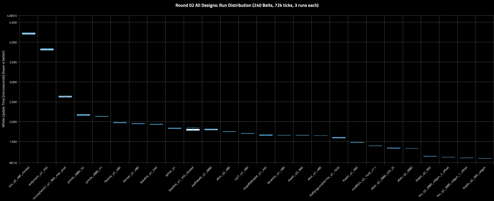
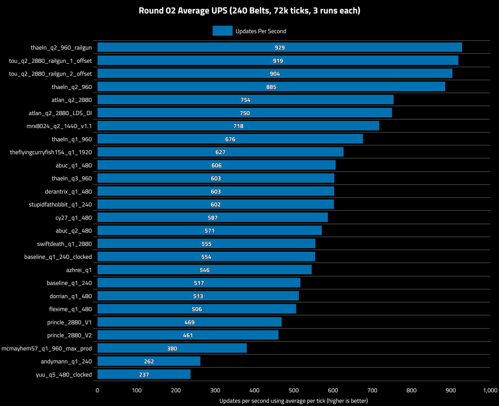
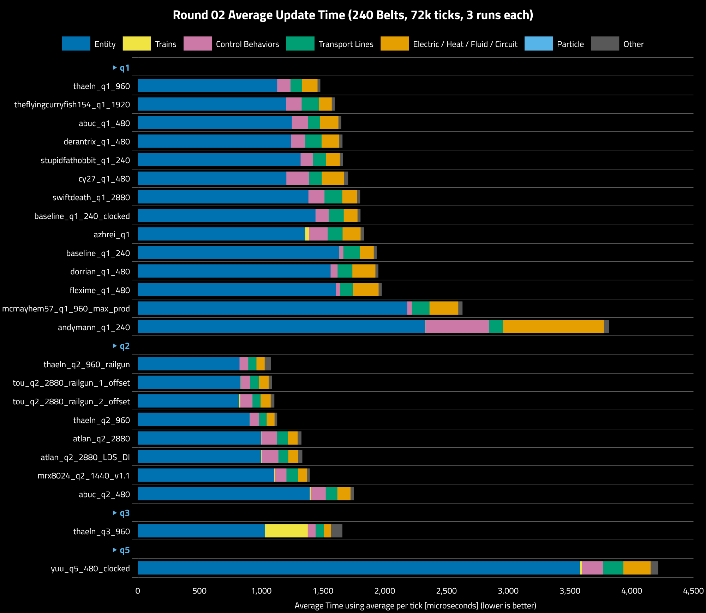
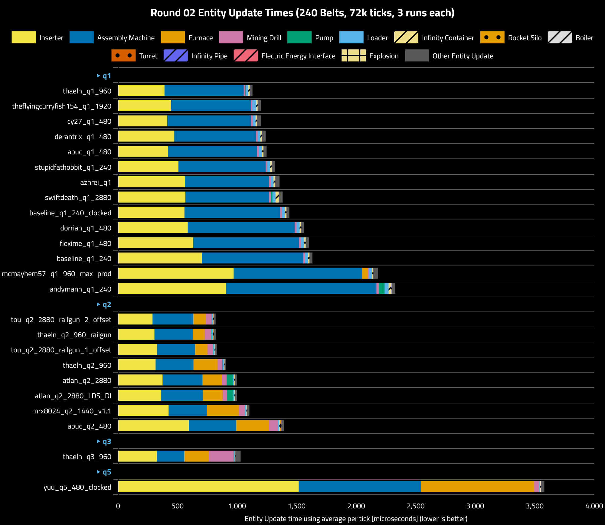
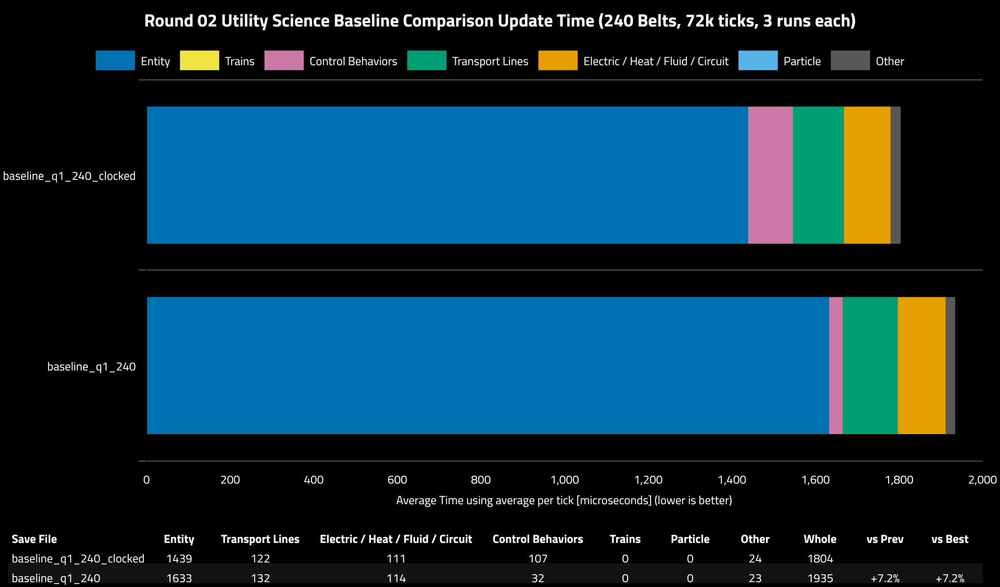
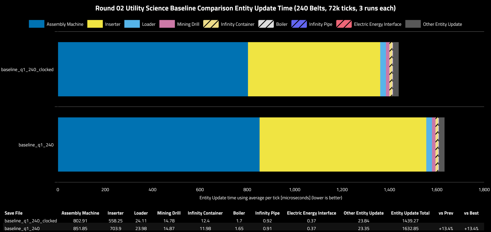

## Round 02

### Table of Contents

- [Round 02](#round-02)
  - [Table of Contents](#table-of-contents)
  - [Scenario](#scenario)
  - [Run Variance](#run-variance)
  - [Updates Per Second](#updates-per-second)
  - [Category Metrics](#category-metrics)
  - [Entity Metrics](#entity-metrics)
  - [Baseline Clocking Comparison](#baseline-clocking-comparison)

### Scenario

Summary:
- **Platform:** linux-x86_64
- **CPU:** 9800X3D
- **Mods:** disable-vehicles,disable-vehicles-particles,particle_free_disposal
- **Factorio Version:** 2.1.20
- **Date:** 2026-09-24
- **Target Production Rate:** 57600/s Utility Science
- Each save was tested for 72000 ticks and 3 runs each

Scale up 10x from round 01 to 240 belts (57_600/s). The tests will now execute for 72000 ticks and 3 runs each.

In the preliminary tests, the only entities that had any meaningful data were the following and only these will be recorded in order to reduce the size of the verbose metric csvs.

- Inserter
- Furnace
- AssemblingMachine
- MiningDrill
- Pump
- InfinityContainer
- Loader
- InfinityPipe
- ElectricEnergyInterface
- Car
- RocketSilo
- Boiler
- Explosion
- Turret
 
 > Note: Entity update for "Character" shows up in `theflyingcurryfish154_q1_1920`. Somehow there is an immortal character that is constantly consuming entity update time. It is very small but it is present.

The designs used in Round 02 will be as stated below.

**Normal Quality**
- `thaeln_q1_960`
- `abuc_q1_480`
- `cy27_q1_480`
- `derantrix_q1_480`
- `stupidfathobbit_q1_240`
- `theflyingcurryfish154_q1_1920`
- `baseline_q1_240_clocked`
- `azhrei_q1`
- `swiftdeath_q1_2880`
- `dorrian_q1_480`
- `flexime_q1_480`
- `baseline_q1_240`
- `andymann_q1_240` (chosen due to maximum di)
- `mcmayhem57_q1_960_max_prod` (chosen due to using maximum productivity)

`crag_q1_2880` has been removed due to being too far below the baseline.

**Uncommon Quality**
All designs are included (Q2 across the board is performing better than the Q1 baseline)

- `thaeln_q2_2880_railgun_tou_2`
- `thaeln_q2_960`
- `thaeln_q2_2880_railgun_tou_1`
- `thaeln_q2_960_railgun`
- `atlan_q2_2880`
- `atlan_q2_2880_LDS_DI`
- `mrx8024_q2_1440_v1`
- `abuc_q2_480`

**Rare Quality**
- `thaeln_q3_960`

**Legendary Quality**
- `yuu_q5_480`

`poochuggah_q5` is omitted due to having extreme entity update time from direct upcycling coal to legendary which is incredibly expensive.

A few mods will be enabled now to disable vehicles and specific particles

1. `disable-vehicles@1.1.0`
2. `disable-vehicles-particles@1.2.0`
3. `particle_free_disposal@0.2.0`

### Run Variance

Run variance was very low in all runs giving high confidence in the results. Run variance was reduced by turning off CPU boosting. All save file runs were executed sequentially, one save at a time, for three runs each to eliminate temporal bias.

### Updates Per Second

### Category Metrics

|Group|Save File|Entity|Electric / Heat / Fluid / Circuit|Control Behaviors|Transport Lines|Trains|Particle|Other|Whole|vs Prev|vs Best|
|---|---|---|---|---|---|---|---|---|---|---|---|
|q1|thaeln_q1_960|1130|125|108|93|0|0|23|1479|||
|q1|theflyingcurryfish154_q1_1920|1203|105|125|139|0|0|25|1596|+8.0%|+8.0%|
|q1|abuc_q1_480|1248|149|132|96|0|0|24|1649|+3.3%|+11.5%|
|q1|derantrix_q1_480|1240|142|117|132|0|0|27|1658|+0.5%|+12.2%|
|q1|stupidfathobbit_q1_240|1319|112|102|105|0|0|24|1660|+0.1%|+12.3%|
|q1|cy27_q1_480|1204|181|183|103|0|0|33|1704|+2.6%|+15.2%|
|q1|swiftdeath_q1_2880|1383|118|130|145|0|0|26|1801|+5.7%|+21.8%|
|q1|baseline_q1_240_clocked|1439|111|107|122|0|0|24|1804|+0.2%|+22.0%|
|q1|azhrei_q1|1356|146|150|121|32|0|28|1833|+1.6%|+24.0%|
|q1|baseline_q1_240|1633|114|32|132|0|0|23|1935|+5.5%|+30.8%|
|q1|dorrian_q1_480|1562|187|56|120|0|0|24|1949|+0.7%|+31.8%|
|q1|flexime_q1_480|1603|207|37|103|0|0|26|1976|+1.4%|+33.6%|
|q1|mcmayhem57_q1_960_max_prod|2183|234|37|143|0|0|34|2630|+33.1%|+77.9%|
|q1|andymann_q1_240|2330|816|515|114|0|0|41|3816|+45.1%|2.58x|
|q2|thaeln_q2_960_railgun|824|67|70|66|0|0|49|1077|-71.8%|-27.2%|
|q2|tou_q2_2880_railgun_1_offset|833|78|75|71|3|0|28|1088|+1.0%|-26.4%|
|q2|tou_q2_2880_railgun_2_offset|820|81|99|66|11|0|30|1106|+1.7%|-25.2%|
|q2|thaeln_q2_960|908|64|71|64|2|0|21|1129|+2.1%|-23.6%|
|q2|atlan_q2_2880|998|81|126|87|4|0|31|1326|+17.4%|-10.3%|
|q2|atlan_q2_2880_LDS_DI|1000|80|136|80|4|0|33|1333|+0.5%|-9.8%|
|q2|mrx8024_q2_1440_v1.1|1104|73|96|93|5|0|23|1393|+4.5%|-5.8%|
|q2|abuc_q2_480|1393|107|122|94|7|0|28|1751|+25.7%|+18.4%|
|q3|thaeln_q3_960|1030|58|64|66|346|0|94|1658|-5.3%|+12.1%|
|q5|yuu_q5_480_clocked|3581|220|172|165|15|0|63|4215|2.54x|2.85x|

From the results, the designs that surpass the baseline move on to the next round. To keep other qualities in scope of testing, `yuu_q5` and `thaeln_q3` are chosen to represent legendary and rare quality respectively.

### Entity Metrics

|Save File|Inserter|Assembly Machine|Furnace|Mining Drill|Pump|Loader|Infinity Container|Rocket Silo|Boiler|Turret|Infinity Pipe|Electric Energy Interface|Explosion|Other Entity Update|Entity Update Total|vs Prev|vs Best|
|---|---|---|---|---|---|---|---|---|---|---|---|---|---|---|---|---|---|
|thaeln_q1_960|390.03|665.19|0|13.43|4.7|19.87|11.93|0|0|0|1.01|0.39|0|23.08|1129.61|||
|theflyingcurryfish154_q1_1920|446.68|670.78|0|10.14|0|32.94|11.84|0|0|0|0.63|0.24|0|29.51|1202.78|+6.5%|+6.5%|
|cy27_q1_480|413.43|703.16|0|14.88|0|23.6|12.34|0|0|0|1.31|0.54|0|34.44|1203.69|+0.1%|+6.6%|
|derantrix_q1_480|473.16|684.64|0|14.29|0|22.85|12.48|0|0|0|1.08|0.4|0|31.21|1240.12|+3.0%|+9.8%|
|abuc_q1_480|420.85|746.42|0|14.56|0|25.44|12.39|0|1.67|0|0.9|0.39|0|25.31|1247.95|+0.6%|+10.5%|
|stupidfathobbit_q1_240|507.03|733.31|0|14.73|0|22.77|11.9|0|1.71|0|0.9|0.38|0|25.89|1318.61|+5.7%|+16.7%|
|azhrei_q1|561.47|706.1|0|15.75|0|23.26|13.21|0|0|0|1.07|0.56|0|34.93|1356.37|+2.9%|+20.1%|
|swiftdeath_q1_2880|565.91|702.71|0|13.9|14.31|26.03|26.56|0|0|0|1.28|0.08|0|31.9|1382.67|+1.9%|+22.4%|
|baseline_q1_240_clocked|558.25|802.91|0|14.78|0|24.11|12.4|0|1.7|0|0.92|0.37|0|23.84|1439.27|+4.1%|+27.4%|
|dorrian_q1_480|585.51|897.84|0|16.08|0|25.93|12.65|0|1.63|0|0.93|0.39|0|20.8|1561.76|+8.5%|+38.3%|
|flexime_q1_480|631.33|888.43|0|16.04|0|24.62|11.96|0|3.04|0|1.22|0.38|0|25.91|1602.92|+2.6%|+41.9%|
|baseline_q1_240|703.9|851.85|0|14.87|0|23.98|11.98|0|1.65|0|0.91|0.37|0|23.35|1632.85|+1.9%|+44.5%|
|mcmayhem57_q1_960_max_prod|970.95|1077.54|49.02|10.25|0|24.22|11.23|0|1.08|0|0.99|0.4|0|37.21|2182.88|+33.7%|+93.2%|
|andymann_q1_240|908.86|1261.6|0|19.23|48.98|33.44|22.02|0|2.86|0|1.93|0.44|0|30.2|2329.55|+6.7%|2.06x|
|tou_q2_2880_railgun_2_offset|289.68|342.06|105.38|48.18|0.6|10.38|5.9|0|0|0.72|0.6|1.16|0|15.35|820|-64.8%|-27.4%|
|thaeln_q2_960_railgun|305.9|322.18|99.62|54.93|2.3|10.25|6.32|0|0|2.13|0.49|0.31|0.04|19.7|824.16|+0.5%|-27.0%|
|tou_q2_2880_railgun_1_offset|328.68|318.29|103.26|48.06|2.71|10.06|5.82|0|0|0.71|0.47|0.56|0|14.1|832.72|+1.0%|-26.3%|
|thaeln_q2_960|315.15|318.39|201.47|40.91|2.27|10.23|6.23|0|0|0|0.49|0.3|0|12.12|907.54|+9.0%|-19.7%|
|atlan_q2_2880|373.81|335.2|164.71|38.65|51.77|9.13|6.23|0|0|0|0.63|0.3|0|17.2|997.64|+9.9%|-11.7%|
|atlan_q2_2880_LDS_DI|360.86|351.27|164.49|38.68|53.19|8.87|6.31|0|0|0|0.64|0.29|0|14.91|999.5|+0.2%|-11.5%|
|mrx8024_q2_1440_v1.1|424.43|322.32|267.86|52.09|0|11.72|5.95|0|0|0|1.09|0.58|0|17.77|1103.81|+10.4%|-2.3%|
|abuc_q2_480|594.24|398.22|275.36|74.3|0|12.39|6.02|11.06|0|0|1.04|0.33|0|20.45|1393.39|+26.2%|+23.4%|
|thaeln_q3_960|325.25|230.6|205.6|210.01|1.84|6.88|4.86|0|0|0|1.07|0.55|0.35|43.28|1030.28|-26.1%|-8.8%|
|yuu_q5_480_clocked|1517.08|1027.03|950.4|41.59|0|5.41|4.92|0|5.14|0|0.73|0.64|0.04|28.02|3581|3.48x|3.17x|

### Baseline Clocking Comparison

In each round, the baseline clocked vs unclocked is compared to check relative performance at different production rate scales.

