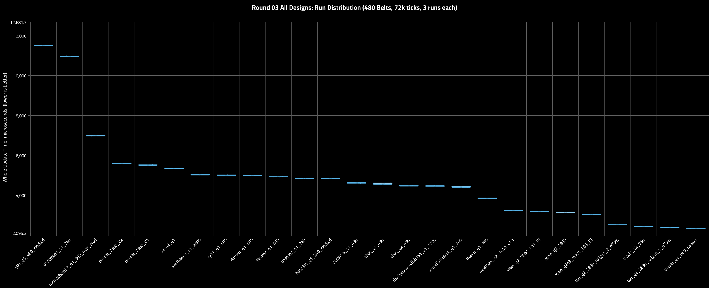
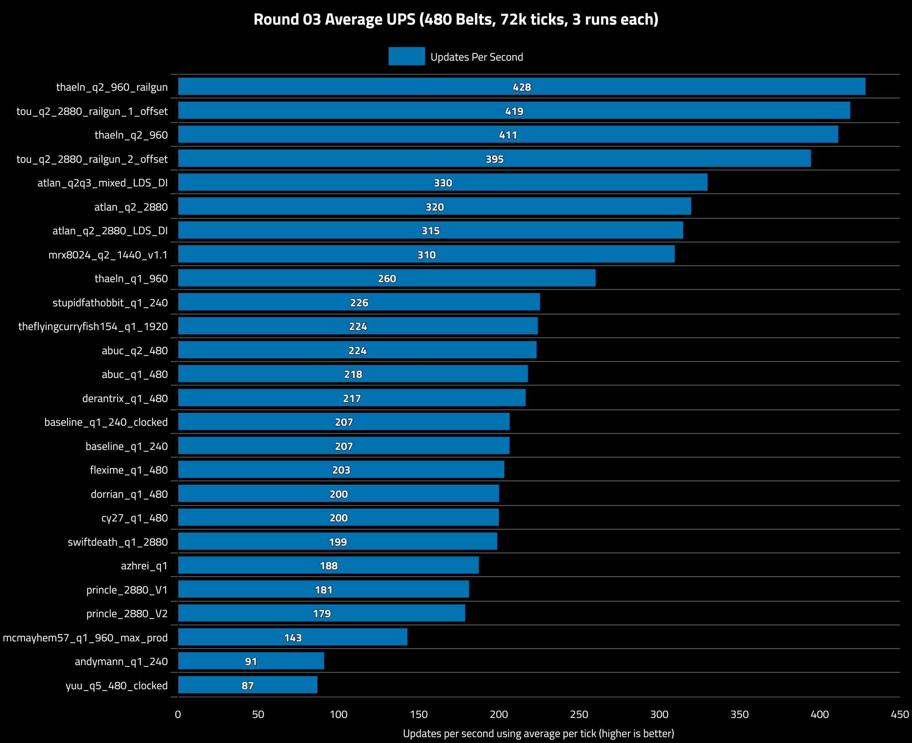
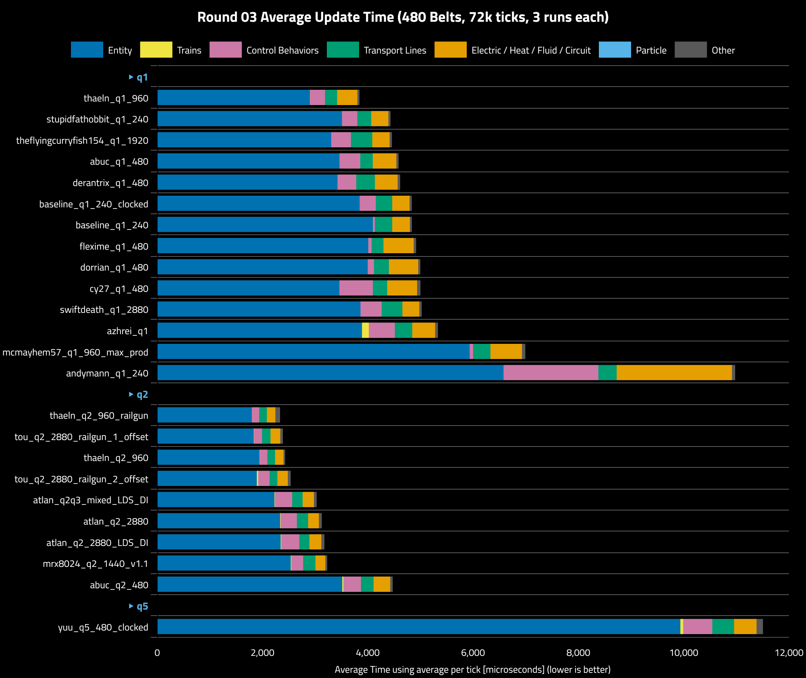
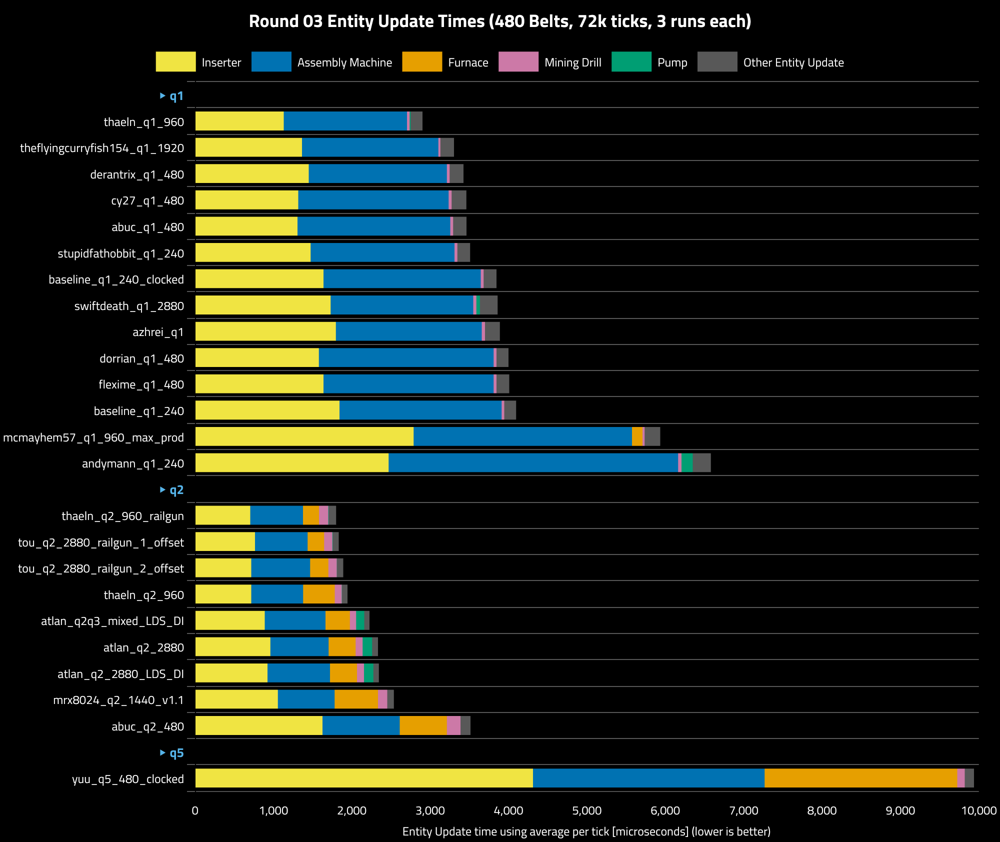
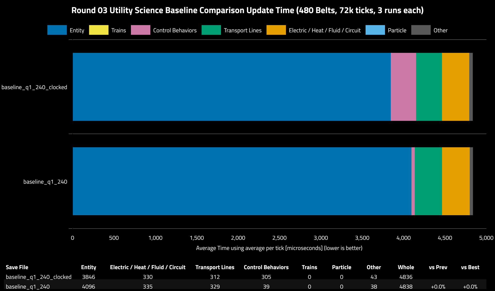
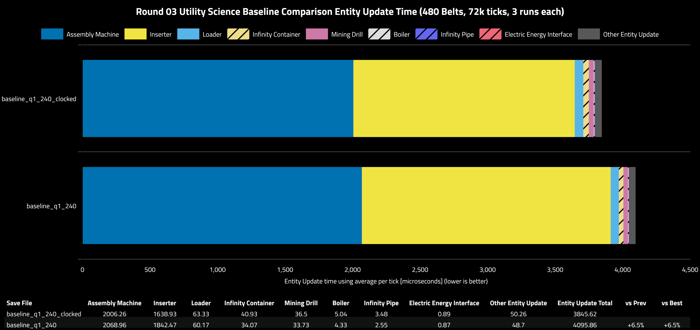

## Round 03

### Table of Contents

- [Round 03](#round-03)
  - [Table of Contents](#table-of-contents)
  - [Scenario](#scenario)
  - [Run Variance](#run-variance)
  - [Updates Per Second](#updates-per-second)
  - [Category Metrics](#category-metrics)
  - [Entity Metrics](#entity-metrics)
  - [Baseline Clocking Comparison](#baseline-clocking-comparison)

### Scenario

Summary:
- **Platform:** linux-x86_64
- **CPU:** 9800X3D
- **Mods:** disable-vehicles,disable-vehicles-particles,particle_free_disposal
- **Factorio Version:** 2.1.20
- **Date:** 2026-09-25
- **Target Production Rate:** 115200/s Utility Science
- Each save was tested for 72000 ticks and 3 runs each

Scale up 20x from round 01 to 480 belts (115200/s). The tests will now execute for 72000 ticks and 3 runs each.

All designs from round 02 are kept with the following exceptions:

1. `thaeln_q3_960` was not able to be cloned and scaled up to 38400/s production rate due to the bots not being able to replaced the smashed cars across all the clones fast enough. Even with tick offsets this didn't work at this scale.
2. `atlan_q2q3_mixed_LDS_DI` is a new entry to compare a mixed quality approach of using the extra Q3 iron ore to produce Q3 science

> Note: at this scale, the only way to make the railgun destroying chest designs work was offsetting each railgun shot by one tick across clones.
> If this is not done, then the construction requests que up and not all are replaced in time. In a real save file this is a complexity that would have to be considered when scaling up.

A few mods will be enabled to disable vehicles and specific particles

1. `disable-vehicles@1.1.0`
2. `disable-vehicles-particles@1.2.0`
3. `particle_free_disposal@0.2.0`

### Run Variance

Run variance was very low in all runs giving high confidence in the results. Run variance was reduced by turning off CPU boosting. All save file runs were executed sequentially, one save at a time, for three runs each to eliminate temporal bias.

### Updates Per Second

### Category Metrics

|Group|Save File|Entity|Electric / Heat / Fluid / Circuit|Control Behaviors|Transport Lines|Trains|Particle|Other|Whole|vs Prev|vs Best|
|---|---|---|---|---|---|---|---|---|---|---|---|
|q1|thaeln_q1_960|2901|384|286|230|0|0|41|3842|||
|q1|stupidfathobbit_q1_240|3510|325|292|264|0|0|41|4431|+15.3%|+15.3%|
|q1|theflyingcurryfish154_q1_1920|3304|330|374|406|0|0|44|4458|+0.6%|+16.0%|
|q1|abuc_q1_480|3462|449|395|236|0|0|43|4585|+2.9%|+19.3%|
|q1|derantrix_q1_480|3425|432|356|354|0|0|48|4615|+0.7%|+20.1%|
|q1|baseline_q1_240_clocked|3846|330|305|312|0|0|43|4836|+4.8%|+25.9%|
|q1|baseline_q1_240|4096|335|39|329|0|0|38|4838|+0.0%|+25.9%|
|q1|flexime_q1_480|4008|576|63|225|0|0|44|4917|+1.6%|+28.0%|
|q1|dorrian_q1_480|3999|556|119|283|0|0|40|4997|+1.6%|+30.1%|
|q1|cy27_q1_480|3461|570|634|272|0|0|63|5000|+0.1%|+30.1%|
|q1|swiftdeath_q1_2880|3860|322|403|393|0|0|47|5026|+0.5%|+30.8%|
|q1|azhrei_q1|3889|435|495|330|130|0|53|5333|+6.1%|+38.8%|
|q1|mcmayhem57_q1_960_max_prod|5935|598|66|330|0|0|63|6991|+31.1%|+82.0%|
|q1|andymann_q1_240|6581|2189|1798|347|0|0|61|10978|+57.0%|2.86x|
|q2|thaeln_q2_960_railgun|1799|160|138|146|1|0|90|2334|-78.7%|-39.3%|
|q2|tou_q2_2880_railgun_1_offset|1833|186|150|162|7|0|49|2387|+2.3%|-37.9%|
|q2|thaeln_q2_960|1945|161|143|144|5|0|31|2430|+1.8%|-36.7%|
|q2|tou_q2_2880_railgun_2_offset|1891|198|217|148|27|0|54|2535|+4.3%|-34.0%|
|q2|atlan_q2q3_mixed_LDS_DI|2226|214|328|200|9|0|52|3029|+19.5%|-21.2%|
|q2|atlan_q2_2880|2333|205|310|213|11|0|55|3127|+3.2%|-18.6%|
|q2|atlan_q2_2880_LDS_DI|2346|225|342|192|11|0|61|3177|+1.6%|-17.3%|
|q2|mrx8024_q2_1440_v1.1|2537|189|222|234|13|0|36|3230|+1.7%|-15.9%|
|q2|abuc_q2_480|3515|315|332|239|23|0|49|4474|+38.5%|+16.4%|
|q5|yuu_q5_480_clocked|9937|427|554|413|53|0|122|11507|2.57x|3.00x|

### Entity Metrics

|Save File|Inserter|Assembly Machine|Furnace|Mining Drill|Pump|Loader|Infinity Container|Rocket Silo|Boiler|Infinity Pipe|Turret|Electric Energy Interface|Explosion|Other Entity Update|Entity Update Total|vs Prev|vs Best|
|---|---|---|---|---|---|---|---|---|---|---|---|---|---|---|---|---|---|
|thaeln_q1_960|1131.73|1572.93|0|32.74|13.02|56.61|38.94|0|0|3.33|0|0.88|0|51.06|2901.25|||
|theflyingcurryfish154_q1_1920|1364.01|1739.93|0|26.14|0|67.89|43.44|0|0|2.22|0|0.52|0|60.31|3304.45|+13.9%|+13.9%|
|derantrix_q1_480|1449.76|1763.27|0|34.83|0|64.88|43.15|0|0|4.06|0|0.99|0|64.41|3425.35|+3.7%|+18.1%|
|cy27_q1_480|1317.21|1917.14|0|38.31|0|64.93|45.47|0|0|5.38|0|1.28|0|71.16|3460.89|+1.0%|+19.3%|
|abuc_q1_480|1307.47|1948.71|0|36.73|0|64.82|41.81|0|5.28|3.58|0|0.91|0|53.1|3462.4|+0.0%|+19.3%|
|stupidfathobbit_q1_240|1474.54|1836.26|0|35.68|0|58.76|40.05|0|4.99|3.52|0|0.86|0|55.06|3509.7|+1.4%|+21.0%|
|baseline_q1_240_clocked|1638.93|2006.26|0|36.5|0|63.33|40.93|0|5.04|3.48|0|0.89|0|50.26|3845.62|+9.6%|+32.6%|
|swiftdeath_q1_2880|1729.35|1819.37|0|40.08|45.49|67.57|87.61|0|0|4.69|0|0.17|0|66.06|3860.4|+0.4%|+33.1%|
|azhrei_q1|1796.21|1861.89|0|40.36|0|68.3|45.37|0|0|4.31|0|1.29|0|71.74|3889.47|+0.8%|+34.1%|
|dorrian_q1_480|1579.2|2229.36|0|37.66|0|62.16|39.67|0|4.56|3.15|0|0.89|0|42.64|3999.28|+2.8%|+37.8%|
|flexime_q1_480|1638.81|2170.21|0|36.65|0|61.22|35.34|0|7.89|3.09|0|0.9|0|54.13|4008.25|+0.2%|+38.2%|
|baseline_q1_240|1842.47|2068.96|0|33.73|0|60.17|34.07|0|4.33|2.55|0|0.87|0|48.7|4095.86|+2.2%|+41.2%|
|mcmayhem57_q1_960_max_prod|2788.15|2785.84|134.97|27.07|0|66.76|42.46|0|3.12|4.08|0|0.96|0|81.45|5934.86|+44.9%|2.05x|
|andymann_q1_240|2468.81|3693.53|0|44.44|143.24|96.04|57.11|0|9.02|7.4|0|1.21|0|60.62|6581.42|+10.9%|2.27x|
|thaeln_q2_960_railgun|704.44|672.93|203.17|119.22|4.63|25.68|13.66|0|0|0.95|5.12|0.61|0.08|48.47|1798.98|-72.7%|-38.0%|
|tou_q2_2880_railgun_1_offset|764.03|672.69|210.4|104.03|5.71|25.76|13.46|0|0|0.99|1.58|1.15|0.01|33.65|1833.45|+1.9%|-36.8%|
|tou_q2_2880_railgun_2_offset|716.68|751.84|232.79|106.07|1.23|26.98|14.62|0|0|1.3|1.64|2.4|0.01|35.77|1891.33|+3.2%|-34.8%|
|thaeln_q2_960|716.78|662.29|402.82|88.88|4.63|25.23|13.62|0|0|0.95|0|0.59|0|29.4|1945.19|+2.8%|-33.0%|
|atlan_q2q3_mixed_LDS_DI|888.57|775.75|310.69|79.47|104.62|17.75|16.32|0|0|1.09|0|0.45|0|31.35|2226.07|+14.4%|-23.3%|
|atlan_q2_2880|960.82|743.65|344.19|88.98|120.63|19.3|17.25|0|0|1.37|0|0.62|0|36.48|2333.3|+4.8%|-19.6%|
|atlan_q2_2880_LDS_DI|924.5|797.84|343.8|88.59|120.99|18.62|17.29|0|0|1.4|0|0.6|0|32.3|2345.92|+0.5%|-19.1%|
|mrx8024_q2_1440_v1.1|1056.82|724.52|553.33|116.96|0|28.4|15.47|0|0|2.58|0|1.21|0|37.32|2536.62|+8.1%|-12.6%|
|abuc_q2_480|1626.44|984.66|602.09|174.05|0|31.86|19.07|29.73|0|3.04|0|0.68|0|42.96|3514.58|+38.6%|+21.1%|
|yuu_q5_480_clocked|4311.85|2954.22|2458.63|96.02|0|13.33|12.89|0|19.39|3.73|0|1.47|0.1|65.82|9937.46|2.83x|3.43x|

### Baseline Clocking Comparison

In each round, the baseline clocked vs unclocked is compared to check relative performance at different production rate scales.
This round is the first time that both save files seem to be equal in terms of update time from clocking vs unclocked. This is further explored in a detailed clocking breakdown exercise with some help from Thaeln.

