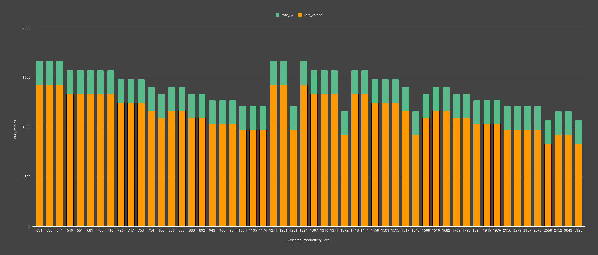
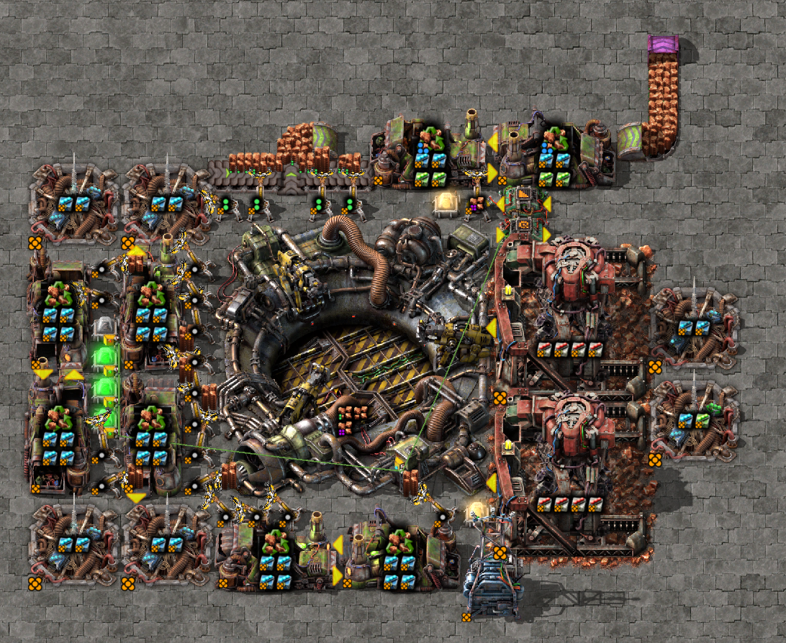
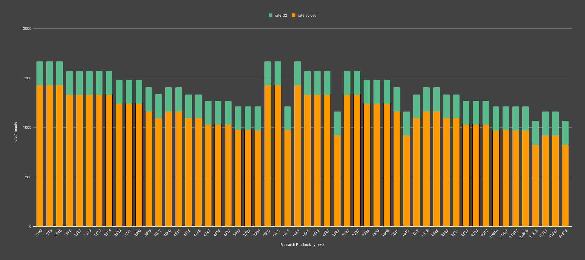

## Overview
There are two csv files in this directory that contain the results of a simulation of all possible speed beacon configurations that can be used to generate 240 items per second. 

For the purposes of this document and attached csv files the following definitions will be used:
1. `Q` = quality level of the module (Q3 = rare quality)
2. `speed-{1,2,3}` = speed module 1, speed module 2, and speed module 3 entities (same for pattern for other modules)

Simulation details are as follows

1. Q5 big mining drills are used with 4 Q5 quality modules in each
2. Calculates the powerset of a mix of Q5 speed-1, speed-2, speed-3, or efficiency  3 modules of up to three beacons
   1. the efficiency modules are only used as placeholders to keep a possible "empty" beacon slot in the combination algorithm. This makes configurations like a beacon with Q5 speed-3 and a beacon with efficiency 3 possible
   2. efficiency modules also add the benefit of reducing pollution, helpful on Nauvis
   3. multiple beacons are used to reduce the transmission power of the speed moduled beacons where applicable
3. Higher tier beacons are prefferred over lower tier beacons when the effected speed is equal for combinations
   1. a beacon with a single Q5 speed 3 is preferred over Q5 speed 1 and speed 2
   2. this sort is performed to limit redundent configurations in the results, however, if you do not have Q5 speed 3s and have instead a Q5 speed 1 and speed 2, they can be substituted accordingly
4. The simulation has a max voided rate of 1440
   1. this was chosen as the designs I use incorporate up to 12 legendary stack inserters, where each has a max throughput rate of 120 items/sec from silo chest to recycler

## Data Files

The csv files include up to three beacons effecting a set of either 1 or 2 miners. It lists the total voided rate compared to the Q2 ore that is produced with the target being a constant at 240 uncommon ore per second.

- normal ore: [q2-miner-sim.csv](./q2-miner-sim.csv)
- tungsten ore: [q2-tungsten-miner-sim.csv](./q2-tungsten-miner-sim.csv)

I have included verbose lists at target intervals of 60, 120, and 240 uncommon ore per second if you want to get started even sooner:

- normal ore verbose list: [q2-miner-sim-verbose.csv](./q2-miner-sim-verbose.csv)
- tungsten ore: [q2-tungsten-miner-sim-verbose.csv](./q2-tungsten-miner-sim-verbose.csv)

## Normal Ore

Chart above shows the mining productivity level on the horizontal axis and the respective amount of uncommon ore generated vs the required amount of other quality ore to be voided depending on the modules in each beacon combination.

The minimum mining prod level required is 637 using two big mining drills. The quality of the mining drill does not impact the rate of production, but does greatly aid in making this method viable as it only drains resources at 8%. 

The following image is an example of a setup that can be produced to void all other quality ore while generating 240 uncommon items per second.

## Tungsten Ore

Tungsten takes 500% longer to mine compared to normal ore. Thus the minimum mining productivity level is substantially higher compared to normal ore for voiding to become viable, starting at level 3190.